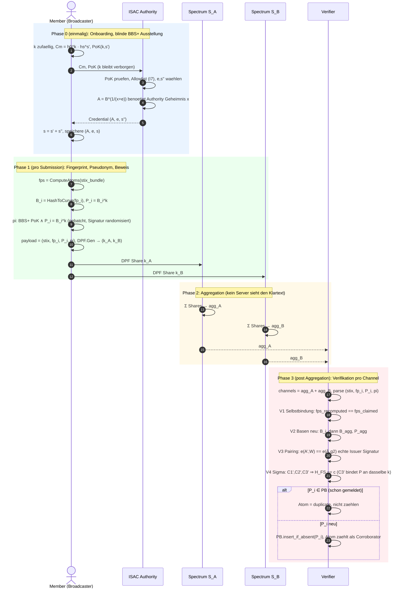

# CHORUS Protocol Specification (v0.2 — Spectrum-based)

**System name (working):** *CHORUS* — *Cryptographic Hidden-Origin Reporting Under Spectrum*: ein rundenbasiertes anonymes CTI-Bulletin-Board-Protokoll auf Basis von Spectrum, mit STIX-Fingerprint-Deduplikation und client-seitiger Threshold-Verifikation.

**Status:** Designspezifikation v0.2 — implementierungsleitend. **Ersetzt v0.1 vollständig.** Die vorherige Express-basierte Variante wurde verworfen; das aktuelle Design basiert auf Spectrum (Newman, Servan-Schreiber, Devadas, NSDI 2022).

**Begründung für den Wechsel:** Express ist ein Mailbox-Modell (jeder Sender hat einen privaten Slot beim Empfänger). Spectrum ist ein *echtes Broadcast-Modell*: wenige berechtigte Sender broadcasten an viele Empfänger, mit Anonymität gegenüber der Gesamt-Client-Menge. Das matcht die CTI-Realität deutlich besser: in einer typischen Epoche möchten nur wenige Mitglieder einer ISAC tatsächlich teilen, alle anderen sind Empfänger und liefern Cover-Traffic. Spectrum verlagert die Per-Request-Serverarbeit von $O(N)$ auf $O(L_w)$, wobei $L_w \ll N$ die im aktuellen Window registrierte Anzahl Broadcaster ist — eine substantielle Performance-Verbesserung für unseren Use-Case.

**Wissenschaftliche Contributions, die CHORUS trägt:**

1. **Rundenbasiertes Per-Round-Broadcaster-Rotation-Schema** *(neu)*. Spectrum sieht *langlebige* Broadcaster vor, die einmalig registriert sind. CTI braucht *episodisches* Broadcasting: ein Mitglied teilt vielleicht heute etwas, in zwei Wochen wieder, dazwischen nichts. Wir entwickeln ein zwei-phasiges Round-Modell: leichtgewichtige Bootstrap-Phase (Riposte) für die anonyme Broadcaster-Anmeldung pro Window, gefolgt von einer Sequenz von Main-Phasen (Spectrum) innerhalb des Windows. Window-basierte Channel-Persistenz reduziert Bootstrap-Overhead.

2. **STIX-Fingerprint-Modul** *(neu)*. Konstruktion eines normalisierten Fingerprints über die atomischen Observable-Fields eines STIX-Bundles. Zwei semantisch gleiche Submissions (gleiche IOC-Menge) ergeben denselben Fingerprint, auch wenn die menschenlesbaren Beschreibungen abweichen. Der Fingerprint dient als Duplikat-Detektor.

3. **Content-Bound Linkable Pseudonyms mit Post-Aggregation-Verifikation** *(neu)*. Jeder Broadcaster bettet in seinen Channel-Payload pro IOC-Atom ein *linkbares Pseudonym* $P_i = B_i^k$ mit $B_i = \mathsf{HashToCurve}(\mathsf{fp}_i)$ ein, zusammen mit einem Zero-Knowledge-Beweis $\pi$. Der Beweis zeigt, dass der Submitter ein gültiges BBS+-Credential mit dem verborgenen langlebigen Member-Geheimnis $k$ besitzt und dass alle $P_i$ mit demselben credential-gebundenen $k$ gebildet wurden. Nach Spectrum-Aggregation rekonstruiert ein Verifier (Consumer oder dedizierter Service) den Channel-Klartext, prüft $\pi$, prüft das Self-Binding gegen $\mathsf{Fingerprint.ComputeAtoms}(\mathsf{stix\_bundle})$, und pflegt ein persistentes Seen-Set über $P$-Werte. Eigenschaften: (i) verschiedene Member produzieren verschiedene $P_i$ für dasselbe IOC-Atom (mehrere unabhängige Reports möglich), (ii) derselbe Member produziert zeitunabhängig dasselbe $P_i$ für dasselbe IOC-Atom (permanenter Duplikat-Block), (iii) das ZKP verbirgt das Member-Geheimnis und die Submitter-Identität — Anonymität bleibt intakt, auch gegenüber einem honest-but-curious Verifier. Wiederholungen desselben Member-Atom-Paars sind über die Zeit bewusst öffentlich linkbar; verschiedene IOC-Atome desselben Members bleiben unter DDH unverkettbar.

4. **Client-seitige Threshold-Verifikation** *(neu)*. Konsumenten zählen lokal, wie oft ein Fingerprint innerhalb eines rolling window von mehreren Submittern *unabhängig* gemeldet wurde. Erst ab einem konfigurierbaren Schwellwert $T$ (typisch 3) wird der zugehörige IOC als verifiziert behandelt und ins SIEM gespeist. Dies ist eine epidemiologische Wahrheits-Aggregation: Falsche IOCs eines einzelnen maliciösen Submitters werden ignoriert, weil keine unabhängige Korroboration auftaucht.

**Orthogonale Forschungslinie (nicht Teil von v0.2).** Aggregate-Metadata-Leakage über die publizierte Bulletin-Board-DB — also Informationslecks an einen passiven Beobachter aus Publikations-Timing, Type-Verteilungen oder Volumen-Mustern — wird als eigenständige Forschungsrichtung in `expose_output_privacy.md` (E-DP-ABS-Framework) behandelt. CHORUS-v0.2 macht hierzu keine Aussage; die Spezifikation ist so geschnitten, dass eine spätere AML-Schicht orthogonal aufsetzen kann (siehe §18.2).

**Vereinfachung gegenüber v0.1.** Der heavy threshold-deanonymization-Mechanismus aus v0.1 entfällt. Die client-seitige Threshold-Verifikation (Contribution 4) macht eine kryptographische Identitäts-Aufdeckung im Normalfall überflüssig: gefälschte IOCs eines einzelnen Akteurs werden statistisch herausgefiltert, ohne dass jemand deanonymisiert werden muss. Threshold-Deanonymisierung bleibt als optionale Erweiterung dokumentiert (§18) für Szenarien, in denen Reputations- oder Sanktionsmechanismen ein konkretes Outing erfordern.

---

## Inhaltsverzeichnis

1. Designprinzipien und Architekturüberblick
2. Notation und kryptographische Bausteine
3. Systemrollen und Vertrauensannahmen
4. Parameter und Konfiguration (inkl. §4.3 Single-Identity-Annahme)
5. Zwei-Phasen-Architektur: Window-Struktur
6. Bootstrap-Phase (Riposte-basiert)
7. Main-Phase (Spectrum-basiert) — Submit, Audit, Post-Aggregation-Verifier
8. STIX-Fingerprint-Modul (inkl. §8.4 offenes Partial-Overlap-Problem, §8.5 ZKP-basiertes Self-Binding, §8.8 konsolidierte kryptographische Pipeline mit Schlüssel-Zuordnung)
9. Pseudonym-Blacklist und Cover-Traffic
10. Operative Publikations-Pipeline (Batch-Coarsening, Cover-Traffic)
11. Client-Seitige Threshold-Verifikation
12. Wire-Formate und Datenstrukturen (inkl. §12.5 Verifier-State)
13. Zustandsmaschinen (Klient, Spectrum-Server, Verifier, Consumer)
14. Sicherheitseigenschaften (inkl. Theorem 7 Honest-but-Curious Verifier)
15. Implementierungs-Roadmap
16. Mapping zur Spectrum-Referenzimplementierung
17. Testvektoren und Akzeptanzkriterien
18. Geklärte Designentscheidungen, Future Work, und Diskussion
19. Implementation Mandate (verbindliche Implementierungs-Anforderungen)

---

## 1. Designprinzipien und Architekturüberblick

### 1.1 Designprinzipien

- **P1 — Asymmetrie nutzen.** CTI-Sharing ist inhärent asymmetrisch: viele Empfänger, wenige aktive Sender pro Zeitraum. Spectrum nutzt diese Asymmetrie für Server-Effizienz. CHORUS macht sie explizit zum Architektur-Prinzip.
- **P2 — Schichtenseparation.** Bootstrap-, Main-, Publish- und Consume-Phasen sind klar getrennt. Jede hat eigene Schnittstellen, Sicherheitsannahmen und Performance-Charakteristiken.
- **P3 — Bit-genaue Veröffentlichung des Inhalts.** Wo Records publiziert werden, sind sie bit-genau. Die operative Publikations-Pipeline (§10) führt höchstens reine Batch- und Ordering-Operationen aus und manipuliert keine Record-Inhalte.
- **P4 — Defense in Depth gegen Poisoning.** Mehrere Verteidigungsschichten gegen falsche IOCs: (a) Spectrum-Audit gegen Disruption, (b) Hash-Blacklist gegen Multi-Submission durch einen Submitter, (c) Fingerprint-Robustheit gegen "kosmetisch verändertes Re-Submit", (d) Client-Threshold gegen Single-Source-Behauptungen.
- **P5 — Implementierungs-Robustheit vor kryptographischer Eleganz.** Wir nutzen erprobte Primitiven (BLAKE3, Curve25519, AES-PRG) statt experimenteller Konstrukte.

### 1.2 System-Übersicht

```
                ┌──────────────────────────────────────────────────────┐
                │                  CHORUS System                      │
                │                                                      │
   Members      │  ┌─────────┐    ┌─────────┐    ┌─────────┐          │
   (Alice,      │  │ Alice   │    │  Bob    │ …  │ Member  │          │
    Bob, …)     │  └────┬────┘    └────┬────┘    └────┬────┘          │
                │       │              │              │                │
                │       │ every BOOTSTRAP_ROUND every MAIN_ROUND       │
                │       │              │              │                │
                │       ▼              ▼              ▼                │
                │  ┌────────────────────────────────────────────┐     │
                │  │  Bootstrap Phase                           │     │
                │  │  (Riposte-style anonymous channel claim)   │     │
                │  │  Output: list of L_w g^α channels         │     │
                │  └────────────────┬───────────────────────────┘     │
                │                   │ valid for one window            │
                │                   ▼                                 │
                │  ┌────────────────────────────────────────────┐     │
                │  │  Main Phase (Spectrum)                     │     │
                │  │  - DPF-share writes to L_w channels        │     │
                │  │  - Carter-Wegman MAC for access control    │     │
                │  │  - Fingerprint hash H(fp) attached         │     │
                │  │  - Cover clients send random hash          │     │
                │  └────────────────┬───────────────────────────┘     │
                │                   │ aggregated channels             │
                │                   ▼                                 │
                │  ┌────────────────────────────────────────────┐     │
                │  │  Pseudonym Seen-Set Check                  │     │
                │  │  (persistent exact seen-set)               │     │
                │  └────────────────┬───────────────────────────┘     │
                │                   │ deduplicated                    │
                │                   ▼                                 │
                │  ┌────────────────────────────────────────────┐     │
                │  │  Publikations-Pipeline                     │     │
                │  │  (Batch-Coarsening, signierte Veröffentl.) │     │
                │  └────────────────┬───────────────────────────┘     │
                │                   ▼                                 │
                │  ┌────────────────────────────────────────────┐     │
                │  │  Public Bulletin Board (signed by both)    │     │
                │  └────────────┬───────────────────────────────┘     │
                │               │                                     │
                │               ▼                                     │
                │       ┌────────────────────────────┐                │
                │       │  Consumer                  │                │
                │       │  - Parse, normalize, fp    │                │
                │       │  - Fingerprint counter     │                │
                │       │  - Threshold-T verification│                │
                │       │  - Emit to SIEM            │                │
                │       └────────────────────────────┘                │
                └──────────────────────────────────────────────────────┘
```

### 1.3 Hauptphasenfluss

Window-Granularität (z.B. 6 Stunden):

```
[Bootstrap-Phase] ─► [Main-Phase #1] ─► [Main-Phase #2] ─► … ─► [Main-Phase #36] ─► [Bootstrap-Phase #2] ─► …
                          (10 Min)         (10 Min)              (10 Min)
```

Pro Window: 1 Bootstrap, danach 36 Main-Phasen (bei 10-min-Main-Phase und 6-h-Window).

---

## 2. Notation und kryptographische Bausteine

### 2.1 Notation

| Symbol | Bedeutung |
|---|---|
| $\lambda$ | Sicherheitsparameter, $\lambda = 128$ |
| $\mathcal{P} = \{P_1, \ldots, P_n\}$ | registrierte Mitglieder, statische Liste |
| $S_A, S_B$ | die beiden Spectrum-Server (non-colluding) |
| $B_R$ | Anzahl Zeilen des Riposte-Bootstrap-Boards, einschließlich Dummy-Zeile 0 |
| $L_w$ | Anzahl im Bootstrap erfolgreich rekonstruierter Broadcaster und damit Spectrum-Channels im Window $w$; dynamisch, $0 \le L_w \le N$ |
| $w$ | Window-Index |
| $r$ | Main-Round-Index innerhalb eines Windows, $r \in \{1, \ldots, R\}$ |
| $\alpha_j$ | Broadcast-Key für Channel $j$ |
| $g^{\alpha_j}$ | öffentlicher Verifikations-Key für Channel $j$ |
| $\mathbb{F}$ | endlicher Körper für Spectrum-MAC, hier $\mathbb{F}_p$ mit $p$ prime von $\approx 2^{128}$ |
| $\mathbb{G}$ | zyklische Gruppe (Curve25519-Punkte) für $g^{\alpha}$-Operationen |
| $|m|$ | Nachrichten-Größe in Bytes (≤ 32 KB für CHORUS) |
| $\mathsf{fp}(m)$ | STIX-Fingerprint, $\{0,1\}^{256}$ |
| $H$ | kryptographische Hash-Funktion (BLAKE3) |
| $\mathsf{PB}$ | persistentes Pseudonym-Seen-Set |
| $T$ | client-seitiger Verifikations-Threshold (typisch $T=3$) |

### 2.2 Kryptographische Bausteine

| Baustein | Konkrete Wahl (v0.2) | Quelle |
|---|---|---|
| Anonymous Broadcast (Main) | Spectrum 2-Server | Newman et al., NSDI 2022 |
| Anonymous Bootstrap | Riposte (single-channel, low-bandwidth) | Corrigan-Gibbs et al., S&P 2015 |
| Distributed Point Function | 2-Server DPF mit AES-PRG | Boyle-Gilboa-Ishai 2016 |
| Access Control MAC | Carter-Wegman MAC über $\mathbb{F}$ | Carter & Wegman 1981 |
| Audit-Verifikation | Spectrum blind audit via $\mathbb{G}$-Operationen | Spectrum §3.1 |
| Audit-Attack-Defense | BlameGame (verifiable encryption + Byzantine broadcast) | Spectrum §4.3 |
| Hash-Funktion | BLAKE3 (für Fingerprint-Hash und PRGs) | O'Connor et al. 2020 |
| PRG | AES-CTR-128 | NIST SP 800-38A |
| Anonymous Credentials (Membership) | BBS+ Signatures | Au-Susilo-Mu 2006 |
| Signaturen (Server-Publication) | Ed25519 | RFC 8032 |
| Public-Key-Encryption (Setup) | NaCl `box` über Curve25519 | Bernstein |

### 2.3 Notations-Kürzel

```
DPF.Gen(1^λ, m, j) → (k_A, k_B)        Spectrum-DPF für Channel j mit Nachricht m
DPF.Eval(k) → m_vec ∈ F^{L_w}          Auswertung über alle Channels des aktuellen Windows
MAC.Tag(α, m) = α·m ∈ F                Carter-Wegman MAC
MAC.Share(t) → (t_A, t_B)              additives Sharing der Tag
ServerAudit(m_A, m_B, t_A, t_B,        Spectrum Audit:
            g^α_1, ..., g^α_{L_w})     prüft ∏ g^β_i = 1
fp(stix) → bytes32                     Fingerprint (siehe §8)
PB.Contains(P) / PB.InsertIfAbsent(P)   persistente Seen-Set-Operationen
H(x) = BLAKE3(x)                       Hash
PRG(seed, n) → bytes                   Pseudo-random byte stream
```

---

## 3. Systemrollen und Vertrauensannahmen

### 3.1 Rollen

**Mitglieder $\mathcal{P}$ (Members).** Jede Organisation, die am ISAC teilnimmt. In jeder Phase (Bootstrap und Main) sind sie *immer* aktiv. Pro Window kann ein Mitglied wahlweise als *Broadcaster* (will senden) oder als *Subscriber* (nur Empfangen + Cover) auftreten. Diese Rolle ist pro Window aufs Neue wählbar.

**Server $S_A, S_B$.** Zwei unabhängig betriebene Server. Verarbeiten DPF-Shares, führen Audits durch, publizieren ihre aggregierten Shares. Pseudonym-Blacklist und post-aggregation Verifikation laufen im *Verifier* (siehe §7.3.3, §12.5), nicht in den Spectrum-Servern.

**ISAC-Authority $\mathcal{I}$.** Vergibt BBS+-Credentials bei Member-Onboarding. Nicht in Bootstrap/Main involviert.

**Consumer.** Liest die publizierte DB. Können Mitglieder sein (die meisten Subscriber sind selbst Consumer ihrer Peers) oder externe Subscriber (z.B. nationale CERTs).

### 3.2 Vertrauensannahmen

- **A1 — Server-Non-Collusion.** Mindestens *einer* von $S_A, S_B$ ist ehrlich. Spectrum-Standard. Praktisch: getrennte juristische Entitäten.
- **A2 — Network-Adversary.** Adversary sieht alle TLS-verschlüsselten Verbindungen, aber kann Klartexte nicht entschlüsseln.
- **A3 — Member-Adversary.** Beliebige Teilmenge $\mathcal{C} \subset \mathcal{P}$ kann maliciös sein. Sie können maliciöse DPF-Schlüssel schicken (Disruption-Attacke), gezielte Cover-Traffic-Muster, oder false IOCs broadcasten (Poisoning).
- **A4 — Standard-Crypto-Annahmen.** DDH in $\mathbb{G}$ (Curve25519), AES-PRG-Sicherheit, BLAKE3 als Random Oracle.
- **A5 — Setup-Free-Initialization.** Wir akzeptieren die Spectrum-Annahme: das System hat einmaliges öffentliches Setup (PKI für Server, BBS+-Authority-Key). Kein anhaltendes Vertrauen in $\mathcal{I}$ nach Issuance.

### 3.3 Adversary-Modelle

| Adversary | Kontrolliert | Schutzziel | Defense |
|---|---|---|---|
| $\mathcal{A}_{\mathrm{Server}}$ | $S_A$ ODER $S_B$ (nicht beide) | Sender-Anonymität | Spectrum-Anonymity (Theorem 1) |
| $\mathcal{A}_{\mathrm{Member}}^{\mathrm{Disrupt}}$ | maliciöse Members senden ill-formed shares | Liveness | Spectrum-Audit + BlameGame |
| $\mathcal{A}_{\mathrm{Member}}^{\mathrm{Poison}}$ | maliciöse Members broadcasten falsche IOCs | DB-Qualität | Hash-Blacklist + Client-Threshold |
| $\mathcal{A}_{\mathrm{Pub}}$ | passiver Beobachter der publizierten DB | Aggregate-Metadata-Leakage | *außerhalb des CHORUS-v0.2-Scope; orthogonale Forschungslinie, siehe §18.2 und `expose_output_privacy.md`* |
| $\mathcal{A}_{\mathrm{Net}}$ | Network-Adversary | Anonymity-Set-Information | Pro Window öffentliches $L_w$ + immer-aktive Member |

---

## 4. Parameter und Konfiguration

### 4.1 Globale Konfiguration

```yaml
# chorus-config.yaml

system:
  name: "CHORUS"
  version: "0.2"
  base_protocol: "Spectrum (NSDI 2022)"
  bootstrap_protocol: "Riposte (S&P 2015)"

security:
  lambda: 128
  field_prime: "2^130 - 5"        # Curve25519 base prime, Spectrum-compatible
  hash: "BLAKE3"
  prg: "AES-CTR-128"
  curve: "Curve25519 / Ristretto255"

window:
  duration_hours: 1                 # v0.2 default; future work: empirical tuning
  main_rounds_per_window: 6        # = 1h / 10min
  bootstrap_duration_minutes: 2    # one-shot per window

main_round:
  duration_seconds: 600            # 10 min
  max_message_size_bytes: 32768
  channel_count: "derived_as_L_w"  # Zahl erfolgreich rekonstruierter Claims
  channel_upper_bound: "members_N" # natürliche Ressourcenobergrenze

bootstrap_round:
  underlying_system: "riposte"
  message_size_bytes: 64           # broadcast-key g^α + channel claim
  cover_row: 0                     # reservierte Dummy-Zeile
  expected_broadcasters_M: 20      # Kapazitätsannahme, kein Channel-Limit
  target_singleton_probability: 0.95
  board_rows_B_R: 372              # 1 Dummy + 371 Claim-Zeilen; siehe §4.2
  claim_rows: "1..board_rows_B_R"  # obere Grenze exklusiv
  audit_required: true

fingerprint:
  function: "structured_digest_v1"  # see §8.2
  output_bytes: 32

pseudonym:                          # NEW in v0.2 (replaces two-hash construction)
  group: "bls12-381-g1"
  hash_to_curve: "RFC 9380"         # B_i = HashToCurve(fp_i)
  pseudonym_function: "P_i = B_i^k"
  zkp_statement: "knowledge of valid BBS+ credential binding k AND P_i = B_i^k"
  zkp_scheme: "BBS+_bound_batched_dleq"
  client_scalar_k_lifecycle: "generated_blindly_at_onboarding_long_lived"

verifier:
  position: "consumer_side"         # default in v0.2
  optional_dedicated_verifier: true # may be deployed as separate service
  trust_model: "honest_but_curious"

blacklist:
  retention: "persistent"
  reset_period_seconds: null       # no periodic reset
  storage: "persistent_exact_set"

output_privacy:
  enabled: true
  m1_delay_distribution:
    type: "geometric_truncated"
    mean_rounds: 2
    max_rounds: 6
  m2_synthetic_channel_injection:
    enabled: false                 # REMOVED in v0.2 per design decision —
                                   # all members send every round (real or cover),
                                   # so synthetic channel filling is unnecessary.
  m3_type_bucketing:
    bucket_count: 4
  m4_batch_coarsening:
    rounds_per_meta_batch: 6

client_threshold:
  default_T: 3                     # consumer trust threshold
  evidence_window_rounds: 6        # one full window of evidence (1h)
  decay: "exponential_weekly"

abuse:
  legacy_threshold_deanon: false   # disabled in v0.2; see §18
```

### 4.2 Parameter-Begründung

- **$B_R = 372$:** typische CTI-Aktivität in ISAC mit $n = 50$–$500$ Mitgliedern: höchstens etwa $M=20$ gleichzeitige Bootstrap-Claims werden als Planungswert angenommen. Von den $B_R$ Zeilen ist Zeile 0 für Empty-Writes reserviert; für echte Claims bleiben $b=B_R-1=371$ Zeilen. Wählt jeder Broadcaster seine Zeile uniform, ist die Singleton-Wahrscheinlichkeit eines bestimmten Claims $(1-1/b)^{M-1}\approx 0{,}95$. $B_R$ steuert damit nur die Bootstrap-Kollisionsrate und ist kein Channel-Limit.
- **Dynamisches $L_w$:** Nach dem Bootstrap gilt $L_w=|C_w|$ für die Menge $C_w$ der erfolgreich rekonstruierten Claims. Es werden genau $L_w$ Spectrum-Channels für das Window erzeugt; die natürliche Obergrenze ist die Zahl $N$ registrierter Mitglieder unter der Ein-Submission-pro-Member-Annahme.
- **Window = 1h (v0.2 Default):** Bootstrap-Amortisation: ein anonymes Riposte-Setup pro Stunde, dann 6 Main-Rounds. Reduziert Setup-Overhead vs. Pro-Round-Setup um Faktor 6. Kurzes Window minimiert die Intra-Window-Linkability (Submissions desselben Channels sind während des Windows linkbar — siehe §14.2). *Future Work:* Optimale Window-Länge empirisch zu bestimmen; siehe §18.2.
- **Main-Round = 10 min:** akzeptable Latenz für operative IOCs.
- **$T = 3$:** epidemiologische Wahrheits-Schwelle. Bei $T = 3$ muss ein Angreifer drei Window-Slots auf drei verschiedenen Identitäten gleichzeitig kontrollieren, um eine False-IOC durchzubringen.
- **Content-Bound Linkable Pseudonym:** $P_i = \mathsf{HashToCurve}(\mathsf{fp}_i)^k$ wird im DPF-Payload (nicht plaintext!) mitgeschickt. Ein post-Aggregation-Verifier prüft den komponierten BBS+-Knowledge-/Pseudonym-Bindungsbeweis $\pi$ und das Self-Binding gegen die neu berechneten Atom-Fingerprints. Das Pseudonym ist deterministisch in (Member, IOC-Atom) und enthält keinen Zeitscope. Cover-Submissions enthalten keinen Pseudonym-Wert — sie sind Spectrum-Zero-Shares und tragen nach Aggregation keinen verwertbaren Inhalt.

### 4.3 Single-Identity-Annahme

Die Sicherheit des Threshold-Schutzes (§11) hängt davon ab, dass ein Angreifer höchstens $T-1$ gültige Member-Credentials kontrolliert. Diese Sybil-Resistenz ist Aufgabe des ISAC-Onboardings (Identitätsprüfung, X.509, organisationale Verifikation), nicht des Submission-Protokolls. Wer mehr als $T-1$ separate Credentials erlangt, kann den Threshold durchbrechen.

Die Grenze gilt auch über die Zeit: Ein Re-Onboarding mit neuem Credential und neuem $k$ erzeugt für bereits gemeldete IOC-Atome neue Pseudonyme. Solange Evidence des alten Credentials noch zählt, kann das neue Credential daher eine zusätzliche Stimme liefern. Die Authority muss wiederholte oder parallele Ausstellung an dieselbe Organisation verhindern beziehungsweise Credential-Nachfolge und Revocation als explizite Policy behandeln. CHORUS-v0.2 besitzt noch keinen anonymen Mechanismus, der zwei nacheinander ausgestellte Credentials derselben Organisation beim Verifier als dieselbe Identität verknüpft.

Den vollständigen Schlüssel-Lifecycle (BBS+-Credential mit langlebigem $k$, zeitunabhängige inhaltsgebundene Pseudonym-Basis, kein Member-Roster für die Verifikation) beschreibt **§8.8 (autoritativ)**.

---

## 5. Zwei-Phasen-Architektur

### 5.1 Window-Struktur

Ein **Window** $w$ ist die Persistenz-Einheit für Broadcaster-Channels. Innerhalb eines Windows sind die in der Bootstrap-Phase registrierten Broadcaster-Channels gültig und können in jeder Main-Round genutzt werden.

```
T_0 ─ Bootstrap_w ─ Main_w_1 ─ Main_w_2 ─ … ─ Main_w_6 ─ Bootstrap_{w+1} ─ …
       (2 min)      (10 min)   (10 min)       (10 min)   (2 min)
       |←─────────────────  Window w (1h)  ────────────→|
```

### 5.2 Rollen pro Window

Vor jedem Window entscheidet jedes Mitglied $P_i$ unabhängig:

- **Broadcaster-Rolle:** Hat Content zu teilen → meldet sich in Bootstrap an, broadcastet in beliebigen Main-Rounds des Windows.
- **Subscriber-Rolle:** Will nur konsumieren → schickt Cover-Traffic in Bootstrap und, sofern $L_w>0$, allen Main-Rounds. Für $L_w=0$ ist bereits öffentlich, dass kein Broadcaster registriert wurde; das Window erzeugt daher keine Main-Submissions und nur signierte leere Round-Ausgaben.

**Wichtig:** Diese Rollen-Wahl wird *innerhalb des Bootstrap-Protokolls anonym getroffen*. Ein Mitglied sendet entweder eine echte Channel-Claim-Nachricht oder einen Riposte-Empty-Write in die reservierte Dummy-Zeile 0. Beide Varianten sind wohlgeformte Riposte-Punktschreibvorgänge gleicher Größe und aus Sicht eines einzelnen Servers ununterscheidbar. Die Dummy-Zeile wird nach der Aggregation verworfen.

### 5.3 Window-Limits

Pro Window wird keine feste Zahl von Spectrum-Channels vorab reserviert. Nach dem Bootstrap werden für alle erfolgreich rekonstruierten Claims genau $L_w$ Channels erzeugt. Unter der Ein-Submission-pro-Member-Annahme gilt $L_w\le N$; ein separates statisches Channel-Limit existiert nicht. Claims, die durch eine Riposte-Board-Kollision nicht rekonstruiert werden können, erhalten in diesem Window keinen Channel und müssen im nächsten Bootstrap erneut versuchen. Konsequenz: $L_w$ ist eine *beobachtbare* Größe für externe Beobachter. Volume-Hiding wird stattdessen durch die Pflicht-Teilnahme aller $N$ Mitglieder als Cover-Subscriber abgesichert (Spectrum-Anonymity über das volle Anonymity-Set).

---

## 6. Bootstrap-Phase (Riposte-basiert)

### 6.1 Zweck

Die Bootstrap-Phase erfüllt zwei Funktionen:

1. **Channel-Key-Registrierung:** Mitglieder, die im kommenden Window broadcasten wollen, schicken einen frisch generierten Broadcast-Key $g^{\alpha_j}$ anonym an die Server.
2. **Dynamische Channel-Index-Assignment:** Aus allen erfolgreich rekonstruierten Claims wird eine kanonisch geordnete Liste gebildet. Jeder dieser Broadcaster erhält genau einen Channel $j \in \{1, \ldots, L_w\}$.

### 6.2 Bootstrap-Protokoll

```
Algorithm 1: Bootstrap.Run(window w, member P_i)

Input:
  - role: "broadcaster" oder "subscriber" (intern entschieden)
  - cred_i: BBS+ membership credential
  - new_key:  α ∈ Z_p, fresh per window if role=broadcaster

Steps:

B1.  IF role = "broadcaster":
         row     ←$ {1, ..., B_R-1}           // uniform zufällige Board-Zeile
         ticket  ←$ {0,1}^128                  // nur für kanonische Reihenfolge
         tag     ← Trunc128(H("CHORUS/bootstrap-claim/v1" ||
                                  w || row || g^α || ticket))
         payload ← g^α || ticket || tag    // exakt 32 + 16 + 16 = 64 Byte
     ELSE:
         row     ← 0                          // reservierte Dummy-Zeile
         payload ← random_bytes(64)            // Riposte "empty" write

B2.  // ZK-Proof π_B: "ich bin valides Mitglied"
     π_B ← BBS+.Prove(cred_i, ε)

B3.  // Riposte point write: genau eine Zeile wird beschrieben
     (shareA, shareB) ← Riposte.Encode(row, payload)
     send_to(S_A, { window=w, shareA, π_B })
     send_to(S_B, { window=w, shareB, π_B })

B4.  // Server-Side (siehe Alg. 2)
     ...

B5.  // Server publiziert Channel-Liste
     CL_w ← receive_from_server()

B6.  IF role = "broadcaster":
         find own (g^α, j) in CL_w
         IF found:
             store (α, j) locally for use in main rounds
         ELSE:
             // Claim kollidierte und muss im nächsten Window erneut versuchen
     ELSE:
         CL_w ist nur für Audit relevant
```

```
Algorithm 2: Bootstrap.Server.Aggregate(window w)

Steps:

S1.  Beide Server akzeptieren während der Bootstrap-Phase Submissions.

S2.  Validieren π_B (BBS+ Membership) für jede eingehende Submission.

S3.  Riposte-Aggregation: Server kombinieren ihre Board-Anteile und erhalten
     eine öffentlich publizierte Tabelle mit B_R Zeilen. Zeile 0 enthält
     die Überlagerung aller Empty-Writes und wird ungeparst verworfen.
     Die Zeilen 1 bis B_R-1 sind potentielle Claim-Zeilen.

S4.  Parse jede Claim-Zeile als (g^α, ticket, tag) und prüfe den
     domain-separierten tag gegen Window und Board-Zeile. Eine Zeile, die
     nicht kanonisch decodiert oder deren tag nicht stimmt, gilt als
     kollidiert beziehungsweise ungültig und wird verworfen.

S5.  Sei C_w die Menge der erfolgreich decodierten, paarweise verschiedenen
     Claims. Sortiere C_w aufsteigend nach (ticket, g^α) und nummeriere die
     Claims in dieser Reihenfolge mit j=1, ..., |C_w|. Setze L_w ← |C_w| und
     CL_w ← [(g^α_1, j=1), ..., (g^α_{L_w}, j=L_w)].

S6.  Beide Server signieren CL_w gemeinsam:
        σ_w ← Ed25519.Sign(sk_A, CL_w) || Ed25519.Sign(sk_B, CL_w)
     Veröffentlichung: (CL_w, σ_w).

S7.  Initialisierung einer neuen Spectrum-Protokollinstanz für Window w mit
     genau L_w aktiven Channels. Für L_w=0 wird kein leerer DPF-Vektor
     instanziiert; die Main-Rounds des Windows publizieren direkt leere,
     signierte Round-Ausgaben.
```

### 6.3 Riposte-Kollisionen und dynamische Channel-Vergabe

Board-Zeile und späterer Spectrum-Channel sind verschiedene Namensräume. Ein Broadcaster wählt zunächst uniform eine Riposte-Zeile aus $\{1,\ldots,B_R-1\}$. Schreiben zwei Broadcaster in dieselbe Zeile, enthält sie die algebraische Kombination ihrer Payloads; die einzelnen Zufalls-Tickets sind dann nicht zugänglich. Ein korrekt dimensioniertes $B_R$ reduziert diese vorgelagerte Kollisionswahrscheinlichkeit. Ohne eine zusätzliche Riposte-Collision-Recovery-Konstruktion wird eine solche Zeile verworfen, und die betroffenen Broadcaster versuchen es im nächsten Window erneut.

Die 128-Bit-Zufallszahl `ticket` verhindert diese Board-Kollision nicht. Sie wird erst *nach* erfolgreicher Rekonstruktion verwendet, um allen decodierten Claims deterministisch fortlaufende Spectrum-Channel-Indizes zuzuweisen. Da jeder decodierte Claim einen Channel erhält, ist `ticket` keine Zulassungslotterie und ein statisches $L$ entfällt. Ein Ticket-Gleichstand ist mit vernachlässigbarer Wahrscheinlichkeit möglich und wird durch die zweite Sortierkomponente $g^\alpha$ eindeutig aufgelöst. Channel-Indizes haben keine Prioritäts- oder Berechtigungssemantik; die Wahl beziehungsweise Optimierung eines Tickets verschafft daher keinen Protokollvorteil.

### 6.4 Sicherheitseigenschaften der Bootstrap-Phase

- **Anonymität:** Riposte garantiert Sender-Anonymität gegenüber $\mathcal{A}_{\mathrm{Server}}$ und $\mathcal{A}_{\mathrm{Net}}$. Server sehen $L_w$ erfolgreich rekonstruierte Channel-Anmeldungen, aber nicht, wer sie eingereicht hat.
- **Bootstrap-Cover:** Subscriber erzeugen wie Broadcaster einen wohlgeformten Riposte-Punktschreibvorgang mit 64-Byte-Nutzlast, schreiben jedoch stets in die reservierte Dummy-Zeile 0. Deren aggregierter Zufallsinhalt wird nicht interpretiert. Das ist das Empty-Write-Modell von Riposte und keine Zero-Funktion wie bei Spectrum-Cover in der Main-Phase.
- **Membership-Soundness:** BBS+-Proof verhindert, dass Nicht-Mitglieder einen Channel claimen.
- **Volume-Beobachtbarkeit:** $L_w$ pro Window ist *beobachtbar*. Das ist eine bewusst akzeptierte Schwäche zugunsten der operativen Klarheit (siehe Designentscheidung in §5.3). Eine Behandlung der dadurch entstehenden Aggregat-Leckage ist nicht Teil von v0.2; sie ist als orthogonale Folgearbeit positioniert (§14.4, §18.2).

### 6.5 Bandbreiten-Analyse Bootstrap

Pro Mitglied: 64-Byte-Payload + BBS+-Proof + Riposte-Overhead $O(\sqrt{B_R})$. Der konkrete Bytewert muss mit der gewählten DPF- und Proof-Serialisierung gemessen werden; er hängt von der Boardgröße, nicht direkt von $N$ oder $L_w$, ab.

---

## 7. Main-Phase (Spectrum-basiert)

### 7.1 Pro-Round-Submission

Pro Main-Round $r$ innerhalb Window $w$ submittet jedes Mitglied $P_i$ eine Submission. Wenn $P_i$ in Window $w$ als Broadcaster (Channel $j$, Key $\alpha_j$) registriert ist, kann es eine reale Nachricht $m$ schicken; andernfalls schickt es eine Cover-Submission ($m = 0$).

```
Algorithm 3: Main.Submit(window w, round r, role, stix_bundle, j, α_j)

Input:
  - w, r:        Window/Round-Indizes
  - role:        "broadcast" or "cover"
  - stix_bundle: STIX bundle (only if broadcasting), size ≤ slot_size - overhead
  - j, α_j:      channel and key (only if broadcasting)
  - k_i:         client's long-term BBS+-bound member secret (from §8.8)
  - cred_i:      BBS+ membership credential (from §8.8)

Steps:

M1.  IF role = "broadcast":
         y, j' ← α_j, j

         // Atomare Fingerprints (§8.2)
         fps       ← Fingerprint.ComputeAtoms(stix_bundle)
                     // Vec<bytes32>, Länge n = Anzahl IOC-Atome

         // Pro Atom: inhaltsgebundene Basis und atomares Pseudonym (§8.8.3)
         B_atoms   ← [HashToCurve_{G1}(DST_PS, fp_i) for fp_i in fps]  // RFC 9380
         Ps        ← [B_atoms[i]^{k} for i in 0..n]         // P_i = B_i^k, langlebiges k

         // Komponierter Beweis π (§8.8.4): BBS+-Proof-of-Knowledge des Credentials
         // (A,e,s) über (k,m_1,m_2,m_3) UND Pseudonym-Bindung P_i = B_i^k für
         // DASSELBE k, gebatcht über alle Atome. k bleibt verborgen; es wird kein
         // g^k bzw. pk_i offengelegt (Roster-Ring entfällt, vgl. §8.8.1).
         // Beweisgröße: ~1-2 KB, unabhängig von n.
         γ_vec     ← [H_coef(i, B_atoms, Ps) for i in 0..n]   // Fiat-Shamir-Koeffizienten
         B_agg     ← ∏_i B_atoms[i]^{γ_vec[i]}
         P_agg     ← ∏_i Ps[i]^{γ_vec[i]}
         π         ← BBS+.ProveComposed(
                       cred    = (A, e, s),
                       hidden  = (k, m_1, m_2, m_3),
                       pseudo  = (B_agg, P_agg),     // C_3 = B_agg^{ρ_k} bindet z_k an P_agg = B_agg^k
                       pk      = W                   // Issuer-Public-Key
                     )   // π = (A', Ā, d, c, z_e, z_{r2}, z_{r3}, z_k, z_{m1..3}, z_{s*})

         m_payload ← serialize(stix_bundle,
                                fps,          // Vec<bytes32>, n Einträge
                                Ps,           // Vec<G1-Punkte>, n Pseudonyme
                                π)            // komponierter Beweis, ~1-2 KB (unabh. von n)
                     // Gesamtgröße ≤ slot_size; typisch n·48B + Stix ~28KB + ~2KB overhead
     ELSE:
         y, j' ← 0, 0
         m_payload ← 0_F^{L_w}                      // Spectrum zero share

M2.  // DPF-Generation (Spectrum §3.2 / §4.2)
     IF role = "broadcast":
         (k_A, k_B) ← DPF.Gen(1^λ, m_payload, j')
     ELSE:
         (k_A, k_B) ← DPF.Gen(1^λ, 0, 0)             // dummy DPF

M3.  // Carter-Wegman MAC-Tag (Spectrum unchanged)
     IF role = "broadcast":
         t ← y · m_payload                            // ∈ F
     ELSE:
         t ← 0
     (t_A, t_B) ← Share(t)

M4.  // Submission packets — NO plaintext metadata about content
     msg_A ← { w, r, k_A, t_A }
     msg_B ← { w, r, k_B, t_B }

M5.  send_to(S_A, msg_A)
     send_to(S_B, msg_B)
```

**Wichtige Anmerkungen:**

*(a) Was im Payload steckt.* Der Broadcaster bettet *vier* Werte in den Channel-Payload ein: das eigentliche STIX-Bundle, das explizite `fp` (zur Self-Binding-Überprüfung), das Pseudonym $P$, und den ZKP $\pi$. Alle vier sind via DPF secret-shared — kein einzelner Server sieht sie pre-Aggregation.

*(b) Was die Server pre-Aggregation sehen.* Nur DPF-Shares und MAC-Tag-Shares. Beide sind durch Spectrum's Konstruktion pseudozufällig. Es gibt *keine* plaintext Pseudonym- oder Hash-Metadaten — damit kann auch ein malicious Server keine Submission↔Channel-Linkage über solche Metadaten herstellen.

*(c) Sybil-Annahme.* Die Soundness des Mechanismus hängt davon ab, dass ein Member nicht mehrere gültige Credentials mit unterschiedlichen Geheimnissen $k$ kontrolliert. Der ZKP bindet das für die Pseudonyme verwendete $k$ an ein gültiges BBS+-Credential. Sybil-Resistenz ist damit eine Eigenschaft des Authority-Onboardings, nicht des Submission-Protokolls.

*(d) Cover-Submissions.* Spectrum-Zero-Shares — kein Pseudonym, kein ZKP. Da Spectrum's Audit-MAC bei Cover-Submissions automatisch $t = 0$ erzwingt und ehrliche Subscriber keinen gültigen $\alpha_j$ kennen, werden Cover-Submissions strukturell von echten Broadcasts unterschieden — *aber* nicht ihren Submittern zugeordnet (Spectrum-Theorem 1).

### 7.2 Server-Side: Audit and Aggregation

**Wichtige Architektur-Änderung in v0.2:** Die Verifikation (ZKP-Check, Self-Binding, Blacklist) findet *nicht* auf den Spectrum-Servern $S_A, S_B$ statt, weil diese nur ihre eigenen Aggregations-Shares publizieren und nicht untereinander aggregieren. Stattdessen findet die Verifikation *post-Aggregation* statt — entweder bei einem dedizierten Verifier-Service oder direkt beim Consumer. Beide Optionen sind unter einer honest-but-curious Annahme sicher (§14.x).

```
Algorithm 4a: Spectrum.Server.Process(round r, batch of submissions)
              [running on S_A; analog für S_B]

Steps:

P1.  Für jede Submission { k_A, t_A } in dieser Round:
     P1.1  m_i ← DPF.Eval(k_A) ∈ F^{L_w}
     P1.2  // Spectrum audit using channel verification keys
            β ← ∏_{j=1}^{L_w} (g^{α_j})^{m_i[j]} · g^{-t_A}
     P1.3  Wenn die Audit-Check ∏ g^β = 1 fehlschlägt:
            Submission ablehnen, BlameGame initiieren (§7.5).
     P1.4  Andernfalls: aggregieren in agg_A[r]

P2.  Nach Verarbeitung aller Submissions:
     P2.1  agg_A[r] ← Σ_{i passed audit} m_i_A ∈ F^{L_w}
     P2.2  Server S_A publiziert agg_A[r] (signiert) auf seinem öffentlichen
            Endpunkt. Analog: S_B publiziert agg_B[r].
            → Keine Inter-Server-Kommunikation der aggregierten Shares!

P3.  Initialer Round-Output:
     channels_raw[r] = { agg_A[r], agg_B[r] } öffentlich abrufbar.
     → Die finale Aggregation channels[r] = agg_A[r] + agg_B[r]
       findet beim Verifier/Consumer statt.
```

```
Algorithm 4b: Verifier.ProcessRound(round r)
              [running at dedicated verifier OR at each consumer]

Steps:

V1.  Lade agg_A[r] von S_A und agg_B[r] von S_B (mit signature checks).

V2.  Aggregiere finale Channel-Inhalte:
     channels[r] ← agg_A[r] + agg_B[r] ∈ F^{L_w}

V3.  Für jeden non-empty channel j in channels[r]:
     V3.1  // Parse Payload-Struktur (atomare Fingerprints)
            (stix_bundle, fps_claimed, Ps, π)
                ← deserialize(channels[r][j])
            // fps_claimed: Vec<bytes32>, Länge n
            // Ps:          Vec<G1-Punkte>, Länge n
            // π:           komponierter BBS+/Pseudonym-Beweis (§8.8.4)

     V3.2  // SELF-BINDING-CHECK (pro Atom)
            fps_recomputed ← Fingerprint.ComputeAtoms(stix_bundle)
            IF fps_recomputed ≠ fps_claimed:   // Mengenvergleich (sort+compare)
                Markiere channel als "self-binding-fail".
                Channel bleibt in der DB. Konsumenten/SIEM-Filter ignorieren ihn.
                CONTINUE next channel.

     V3.3  // ZKP-VERIFIKATION (komponierter Beweis, §8.8.5 V3+V4)
            // EIN Beweis über das verborgene, credential-gebundene k.
            // Es wird KEIN g^k bzw. pk_i rekonstruiert (sonst Deanonymisierung).
            // Basen aus den NEU berechneten Fingerprints bilden.
            B_atoms   ← [HashToCurve_{G1}(DST_PS, fp_i) for fp_i in fps_claimed]
            γ_vec     ← [H_coef(i, B_atoms, Ps) for i in 0..n]
            B_agg     ← ∏_i B_atoms[i]^{γ_vec[i]}
            P_agg     ← ∏_i Ps[i]^{γ_vec[i]}
            (A', Ā, d, c, z_e, z_{r2}, z_{r3}, z_k, z_{m1}, z_{m2}, z_{m3}, z_{s*}) ← π

            // (V3) Pairing-Check: A' ist eine echte randomisierte Issuer-Signatur (sonst q-SDH)
            valid_sig ← (A' ≠ 1_{G1}) ∧ (e(A', W) == e(Ā, g_2))

            // (V4) Sigma-Rekonstruktion; C3' bindet das Pseudonym an dasselbe k wie das Credential
            C1' ← A'^{-z_e} · h_s^{z_{r2}} · (Ā · d^{-1})^{-c}
            C2' ← d^{z_{r3}} · h_0^{-z_k} · h_1^{-z_{m1}} · h_2^{-z_{m2}} · h_3^{-z_{m3}} · h_s^{-z_{s*}} · g_1^{-c}
            C3' ← B_agg^{z_k} · P_agg^{-c}
            valid_zkp ← ( H_FS(pk, A', Ā, d, {B_i}, {P_i}, B_agg, P_agg, C1', C2', C3') == c )

            IF NOT (valid_sig ∧ valid_zkp):
                Markiere channel als "zkp-fail". CONTINUE.

     V3.4  // BLACKLIST-CHECK pro Atom (Duplikat-Detektion)
            any_duplicate ← false
            for each (fp_i, P_i) in zip(fps_claimed, Ps):
                IF P_i ∈ PB:
                    // Dieser Atom wurde von demselben Member bereits gemeldet.
                    // Diesen Atom im Counter ignorieren, aber den ganzen Channel
                    // nicht verwerfen (andere Atome können frisch sein).
                    mark_atom_duplicate(channel_j, atom_i)
                    any_duplicate ← true
                ELSE:
                    PB.insert_if_absent(P_i)

     V3.5  Channel j wird publiziert.
            Status-Markierungen: "self-binding-fail", "zkp-fail", oder
            pro Atom "duplicate" (nicht-exklusive Markierungen).

V4.  Verifizierte Round-Publikation:
     verified_publication[r] = { channels[r] mit pro-Channel-Markierungen,
                                  Verifier-Signatur }
```

**Was passiert bei "Schummeln" konkret:**

- Falls **Self-Binding-Fail**: Der Submitter hat $\mathsf{fp}_\mathsf{claimed}$ angegeben, das nicht zu seinem stix_bundle passt. Konsument kann sehen, *dass* etwas nicht stimmt, *kann aber nicht* identifizieren, *wer* es war (anonym im Ring). Der Channel ist als "self-binding-fail" markiert und wird vom SIEM-Filter ignoriert.
- Falls **ZKP-Fail**: Der ZKP ist mathematisch ungültig. Analoge Behandlung. (Sollte praktisch nie auftreten, weil ein ehrlicher Submitter immer einen gültigen ZKP konstruieren kann; ein böser kann unter Soundness-Annahme keinen gültigen für eine falsche Behauptung produzieren.)
- Falls **Duplikat**: Derselbe Member hat denselben fp bereits zu einem früheren Zeitpunkt eingereicht. Channel bleibt in der DB (für Audit-Trail), aber wird nicht zum Threshold-Counter gezählt.

**Kein expliziter Member-Ban mehr.** Da Verifier nicht weiß, wer der Submitter ist (Ring-Anonymität), kann er auch nicht "permanent verbannen". Konsequenz ist Channel-Slot-Verschwendung + öffentliche Markierung. Threshold-Mechanismus (§11) übernimmt den eigentlichen Schutz.

### 7.3 Pseudonym-Konstruktion und Anonymitäts-Garantie

> **§8.8 ist massgeblich.** Verwendet werden ein langlebiges, BBS+-gebundenes $k$, die inhaltsgebundene Basis $B_i = \mathrm{HashToCurve}(\mathsf{fp}_i)$, das Pseudonym $P_i = B_i^{k}$ und ein einziger komponierter Beweis (BBS+ Proof-of-Knowledge $\wedge$ Pseudonym-Bindung über den geteilten Response $z_k$), der $g^k$ niemals offenlegt. Mitgliedschaft folgt aus dem BBS+ Knowledge-Proof; ein Member-Roster ist für die Verifikation nicht erforderlich.

CHORUS verwendet **content-bound linkable Pseudonyme** mit ZKP-basierter Soundness und post-Aggregation-Verifikation. Die Konstruktion löst alle drei zentralen Anforderungen simultan:

1. **Member-spezifisch:** $P_i = B_i^k$ hängt vom credential-gebundenen Geheimnis $k$ ab. Verschiedene Member produzieren verschiedene $P_i$ für dasselbe IOC-Atom.
2. **Inhalts-gebunden und zeitunabhängig:** $P_i$ ist deterministisch in $(k,\mathsf{fp}_i)$. Derselbe Member produziert jederzeit dasselbe $P_i$ für dasselbe IOC-Atom — Seen-Set-Match.
3. **Identitätsverbergend:** Das ZKP verbirgt $k$ und das Credential. Unter DDH lassen sich Pseudonyme desselben Members für verschiedene Fingerprints nicht miteinander verknüpfen. Wiederholungen desselben Fingerprints sind dagegen bewusst linkbar.

### 7.3.1 Soundness-Argument

**Behauptung 1 (Inhalts-Bindung, pro Atom):** Ein Submitter kann nicht $P_i = \mathsf{HashToCurve}(\mathsf{fp}_i')^k$ für ein $\mathsf{fp}_i' \ne \mathsf{Fingerprint.ComputeAtoms}(\mathsf{stix\_bundle})[i]$ über den Self-Binding-Check schmuggeln.

*Beweisskizze:* Der Verifier rechnet $\mathsf{fps}_\mathsf{recomputed} = \mathsf{Fingerprint.ComputeAtoms}(\mathsf{stix\_bundle})$ aus dem aggregierten Channel-Inhalt. Self-Binding prüft $\mathsf{fps}_\mathsf{claimed} \stackrel{?}{=} \mathsf{fps}_\mathsf{recomputed}$ (Mengenvergleich). Der gebatchte Pseudonym-Bindungsbeweis bindet jedes $P_i$ an $\mathsf{fp}_{i,\mathsf{claimed}}$. Damit gilt $P_i = \mathsf{HashToCurve}(\mathsf{fps}_\mathsf{recomputed}[i])^k$ für jedes Atom $i$.

**Behauptung 2 (Member-Bindung):** Ein Submitter kann für eine akzeptierte Submission kein anderes $k$ verwenden als das langlebige Geheimnis, das in seinem gültigen BBS+-Credential gebunden ist.

*Beweisskizze:* Der komponierte Proof of Knowledge verwendet für den Credential-Witness und die Pseudonymrelation denselben Response $z_k$. Ein frei gewähltes $k^*$ ohne dazugehöriges, von der Authority signiertes Credential erfüllt daher die Beweisgleichungen nicht. Das Pseudonym ist deterministisch in (Member, $\mathsf{fp}$), unabhängig vom Einreichungszeitpunkt.

**Behauptung 3 (Anonymität gegen honest-but-curious Verifier):** Aus $(\mathsf{stix\_bundle}, \mathsf{fp}_\mathsf{claimed}, P, \pi)$ kann der Verifier die Submitter-Identität nicht extrahieren.

*Beweisskizze:* Das ZKP ist Zero-Knowledge bezüglich $k$ und der verborgenen Credential-Attribute. Für verschiedene Fingerprint-Basen sind die resultierenden Pseudonyme unter DDH nicht als demselben Exponenten zugehörig erkennbar. Damit ist die Sicht des Verifiers aus öffentlichen Informationen simulierbar, ohne Kenntnis der Member-Identität. Derselbe Fingerprint desselben Members ergibt absichtlich dasselbe $P$ und ist als Wiederholung erkennbar.

### 7.3.2 Was die Konstruktion *nicht* leistet (akzeptierte Schwächen)

- **Sybil-Resistenz.** Ein Angreifer, der $T$ gültige Member-Credentials kontrolliert, kann $T$ verschiedene Geheimnisse $k$ verwenden und damit $T$ unabhängige $P$ für denselben fp erzeugen — der Threshold wird erfüllt. Verteidigung: Onboarding-Prüfung der ISAC-Authority.
- **Verifier-Verfügbarkeit.** Der Verifier (Consumer oder dedizierter Service) muss zuverlässig arbeiten. Bei Ausfall des Verifiers funktioniert die Blacklist-Logik nicht. Mitigation: Verifikation ist replizierbar (jeder Consumer kann selbst verifizieren).
- **Verifier-Konsistenz.** Bei Consumer-Side-Verifikation pflegt jeder Consumer seine eigene Blacklist. Verschiedene Consumer könnten leicht abweichende Sichten haben (z.B. wenn ein Consumer eine Round verpasst). Für einen einzelnen Consumer ist die Konsistenz innerhalb seiner Sicht garantiert.

### 7.3.3 Verifier-Position (Architektur-Optionen)

Die Verifikation kann an drei Stellen stattfinden:

**Option A (v0.2 Default): Consumer-Side.** Jeder Consumer lädt $\mathsf{agg}_A, \mathsf{agg}_B$, aggregiert lokal, verifiziert ZKPs und pflegt seine eigene Blacklist. Vollständig dezentral. Honest-but-curious Consumer können sich nicht gegenseitig deanonymisieren, weil sie ZKP/Pseudonyme nur post-Aggregation sehen.

**Option B: Dedicated Verifier-Service.** Eine dritte Partei lädt Shares, aggregiert, verifiziert, publiziert die verifizierte DB inkl. zentraler Blacklist-Sicht. Effizienter (Verifikations-Arbeit wird nicht repliziert), aber führt eine neue Vertrauenseinheit ein. Trust-Modell: honest-but-curious — Verifier sieht denselben Klartext wie jeder Consumer, kann aber nicht deanonymisieren (siehe Behauptung 3).

**Option C: Hybrid.** Dedicated Verifier als Performance-Default; Consumer können bei Bedarf selbst nachverifizieren.

Die initiale CHORUS-Implementierung verwendet Option A. Optionen B und C sind über das gleiche Verifier-Modul bedienbar (es läuft entweder beim Consumer oder als Service).

### 7.4 Spectrum-Audit-Subroutinen

Diese sind 1:1 aus Spectrum übernommen und in der Referenzimplementierung verfügbar:

- **`AccessControlCheck`** (Spectrum §3.1): Carter-Wegman MAC verification über $\mathbb{G}$.
- **`DPFAudit`** (Spectrum §4.2): blind audit of DPF well-formedness.

### 7.5 BlameGame

Falls ein Server beim Audit eine Submission ablehnt, kann der andere Server vermuten, dass entweder (a) der Klient maliciös war, oder (b) der ablehnende Server lügt. **BlameGame** (Spectrum §4.3) löst das auf:

- Jede Submission ist verifiable encryption committed.
- Bei Audit-Failure: Server publizieren ihre Decryption-Proofs.
- Server, deren Decryption fehlerhaft ist, werden als bad markiert.
- Klient, dessen Submission tatsächlich invalid war, wird dropped.

Dies ist 1:1 aus Spectrum übernommen.

### 7.6 Pro-Round-Bandbreiten-Analyse

| Partei | Pro-Round-Kommunikation |
|---|---|
| Klient → Server (je) | $O(\sqrt{L_w} + |m|)$ (Spectrum 2-Server-DPF) — bei $L_w=20$, $|m|=32$ KB: ca. 32 KB |
| Server-zu-Server (Audit) | $O(\lambda)$ = ca. 70 Byte pro Submission |
| Server → Public (publication) | $O(L_w \cdot |m|)$ pro Round = ca. 640 KB bei $L_w=20, |m|=32$KB |

Bei $N = 100$, einem beispielhaften $L_w = 20$, $|m| = 32$ KB, 10-min-Rounds, 24h/Tag = 144 Rounds:

- Klient-Submit: $100$ Klienten × $32$ KB × $144$ = $\approx 460$ MB upload per ISAC per day
- Public-Download per Consumer: $L_w \cdot |m| \cdot 144 = 92$ MB/Tag (alle Channels, alle Rounds; bei konstantem $L_w=20$)

---

## 8. STIX-Fingerprint-Modul

Dies ist das *Kern-Innovationsmodul* von CHORUS über Spectrum hinaus.

### 8.1 Anforderungen

- **Atom-Sensitivität:** Zwei IOC-Atome mit unterschiedlichen normalisierten Werten müssen unterschiedliche Fingerprints produzieren. (Granularität: pro Atom, nicht pro Bundle — siehe §8.2.)
- **Beschreibungs-Robustheit:** Zwei Records desselben Vorfalls mit gleichen IOCs aber abweichenden Texten, Timestamps oder Metadaten müssen identische atomare Fingerprints ergeben.
- **Deterministisch:** Gleicher normalisierter Atom → gleicher fp, auf jedem System.
- **Effizient:** Berechnung aller atomaren fps eines Bundles in < 10 ms (≤ 32 KB Bundle).
- **Stabil unter STIX-Versions-Upgrade.**

### 8.2 `structured_digest_v1` Algorithmus

**Granularitätsentscheidung:** Der Fingerprint wird pro IOC-Atom berechnet, nicht pro Bundle. Ein Bundle mit $n$ Atomen produziert $n$ Fingerprints. Diese Entscheidung ist sicherheitskritisch: Bundle-Level-Fingerprinting ermöglicht den Huckepack-Angriff (siehe §8.7) und verhindert korrektes Threshold-Counting bei ehrlichen Teil-Überlappungen.

**Was in den Fingerprint einfließt — und warum.**

Ein IOC-Atom ist der kleinste, eigenständig prüfbare Indikator: eine IP-Adresse, ein Domain-Name, eine URL, ein Datei-Hash, ein CVE-Bezeichner oder eine MITRE-ATT&CK-Technik-ID. Nur diese maschinenlesbaren Kerndaten gehen in den Fingerprint ein. Ausdrücklich ausgeschlossen sind alle Felder, die zwischen Submittern variieren können, ohne die Bedeutung des IOC zu ändern: Freitext (`description`, `name`), Zeitstempel (`created`, `modified`, `valid_until`), Konfidenz- und TLP-Markierungen sowie Bundle-IDs.

Für jedes dieser Felder gibt es eine Normalisierungsregel, die sicherstellt, dass zwei Submitter, die denselben IOC in syntaktisch unterschiedlicher Form gesehen haben, auf denselben Atom-String — und damit denselben Fingerprint — abbilden:

- **IP-Adressen**: IPv4 in dotted-quad ohne führende Nullen (`192.168.001.002` → `192.168.1.2`); IPv6 nach RFC 5952 Kurzform.
- **Domains**: lowercase, kein abschließender Punkt, IDN-dekodiert.
- **URLs**: scheme und host lowercase; Standard-Ports entfernt (`:80` bei HTTP, `:443` bei HTTPS); Fragment entfernt; Percent-Encoding im Pfad dekodiert und kanonisch re-enkodiert; Query-Parameter alphabetisch nach Key sortiert (damit `?b=2&a=1` und `?a=1&b=2` identisch werden). Trailing-Slash im Pfad wird normalisiert: ein leerer Pfad bleibt `""`, ein explizites `/` bleibt `/`.
- **Datei-Hashes**: lowercase Hex, keine Trennzeichen. *Dateinamen fließen nicht ein* — sie sind trivial veränderbar und kein zuverlässiges Korroborationskriterium.
- **CVE**: uppercase (`cve-2023-38146` → `CVE-2023-38146`).
- **MITRE ATT&CK**: uppercase Technik-ID (`t1566.001` → `T1566.001`).

```
Algorithm 5: Fingerprint.ComputeAtoms(stix_bundle b) → Vec<bytes32>

Steps:

F1.  // Extract canonical observables
     observables ← []
     for each object o in b.objects:
         if o.type = "indicator":
             pattern ← parse_stix_pattern(o.pattern)
             observables.extend(extract_atomic_ioc(pattern))
             // extract_atomic_ioc gibt (type, value)-Paare zurück;
             // Dateinamen aus file:name-Feldern werden ignoriert
         else if o.type in ["ipv4-addr", "ipv6-addr",
                            "domain-name", "url", "email-addr",
                            "windows-registry-key"]:
             observables.append(canonicalize_observable(o))
         else if o.type = "file":
             // Nur Hashes — kein file.name
             for each (algo, value) in o.hashes:
                 observables.append(("hash", value))
         else if o.type = "attack-pattern":
             observables.append("mitre:" + o.external_references[
                where source_name = "mitre-attack"].external_id)
         else if o.type = "vulnerability":
             observables.append("cve:" + o.name)

F2.  // Normalize each observable
     normalized ← [normalize(obs) for obs in observables]
     // Normalize rules:
     //   - IPv4: dotted quad, no leading zeros        → "ipv4:1.2.3.4"
     //   - IPv6: RFC 5952 canonical form              → "ipv6:2001:db8::1"
     //   - Domain: lowercase, no trailing dot,
     //             IDN decoded                        → "domain:example.com"
     //   - URL: scheme+host lowercase; default ports
     //          removed; fragment removed; path
     //          percent-decoded+re-encoded canonical;
     //          query params sorted by key            → "url:https://host/path?a=1&b=2"
     //   - Hash: lowercase hex, no separators         → "hash:2cf24dba..."
     //   - CVE: uppercase                             → "cve:CVE-2023-38146"
     //   - MITRE: uppercase                           → "mitre:T1566.001"

F2b. // Revoked-Status ist Teil des kanonischen Atoms.
     // Trägt das Quellobjekt o das STIX-2.1-Feld `revoked: true`, wird an das
     // normalisierte Atom der kanonische Zusatz "|revoked" angehängt, z. B.
     // "ipv4:1.2.3.4|revoked". Damit ist ein Benign-Report eines Observables ein
     // anderes Atom als der Malicious-Report desselben Observables und erhält einen
     // eigenen Fingerprint (und, da P = H_fp^{k}, ein eigenes Pseudonym).
     //
     // Konsequenz: Revocation ist kein Sondermechanismus, sondern implizit. Ein
     // widerrufenes Atom akkumuliert seine Korroboration unter derselben
     // Schwellwertregel wie jedes andere Atom; erreicht es den Schwellwert, wird es
     // als Benign-Signal publiziert. Ob ein Indicator daraufhin zurückgezogen wird,
     // entscheidet die Consumer-/SIEM-Policy über die beiden Zähler (malicious und
     // benign), nicht der Aggregator durch eine Zustandsmutation.

F3.  // Deduplicate and sort (eliminiert doppelte Atome innerhalb eines Bundles)
     normalized ← sorted(unique(normalized))

F4.  // Pro Atom: deterministischen Fingerprint berechnen
     fps ← []
     for each atom in normalized:
         fp_i ← BLAKE3("chorus-atom-v1\x00" || atom)[0..32]
         //       ↑ Domain-Separation-Prefix verhindert Längenextension-Konflikte
         //         und trennt atomare von potentiellen Bundle-Level-Hashes
         fps.append(fp_i)

F5.  return fps   // Vec<bytes32>, Länge = |normalized|, Reihenfolge = lexikographisch
                  // (deterministisch wegen Sortierung in F3)
```

**Rückwärtskompatibilität.** Für Systeme, die einen einzelnen Fingerprint pro Bundle benötigen (z.B. externe APIs), ist ein optionaler Bundle-Digest definiert als:

```
Fingerprint.BundleDigest(b) → bytes32:
    fps ← Fingerprint.ComputeAtoms(b)
    return BLAKE3("chorus-bundle-v1\x00" || join(fps, ""))
```

Dieser Bundle-Digest ist aber **nicht** der Fingerprint, der in Pseudonymen und Blacklists verwendet wird.

### 8.3 Was bewusst NICHT in den Fingerprint einfließt

- **Submitter-Identität, Zeitstempel**, `created_by_ref`, `created`, `modified` — sind submission-spezifisch, würden Inkonsistenz erzeugen.
- **`description`, `name`** — natürliche Sprache, variiert zwischen Submittern.
- **`labels`, `confidence`** — subjektive Bewertungen.
- **`valid_until`** — kann pro Submitter variieren.
- **TLP-Marking** — orthogonale Dimension.
- **Dateinamen** (`file.name`) — trivial veränderbar; ein malicious Client kann dieselbe Schadsoftware unter beliebigen Namen ablegen. Nur kryptographische Hashes derselben Datei sind als Atoms geeignet.
- **Granulare STIX-Metadaten** wie Object-Refs zwischen STIX-Objekten — strukturabhängig, nicht inhaltsdefinierend.

### 8.4 Partial-Overlap: gelöster und verbleibender Teil

Die ursprüngliche Problemstellung beschrieb vier Fälle, in denen zwei Submitter denselben Angriff mit strukturell verschiedenen Bundles beschreiben. Durch die Umstellung auf atomare Fingerprints (§8.2) ist einer dieser Fälle nun gelöst; drei bleiben offen.

**Fall (a): Unterschiedliche IOC-Teilmengen — gelöst durch atomare fps.**

Submitter A erkennt 3 C2-IPs, Submitter B erkennt 4 (inkl. der 3 von A). Mit atomaren fps:

```
A reicht ein: { fp(ip1), fp(ip2), fp(ip3) }
B reicht ein: { fp(ip1), fp(ip2), fp(ip3), fp(ip4) }

Threshold-Counter nach beiden Submissions:
  ip1: 2 unabhängige Pseudonyme  → bei T=3 fehlt noch 1
  ip2: 2                         → bei T=3 fehlt noch 1
  ip3: 2                         → bei T=3 fehlt noch 1
  ip4: 1                         → bei T=3 fehlt noch 2
```

Sobald ein dritter Member ip1–ip3 corroboriert, erreichen diese den Threshold. ip4 nur von B bleibt unter T. Das ist korrekt und erwünscht. Kein gemeinsamer Bundle-fp erforderlich.

**Verbleibende offene Fälle (b)–(d): vollständig disjunkte IOC-Mengen.**

**(b) Heterogene Indikator-Typen.** A sieht nur den Malware-Payload und meldet Datei-Hashes; B sieht nur den Netzwerkverkehr und meldet C2-IPs. Beide beschreiben dieselbe Kampagne, teilen aber buchstäblich keinen IOC-Atom. Jeder Atom hat nur einen Corroborator und erreicht nie T.

**(c) Ableitungs-Asymmetrien.** A meldet Domain `evil.com`; B hat per DNS aufgelöst und meldet IP `1.2.3.4`. Technisch verschiedene Atoms, semantisch äquivalent. Mit der aktuellen Normalisierung werden beide als unterschiedliche Fingerprints behandelt.

**(d) Zeitversetzte Sichtungen.** A sieht die Reconnaissance-Phase (andere IPs), B die Exfiltration-Phase. Disjunkte, zeitlich verschobene Atoms desselben Angriffs.

**Warum diese Fälle kein kryptographisches Problem haben, sondern ein epistemisches.**

Alle drei verbleibenden Fälle scheitern nicht am Protokoll, sondern daran, dass die Information "diese Atoms gehören zum selben Angriff" schlicht nicht in den STIX-Bundles kodiert ist. Das Protokoll kann keine Information aggregieren, die nicht vorhanden ist. Jede technische Lösung (MinHash, Campaign IDs, Server-seitige Korrelation) muss entweder diese Information von außen einbringen oder Anonymität kompromittieren:

- *MinHash / Locality-Sensitive Hashing:* erkennt Teil-Übereinstimmung, produziert aber keine deterministischen gemeinsamen Fingerprints. Der Threshold-Counter müsste über "FP-Cluster" operieren, was eine zweite Konfliktschicht erzeugt (Cluster-Definition, Cluster-Boundary-Drift).
- *Canonical Attack Identifier (z.B. MITRE-Campaign-ID):* funktioniert, wenn Submitter denselben Identifier verwenden. In der Praxis benennen verschiedene Analysten Angriffe oft unterschiedlich, und neue Kampagnen haben anfangs keine ID.
- *Server-seitige IOC-Korrelation:* ein Server, der entscheidet welche Submissions "zum gleichen Angriff" gehören, würde Submission-Inhalte vor Aggregation einsehen — das bricht die Anonymitätsgarantie von Spectrum.

**Status v0.2:** Fälle (b)–(d) sind als offenes Problem dokumentiert und als Future Work ausgewiesen (§18.2 *Semantic Attack Fingerprinting*). In der Praxis sind diese Fälle seltener als ursprünglich angenommen: zwei Submitter, die denselben aktiven Angriff beobachten, teilen meistens mindestens einen IOC-Atom — zumindest wenn beide aktive Sensoren im selben Netzwerksegment betreiben. Vollständige IOC-Disjunktheit tritt primär bei sehr unterschiedlichen Beobachtungsperspektiven (Endpoint vs. Netzwerk) oder großen zeitlichen Versätzen auf.

### 8.5 Fingerprint-Self-Binding (gelöst in v0.2, atomare Granularität)

**Problem:** Wie verhindern, dass ein Submitter zwei Submissions desselben STIX-Inhalts mit verschiedenen Member-Spezifischen Tags durchbringt? Das würde den Threshold-Schutz untergraben (Member kann sich selbst $T$-fach bestätigen).

**Lösung v0.2: Atomare ZKP-gebundene Pseudonyme + Self-Binding-Verifikation post-Aggregation.** Der Broadcaster bettet pro IOC-Atom ein `(fp_i, P_i)`-Paar in den Payload ein, dazu einen einzigen komponierten Beweis $\pi$ (BBS+ Proof-of-Knowledge $\wedge$ gebatchte Pseudonym-Bindung, §8.8.4). Der Verifier prüft nach Aggregation zwei Bindungen:

$$
\textbf{Bindung 1 (Self-Binding, pro Atom):}\quad \mathsf{fps}_\mathsf{claimed} \stackrel{?}{=} \mathsf{Fingerprint.ComputeAtoms}(\mathsf{stix\_bundle})
$$

$$
\textbf{Bindung 2 (ZKP):}\quad \pi_\mathsf{bbs}\ \text{valid} \wedge \pi_\mathsf{batch}\ \text{valid für alle}\ (H_{\mathsf{fp}_i}, P_i)
$$

Zusammen: $P_i = \mathsf{HashToCurve}(\mathsf{fp}_i)^k$ für genau das im gültigen BBS+-Credential gebundene $k$ des Submitters, für jedes Atom $i$ separat.

Konsequenz: Ein Submitter kann seinen $P$ nicht von seinem stix_bundle entkoppeln. Zwei Submissions desselben Inhalts ergeben *zwingend* dasselbe $P$ → Blacklist-Match.

**Warum kein klassisches "Pre-Aggregation Self-Binding via separater Hash" mehr?**

Die naive Konstruktion (separater HMAC-Hash plus embedded Hash) hat einen subtilen Soundness-Bug: weil der Server das Member-Geheimnis $k$ nicht kennt, kann er den separaten HMAC nicht gegen den embedded Hash verifizieren. Ein bösartiger Submitter konnte beliebigen Müll als separaten Hash senden — und damit denselben Fingerprint mehrfach durchbringen. Der ZKP-basierte Ansatz löst genau dieses Problem: der ZKP zwingt die Bindung kryptographisch, ohne dass der Verifier $k$ kennen muss.

**Sanktionspolitik (geändert in v0.2):** Bei Self-Binding-Fail oder ZKP-Fail wird der Channel als ungültig *markiert*, nicht verworfen oder aus der DB entfernt. Konsumenten/SIEM-Filter ignorieren markierte Channels für die Threshold-Zählung. Es gibt **keinen expliziten Member-Ban**, weil der Verifier den Submitter aufgrund der Ring-Anonymität nicht identifizieren kann. Das Ban-Modell ist gegen die hier eingesetzte Anonymitäts-Architektur nicht durchsetzbar — Konsumenten entscheiden lokal über den Umgang mit markierten Channels.

**Bemerkung zur Verifier-Konsistenz:** Verschiedene Verifier (Consumer-Side oder dedizierte Services) müssen dieselbe `Fingerprint.Compute`-Implementation und dasselbe ZKP-Verifikations-Verfahren nutzen, um zu konsistenten Markierungen zu kommen. Bei Versions-Mismatch könnten Konsumenten unterschiedliche Sichten haben — was bei einem dezentralen Modell akzeptabel, aber dokumentations-relevant ist.

**Verbleibendes Schwächeprofil:** Ein Submitter kann zwei *verschiedene* Angriffe in zwei verschiedenen Windows melden — das produziert verschiedene $\mathsf{fp}$ und damit verschiedene $P$. Aber das ist gewünschtes Verhalten. Was das System verhindert, ist ausschließlich: ein Submitter lässt *dasselbe* IOC-Atom mit demselben Credential mehr als einmal als unabhängige Korroborierung zählen.

### 8.6 Implementierungshinweise

- Parser für STIX 2.1 verwenden: z.B. `mitre/cti` oder `oasis-open/cti-python-stix2`.
- `extract_atomic_ioc` muss STIX-Pattern-Sprache parsen (`[file:hashes.SHA-256 = '...']`).
- Performance-Ziel: < 10 ms für STIX-Bundle ≤ 32 KB, inklusive aller Atom-Hashings.
- Rückgabetyp von `Fingerprint.ComputeAtoms` ist `Vec<[u8; 32]>` (Rust) mit garantiert lexikographisch sortierter Reihenfolge.

### 8.7 Huckepack-Angriff (ausgeschlossen durch atomare Granularität)

Mit Bundle-Level-Fingerprinting wäre folgender Angriff möglich: ein Adversary reicht ein Bundle mit `{echter_ioc_1, echter_ioc_2, falscher_ioc}` ein. Der Bundle-fp ist einzigartig und erreicht den Threshold nie — aber wenn der Threshold-Counter atomare IOC-Zählung (§11.3) *kombiniert* mit Bundle-fp-Blacklisting verwendet, gibt es eine Lücke: das Bundle-gebundene Pseudonym $P$ wird einmal in die Blacklist eingetragen, aber der atomare Counter für `echter_ioc_1` und `echter_ioc_2` wird dennoch inkrementiert, als wäre der Adversary ein unabhängiger Corroborator.

**Warum der Angriff mit atomaren fps nicht mehr funktioniert.** Mit `Fingerprint.ComputeAtoms` hat jeder IOC-Atom sein eigenes $P_\text{atom}$, das kryptographisch an genau diesen Atom und das credential-gebundene Member-Geheimnis gebunden ist. Der Adversary-Beitrag zu `echter_ioc_1` wird durch $P_\text{atom,echter_ioc_1}$ im Seen-Set eingetragen. Ein zweiter Versuch desselben Adversarys mit einem anderen Bundle, das ebenfalls `echter_ioc_1` enthält, produziert dasselbe $P_\text{atom,echter_ioc_1}$ und wird als Duplikat erkannt. Der Adversary kann also mit demselben Credential zu jedem IOC-Atom insgesamt maximal einmal beitragen, unabhängig von Zeitpunkt und einbettendem Bundle.

### 8.8 Konsolidierte kryptographische Pipeline (normativ): Fingerprint, Pseudonym, ZKP

Dieses Unterkapitel ist die *autoritative* Gesamtbeschreibung der Verarbeitung von der Fingerprint-Bildung über Pseudonym und Zero-Knowledge-Beweis bis zur Verifikation. Es konsolidiert die zuvor über §7.1, §7.2, §7.3 und §8.5 verstreuten Teilbeschreibungen und ist bei Abweichungen massgeblich. Es legt insbesondere eindeutig fest, **welcher Schlüssel wo verwendet wird**.

#### 8.8.1 Gruppen, Parameter und Schlüssel

Die Credential-, Roster- und Pseudonym-Arithmetik lebt in der pairingfreundlichen Kurve BLS12-381. Der Spectrum-Transport (DPF, Carter-Wegman-MAC, Bootstrap-Channel-Key) bleibt auf Ristretto255, weil er einen davon unabhängigen Schlüssel nutzt.

| Symbol | Raum | Bedeutung | Geheim? | Lebensdauer |
|---|---|---|---|---|
| $\mathbb{G}_1, \mathbb{G}_2, \mathbb{G}_T$ | BLS12-381 | Pairing-Gruppen, $e:\mathbb{G}_1\times\mathbb{G}_2\to\mathbb{G}_T$ | nein | fix |
| $g_1\in\mathbb{G}_1,\ g_2\in\mathbb{G}_2$ | Generatoren | Standard-Generatoren | nein | fix |
| $h_0,h_1,h_2,h_3,h_s\in\mathbb{G}_1$ | NUMS | BBS+ Nachrichten-Generatoren (Hash-to-Curve, unbekannter DL) | nein | fix |
| $x\in\mathbb{F}_r$ | Skalar | BBS+ Issuer-Geheimnis der Authority | **ja (Authority)** | langlebig |
| $W=g_2^{x}\in\mathbb{G}_2$ | Punkt | BBS+ Issuer-Public-Key | nein | langlebig |
| $k\in\mathbb{F}_r$ | Skalar | **langlebiges Member-Geheimnis** ($k = k_i$), im Credential gebunden | **ja (Member)** | langlebig |
| $m_1,m_2,m_3\in\mathbb{F}_r$ | Skalare | member_id, sector, jurisdiction (als Skalare) | nein (gebunden) | langlebig |
| $(A,e,s)$ | $\mathbb{G}_1\times\mathbb{F}_r^2$ | BBS+ Credential des Members | **ja (Member)** | langlebig |
| $\alpha\in\mathbb{F}_r^{(255)}$ | Ristretto-Skalar | Spectrum-Channel-Auth-Key, **unabhängig von $k$** | **ja (Member)** | pro Window |

**Zentrale Designentscheidung (löst das Schlüssel-Lebenszyklus-Problem).** Es wird ein einziges langlebiges $k$ verwendet, genau das Geheimnis, das im BBS+-Credential gebunden ist. Die Pseudonym-Basis ist ausschließlich an den atomaren Fingerprint gebunden und enthält keinen Zeit-, Window- oder Wochen-Scope. Dadurch ist $P_i$ für dasselbe (Member, IOC-Atom)-Paar über die gesamte Lebensdauer des Credentials stabil. Ein Member-Roster ist für die Verifikation nicht erforderlich: Mitgliedschaft folgt aus dem BBS+ Knowledge-Proof, nicht aus Roster-Ring-Mitgliedschaft.

Diese Entscheidung verzichtet bewusst auf zeitliche Unlinkability für Wiederholungen desselben IOC-Atoms. Sie ermöglicht dafür einen permanenten Duplikat-Block ohne Key-Rotation oder KDF-Beweis. Pseudonyme desselben Members für unterschiedliche IOC-Atome bleiben unter DDH unverkettbar, da ihre HashToCurve-Basen unabhängig sind.

#### 8.8.2 Credential-Ausstellung (einmalig beim Onboarding)

Das Credential ist eine echte pairingbasierte BBS+ Signatur (Au-Susilo-Mu 2006; Camenisch-Drijvers-Lehmann 2016). Die Ausstellung erfordert zwingend $x$; eine Fälschung erfordert q-SDH. $k$ wird blind eingebracht und bleibt der Authority verborgen.

```
Onboarding (Member P_i ↔ Authority I):
  1. P_i wählt k ←$ F_r  (langlebiges Geheimnis, niemals an I).
  2. P_i bildet Commitment  Cm = h0^k · hs^{s'}   mit s' ←$ F_r
     und PoK{(k,s'): Cm = h0^k · hs^{s'}}.
  3. I prüft den PoK, prüft die Allowlist (I7) und wählt e, s'' ←$ F_r.
     I berechnet  B = g1 · Cm · hs^{s''} · h1^{m1} · h2^{m2} · h3^{m3}
                  A = B^{1/(x+e)}        // benötigt den Geheimschlüssel x
     I gibt (A, e, s'') zurück.
  4. P_i setzt  s = s' + s''  und speichert das Credential (A, e, s).
```

Verifikationsgleichung des Credentials (Pairing):
$$
e\!\left(A,\ W\cdot g_2^{\,e}\right) \stackrel{?}{=} e\!\left(g_1\cdot h_0^{k}\cdot h_s^{s}\cdot h_1^{m_1}\cdot h_2^{m_2}\cdot h_3^{m_3},\ g_2\right).
$$

#### 8.8.3 Fingerprint und inhaltsgebundenes Pseudonym (Client, pro Submission)

```
Schritt 1  Fingerprints:   fps = Fingerprint.ComputeAtoms(stix_bundle)   // §8.2, Vec<bytes32>
Schritt 2  Inhalts-Basis:  für jedes Atom i:  B_i = HashToCurve_{G1}(DST_PS, fp_i)   // RFC 9380
Schritt 3  Pseudonym:      für jedes Atom i:  P_i = B_i^{k}
```

mit der Domain-Separation $\text{DST\_PS} = $ `"CHORUS-PSEUDONYM-H2C-v1"`. Das Pseudonym $P_i$ hängt von $(k, \mathsf{fp}_i)$ ab und von nichts sonst. Im Single-Fingerprint-Fall (Bundle-Digest) gilt dasselbe mit $n=1$.

#### 8.8.4 Komponierter Beweis $\pi$ (Client, pro Submission)

$\pi$ belegt gleichzeitig zwei Aussagen, beide unter Verbergung aller Attribute und von $k$:

1. **Mitgliedschaft.** Kenntnis einer gültigen BBS+ Signatur $(A,e,s)$ der Authority über $(k,m_1,m_2,m_3)$ (BBS+ Proof of Knowledge, CDL16).
2. **Pseudonym-Bindung.** $P_i = B_i^{k}$ für *dasselbe* $k$, gebatcht über alle Atome.

Vorbereitung (Randomisierung der Signatur):
$$
r_1 \leftarrow \mathbb{F}_r^{*},\quad r_2 \leftarrow \mathbb{F}_r,\quad r_3 = r_1^{-1},\quad
b = g_1\cdot h_0^{k}\cdot h_s^{s}\cdot \textstyle\prod_j h_j^{m_j},
$$
$$
A' = A^{r_1},\qquad \bar A = A'^{-e}\cdot b^{\,r_1},\qquad d = b^{\,r_1}\cdot h_s^{-r_2},\qquad s^{\ast} = s - r_2 r_3.
$$

Gebatchte Pseudonym-Basis mit Fiat-Shamir-Koeffizienten $\gamma_i = H_{\text{coef}}(i, \{B_i\}, \{P_i\})$:
$$
B_{\text{agg}} = \textstyle\prod_i B_i^{\gamma_i},\qquad P_{\text{agg}} = \textstyle\prod_i P_i^{\gamma_i}.
$$

Sigma-Protokoll (eine gemeinsame Challenge bindet alle Relationen an dasselbe $k$). Blendwerte $\rho_e,\rho_{r_2},\rho_{r_3},\rho_k,\rho_{m_1},\rho_{m_2},\rho_{m_3},\rho_{s^{\ast}} \leftarrow \mathbb{F}_r$:
$$
\begin{aligned}
C_1 &= A'^{-\rho_e}\cdot h_s^{\rho_{r_2}}, \\
C_2 &= d^{\rho_{r_3}}\cdot h_0^{-\rho_k}\cdot h_1^{-\rho_{m_1}}\cdot h_2^{-\rho_{m_2}}\cdot h_3^{-\rho_{m_3}}\cdot h_s^{-\rho_{s^{\ast}}}, \\
C_3 &= B_{\text{agg}}^{\,\rho_k}.
\end{aligned}
$$
$$
c = H_{\text{FS}}\big(\text{pk},\, A',\, \bar A,\, d,\, \{B_i\},\, \{P_i\},\, B_{\text{agg}},\, P_{\text{agg}},\, C_1, C_2, C_3\big).
$$
Antworten:
$$
\begin{aligned}
&z_e = \rho_e + c\,e,\quad z_{r_2} = \rho_{r_2} + c\,r_2,\quad z_{r_3} = \rho_{r_3} + c\,r_3,\quad z_k = \rho_k + c\,k,\\
&z_{m_j} = \rho_{m_j} + c\,m_j\ (j=1,2,3),\quad z_{s^{\ast}} = \rho_{s^{\ast}} + c\,s^{\ast}.
\end{aligned}
$$
$$
\pi = \big(A',\ \bar A,\ d,\ c,\ z_e,\ z_{r_2},\ z_{r_3},\ z_k,\ z_{m_1},\ z_{m_2},\ z_{m_3},\ z_{s^{\ast}}\big).
$$

Der Payload, der via DPF secret-geshared in den Channel eingebettet wird, ist $\big(\mathsf{stix\_bundle},\ \{\mathsf{fp}_i\},\ \{P_i\},\ \pi\big)$. Kein Server sieht diese Werte vor der Aggregation (Spectrum-Indistinguishability).

#### 8.8.5 Verifikation (post-Aggregation, beim Verifier)

Eingaben: rekonstruierter Channel-Payload und Issuer-Public-Key.

```
V1  Self-Binding:   fps_recomputed = Fingerprint.ComputeAtoms(stix_bundle)
                    prüfe  fps_recomputed == fps_claimed   (Mengenvergleich); sonst "self-binding-fail".
V2  Basen:          für jedes Atom i:  B_i = HashToCurve_{G1}(DST_PS, fps_recomputed[i])
                    γ_i, B_agg, P_agg  wie in §8.8.4 (P_i aus dem Payload).
V3  Pairing-Check:  prüfe  A' ≠ 1_{G1}  und   e(A', W) == e(Ā, g2).
V4  Sigma-Rekonstruktion:
       C1' = A'^{-z_e} · hs^{z_{r2}} · (Ā · d^{-1})^{-c}
       C2' = d^{z_{r3}} · h0^{-z_k} · h1^{-z_{m1}} · h2^{-z_{m2}} · h3^{-z_{m3}} · hs^{-z_{s*}} · g1^{-c}
       C3' = B_agg^{z_k} · P_agg^{-c}
       prüfe  H_FS(pk, A', Ā, d, {B_i}, {P_i}, B_agg, P_agg, C1', C2', C3') == c ; sonst "zkp-fail".
V5  Seen-Set/Threshold:   für jedes Atom i: wenn P_i ∈ PB → "duplicate" (Atom nicht zählen),
                          sonst PB.insert_if_absent(P_i) atomar und persistent; Atom zählt als unabhängiger Corroborator.
```

Die Gleichung in V3 stellt sicher, dass $A'$ eine echte randomisierte Issuer-Signatur ist (sonst q-SDH-Bruch). V4 stellt die Kenntnis der gebundenen Werte $(e,k,m_j,s^{\ast})$ sicher und bindet über $C_3'$ das Pseudonym an dasselbe $k$. V1 verhindert, dass ein Submitter einen $\mathsf{fp}$ deklariert, der nicht zu seinem Bundle passt, und die Basen in V2 werden aus den *neu berechneten* Fingerprints gebildet, sodass die Pseudonym-Bindung nicht über einen gefälschten $\mathsf{fp}$ umgangen werden kann.

#### 8.8.6 Schlüssel-Zuordnung auf einen Blick

| Operation | verwendeter Schlüssel | Begründung |
|---|---|---|
| Credential-Signatur erstellen | Authority $x$ | nur die Authority darf ausstellen |
| Credential-Verifikation (Pairing) | nur Public-Key | öffentlich prüfbar (I3, Consumer-Side-Verifier) |
| Pseudonym $P_i=B_i^{k}$ | langlebiges $k$ | bindet an die Credential-Identität, kein KDF-Beweis nötig |
| Zeitverhalten | kein Zeitscope | dasselbe (Member, Atom)-Paar ergibt dauerhaft dasselbe $P_i$ |
| ZKP-Witness | $k,(A,e,s),m_j$ | bindet Mitgliedschaft und Pseudonym an dasselbe $k$ |
| DPF-Share, Bootstrap-Claim | Ristretto-Key $\alpha$ | Spectrum-Transport, unabhängig von $k$ |

#### 8.8.7 Resultierende Sicherheitseigenschaften

- **Zeitunabhängig linkbar für dasselbe Atom (gewünscht):** gleiches $(k,\mathsf{fp}_i)$ ergibt deterministisch dasselbe $P_i$. Duplikate desselben Members für dasselbe Atom werden unabhängig vom Einreichungszeitpunkt erkannt.
- **Zwischen unterschiedlichen Atomen unverkettbar (gewünscht):** Für $\mathsf{fp}_i \ne \mathsf{fp}_j$ entstehen unabhängige Random-Oracle-Basen $B_i$ und $B_j$. Zu entscheiden, ob $P_i=B_i^k$ und $P_j=B_j^k$ denselben Exponenten tragen, ist unter DDH nicht effizient möglich.
- **Ein Pseudonym pro (Member, Atom):** $k$ ist durch das Credential eindeutig und im ZKP gebunden, also kann ein Member einen einzelnen Atom nicht in mehrere "unabhängige" Reports aufspalten. Sybil über mehrere *Credentials* bleibt Aufgabe des Onboardings (§4.3 Single-Identity-Annahme).
- **Unfälschbare Mitgliedschaft:** ohne gültiges, von der Authority signiertes Credential existiert kein akzeptierender Beweis (q-SDH); die Authority ist nach dem Onboarding off-path (I3).

#### 8.8.8 Hinweis zum Implementierungsstand

Die Referenzimplementierung setzt §8.8.1 bis §8.8.7 in atomarer Granularität um: pro Submission wird der Vektor $\{(\mathsf{fp}_i, P_i)\}$ über `Fingerprint.ComputeAtoms` gebildet (§8.2), die Pseudonyme nutzen die zeitunabhängige Basis $B_i = \mathrm{HashToCurve}(\mathsf{fp}_i)$, und ein einziger BBS+ Knowledge-Proof wird mit einem gebatchten DLEQ über alle Atome komponiert (Beweisgröße unabhängig von $n$, §8.8.4). Der Verifier prüft Self-Binding über den Mengenvergleich der Atom-Fingerprints, rekonstruiert die Basen aus den neu berechneten Fingerprints, verifiziert den komponierten Beweis und führt das persistente Seen-Set sowie das Threshold-Counting **pro Atom** (§7.2 V3.4, §11.3).

#### 8.8.9 Sequenzdiagramm (Gesamtprozess)

Das folgende Diagramm zeigt den vollständigen Ablauf über alle vier Phasen: einmaliges Onboarding mit blinder BBS+ Ausstellung, Submission mit scope gebundenen Pseudonymen und komponiertem Beweis, DPF Transport über die Spectrum Server, sowie post Aggregation Verifikation beim Verifier.



Anonymität bleibt über alle Phasen erhalten: $k$ und $g^k$ werden nie offengelegt, die Signatur wird pro Submission frisch randomisiert, und die Spectrum Server sehen nur pseudozufällige Shares.

---

## 9. Pseudonym-Blacklist und Cover-Traffic

### 9.1 Pseudonym-Blacklist-Datenstruktur

Das Seen-Set enthält die kanonischen komprimierten BLS12-381-G1-Repräsentationen aller bereits akzeptierten Pseudonyme. Es wird beim Verifier gepflegt — entweder lokal pro Consumer (Default in v0.2) oder zentral bei einem dedizierten Verifier-Service. Der historische Name „Blacklist“ bleibt in Teilen der API erhalten; semantisch handelt es sich um ein persistentes Exact-Set.

```
struct PseudonymSeenSet {
    initialized_at:      timestamp
    storage:             PersistentExactSet<bytes48> // canonical compressed BLS12-381 G1
    item_count:          u64
}

Operations:
  PB.insert_if_absent(P: GroupElement) → bool     // atomic; true only for a new P
  PB.contains(P: GroupElement) → bool
```

**Speicherwahl:**
- Für Tests und kleine, kurzlebige Läufe: `HashSet<[u8; 48]>` mit explizitem Snapshot beim geordneten Shutdown.
- Für den dauerhaften Betrieb: transaktionales eingebettetes Key-Value-Store oder eine relationale Tabelle mit `P` als eindeutigem Primärschlüssel. `insert_if_absent` muss atomar sein, damit parallele Verifier-Tasks dasselbe Pseudonym nicht zweimal als neu akzeptieren.
- Ein Bloom Filter ist für die normative Duplikatentscheidung ungeeignet: ein False Positive würde einen legitimen unabhängigen Report dauerhaft als Duplikat verwerfen. Er darf höchstens als vorgeschalteter Cache dienen; ein Treffer muss gegen das Exact-Set bestätigt werden.

**Kein periodischer Reset:** Das Seen-Set bleibt über Window-, Prozess- und Host-Neustarts erhalten. Ein Member kann dasselbe IOC-Atom mit demselben Credential nur einmal als unabhängige Korroborierung beitragen. Nach einem legitimen Re-Onboarding mit neuem Credential und neuem $k$ entsteht ein neues Pseudonym; die Policy muss entscheiden, ob dies als neue Identität zählen darf.

**Deterministische Wiederherstellung:** Ein neuer oder nach Datenverlust zurückkehrender Consumer darf nicht mit einem leeren Seen-Set starten und anschließend alte Duplikate als neu zählen. Die korrekte Referenzmethode ist, alle verifizierten Publikationen in kanonischer Reihenfolge `(window, round, channel_index, atom_index)` vom Genesis-Eintrag an nachzuspielen. Verifizierbare Checkpoints dürfen diesen Replay beschleunigen, müssen aber kryptographisch an den Hash-Chain-Stand der Publikation gebunden sein und dürfen die resultierende Menge nicht verändern.

### 9.2 Cover-Traffic-Strategie

In der Pseudonym-Architektur ist Cover-Traffic wesentlich einfacher als die alte Zwei-Hash-Konstruktion: **Cover-Submissions enthalten kein Pseudonym und keinen ZKP** — sie sind reine Spectrum-Zero-Shares mit korrektem MAC-Tag $t = 0$.

**Indistinguishability gegen externe Beobachter und Server:**

Aus Sicht eines pre-Aggregation-Beobachters (z.B. malicious Server) sieht jede Submission gleich aus: ein DPF-Share + MAC-Tag-Share, beide pseudozufällige Bit-Strings. Spectrum's Theorem 1 garantiert, dass Cover und Broadcast für *einen* korrumpierten Server ununterscheidbar sind.

Aus Sicht eines post-Aggregation-Verifiers sieht man:
- Reale Broadcaster-Channels: enthalten `(stix_bundle, fp, P, π)` als Klartext.
- Cover-Submissions sind *strukturell* von Broadcasts unterschieden, *aber* nicht ihren Submittern zugeordnet — der Verifier weiß nicht, welche Mitglieder in einer Main-Round Cover statt eines echten Broadcasts geliefert haben.

**Warum braucht es keinen "Cover-Hash" mehr?** Die alte Konstruktion brauchte Cover-Hashes, weil pre-Aggregation Hash-Werte plaintext mitgesendet wurden — ohne Cover-Hash wären Cover-Submissions identifizierbar gewesen. In der Pseudonym-Konstruktion werden *gar keine* Klartext-Hashes mehr pre-Aggregation gesendet — die Pseudonyme stecken im DPF-verschlüsselten Payload. Damit gibt es kein Indistinguishability-Problem pre-Aggregation.

### 9.3 Bandbreiten-Berechnung

Pro Submission (Broadcaster oder Cover): nur DPF-Key + MAC-Tag — keine zusätzlichen Klartext-Hashes wie in der alten Konstruktion. Submissions sehen pre-Aggregation alle gleich aus.

Das Seen-Set wächst mit der Zahl erstmals akzeptierter (Member, IOC-Atom)-Paare. Der rohe Schlüsselanteil beträgt 48 Byte pro Eintrag; hinzu kommt der Index-/Datenbank-Overhead. Eine feste Obergrenze „pro Woche“ existiert nicht mehr. Speicherwachstum, Backup und Migration sind daher operative Anforderungen und müssen in Langzeit-Evaluationen gemessen werden.

### 9.4 Adversarielle Angriffe gegen Pseudonym-Blacklist

**Attacke 1 — Pseudonym-Burning durch Pre-Image-Wahl:** Ein Angreifer versucht, ein $P$ zu konstruieren, das einem zukünftigen $\mathsf{HashToCurve}(\mathsf{fp})^{k_j}$ eines anderen Members entspricht (Pre-Blocking).

*Verteidigung:* Um ein solches $P$ zu konstruieren, müsste der Angreifer das credential-gebundene Geheimnis $k_j$ des anderen Members kennen. Außerdem könnte er den komponierten BBS+-Knowledge-/Pseudonym-Bindungsbeweis nicht für dieses fremde $k_j$ erzeugen.

**Attacke 2 — Multi-Identity-Pseudonym-Spam:** Ein Sybil-Angreifer mit mehreren $k_i$ kann mehrere $P$ für denselben fp erzeugen. Das ist genau der Sybil-Angriff aus §4.3: die Schutzgrenze ist hier $T-1$ Identitäten. Über diese Grenze hinaus bricht der Threshold-Schutz, nicht die Blacklist selbst.

**Attacke 3 — Honest-but-Curious Verifier:** Ein Verifier könnte versuchen, Pseudonyme zu deanonymisieren.

*Verteidigung:* $P = \mathsf{HashToCurve}(\mathsf{fp})^k$ ist für den Verifier keinem konkreten Member zuordenbar, solange $k$ geheim bleibt und das Credential-Proof-System Zero-Knowledge ist. Gleiche Pseudonyme offenbaren allerdings bewusst, dass dasselbe anonyme Member-Atom-Paar wiederholt wurde; diese Gleichheit ist für die Duplikaterkennung erforderlich.

**Attacke 4 — Verifier-Server-Manipulation:** Ein malicious Verifier-Service könnte gezielt Pseudonyme aus der Blacklist entfernen oder hinzufügen, um Konsumenten zu täuschen.

*Verteidigung:* Konsumenten können bei Bedarf selbst nachverifizieren (Option C aus §7.3.3). Außerdem ist die Verifier-Signatur über die finalisierte DB nachverfolgbar — Inkonsistenzen sind erkennbar.

---

## 10. Operative Publikations-Pipeline

Dieses Kapitel beschreibt zwei Aspekte der Publikations-Pipeline, die keine kryptographischen Anonymitäts-Garantien begründen, aber für ein deploybares System spezifiziert sein müssen: die operative Batch-Granularität der Veröffentlichung und den Cover-Traffic-Mechanismus auf Submit-Seite.

**Abgrenzung.** Aggregate-Metadata-Leakage (AML) — also Informationslecks, die ein passiver Beobachter aus Publikations-Timing, Type-Verteilungen oder Volumen-Mustern *über mehrere Rounds hinweg* extrahieren könnte — ist eine eigenständige, orthogonale Forschungslinie und nicht Teil der CHORUS-v0.2-Kernspezifikation. Die zugehörige Mechanismen-Familie (Temporal Delay, Type Bucketing, Differential-Privacy-Komposition über Anonymous-Broadcast-Streams) ist in einem separaten Exposé (`expose_output_privacy.md`) ausgearbeitet und wird in §18.2 als Future-Work-Strang referenziert.

### 10.1 Batch-Coarsening *(operativ, nicht anonymitätsrelevant)*

**Zweck.** Vereinfacht die Schnittstelle zwischen Verifier und Konsument, reduziert API-Roundtrips und glättet die per-Round-Burstigkeit der publizierten Records.

**Mechanismus.** $B$ aufeinanderfolgende Main-Rounds eines Windows werden vom Verifier zu einem Meta-Batch zusammengefasst. Innerhalb eines Meta-Batches wird die Ausgabe-Reihenfolge der Records durch einen deterministischen Shared-PRG permutiert (Seed: $(w, \mathsf{batch\_index})$, abgeleitet aus der signed Konfiguration). $B$ ist Konfigurationsparameter, Default $B = 4$.

**Was dies leistet.** Vorhersagbare API-Last für Consumer-Side-Threshold-Engines; deterministische Reihenfolge über alle Verifier-Instanzen (wichtig bei Consumer-Side-Verifier-Deployment, damit zwei Verifier in zwei Organisationen für denselben Window dieselbe Reihenfolge publizieren — relevant für Reproduzierbarkeit und Audit).

**Was dies *nicht* leistet.** Keine kryptographische Verschleierung von Submission-Timing. Innerhalb eines Meta-Batches wird die feinkörnige Round-Zuordnung aufgegeben, aber die Verifier-Output-Frequenz bleibt aus extern beobachtbar. Batch-Coarsening ist eine Engineering-Maßnahme, kein Anonymisierungs-Primitive.

### 10.2 Cover-Traffic-Mechanismus

In CHORUS gibt es einen einzigen Cover-Mechanismus, der direkt aus der Spectrum-Konstruktion folgt:

**Subscriber-Cover-Traffic (Pflicht).** Für $L_w>0$ schickt jedes Mitglied $P_i$ pro Main-Round genau eine Spectrum-Submission. Wenn $P_i$ in dem aktuellen Window Broadcaster ist und in dieser Round sendet, ist es eine echte Submission auf den ihm zugewiesenen Channel; andernfalls sendet $P_i$ eine $m = 0$ Spectrum-Cover-Submission. Aus Sicht eines korrumpierten Servers (höchstens einer) und externer Netzwerkbeobachter sind echte und Cover-Submissions ununterscheidbar — Cover-Indistinguishability ist strukturell durch die DPF+MAC-Konstruktion von Spectrum gegeben (Spectrum Anonymity Theorem 1). Für den bereits öffentlichen Sonderfall $L_w=0$ werden keine Main-Submissions erzeugt (§5.2, §6.2 S7).

**Konsequenz.** Es ist *kein* separater Cover-Hash-Mechanismus, kein synthetisches Channel-Injection und keine weitere Plaintext-Cover-Logik nötig. Die Anonymitäts-Garantie der Main-Phase reduziert sich vollständig auf die Spectrum-Annahmen plus die Pflichtteilnahme aller Mitglieder pro Round.

**Akzeptierte Beobachtbarkeit.** Die effektive Anzahl realer Broadcaster pro Window $L_w$ ist als beobachtbare Größe akzeptiert: ein externer Beobachter sieht bereits in der publizierten Channel-Liste, wie viele Claims erfolgreich rekonstruiert wurden, und kann später zählen, wie viele Channels non-empty Klartext-Records produzierten. Verschleierung dieser Größe (Volume-Hiding) wäre nur via synthetischer Records erreichbar, was operativ und haftungstechnisch nicht tragbar ist (insbesondere für SIEM-Konsumenten, die ein synthetisches IOC nicht von einem echten unterscheiden könnten). $L_w$-Beobachtbarkeit wird als bewusste Designentscheidung zugunsten operativer Sauberkeit dokumentiert (siehe §5.3, §6.4).

---

## 11. Client-Seitige Threshold-Verifikation

### 11.1 Konzept

Der Consumer-Client führt clientseitig eine **Wahrheits-Aggregation** durch. Konzeptionell wichtig: der Threshold zählt *unabhängige Member-Reports* desselben Fingerprints — und "unabhängig" wird über die *Pseudonyme* $P$ definiert, weil verschiedene Member für denselben fp verschiedene $P$ produzieren.

```
Naive consumer (without threshold):
   for each new verified record in published DB: emit to SIEM

CHORUS consumer (atomarer Threshold):
   // Pro IOC-Atom: welche verschiedenen Pseudonyme haben ihn gemeldet?
   distinct_pseudonyms_per_atom: map<bytes32, set<bytes32>>  // fp_atom → set<P_atom>
   already_emitted: set<bytes32>                             // fp_atom

   for each verified record in published DB:
       if record.channel_status ∉ {ok}:
           continue    // self-binding-fail oder zkp-fail: ganzen Channel ignorieren

       for each atom in record.atoms:
           if atom.atom_status == duplicate:
               continue    // dieser Atom wurde von demselben Member bereits gezählt
                           // das Seen-Set hat ihn markiert, hier ausschließen

           fp_atom ← atom.fp     // already self-binding-verified by verifier
           P_atom  ← atom.P      // already batch-DLEQ-verified by verifier

           distinct_pseudonyms_per_atom[fp_atom].add(P_atom)

           if |distinct_pseudonyms_per_atom[fp_atom]| >= T_local
                   AND fp_atom ∉ already_emitted:
               emit_atom_to_siem(fp_atom, record)
               already_emitted.add(fp_atom)
```

**Warum Pseudonyme statt nur fp_atom zählen?** Wenn ein Member denselben IOC-Atom zweimal einreicht, ist $P_\text{atom}$ deterministisch und identisch — die Set-Datenstruktur dedupliziert automatisch. Das Pseudonym-Binding erzwingt, dass jeder Eintrag im Counter einem *anderen* Member entspricht.

**Kein Huckepack-Angriff mehr.** Weil jedes IOC-Atom sein eigenes $P_\text{atom}$ hat, das kryptographisch an dieses spezifische Atom und den Submitter gebunden ist, kann ein Adversary keine falschen IOCs in Bundles mit legitimen IOCs "einschmuggeln" und dabei den Threshold der legitimen IOCs ausnutzen. Jedes Atom braucht seine eigenen $T$ unabhängigen Corroborierungen.

### 11.2 Threshold-Politik

Der Client entscheidet **lokal** über sein Threshold $T_{\mathrm{local}}$. Mögliche Politiken:

- $T = 1$: traditionelles Verhalten (jeder Record direkt vertraut)
- $T = 2$: zwei unabhängige Quellen erforderlich
- $T = 3$: dreifache Korroboration (Standard-Empfehlung)
- $T = \lceil 0.05 \cdot N \rceil$: 5% des ISACs muss berichten (große ISACs)

Die Wahl trifft jedes Mitglied selbst, in Abhängigkeit von der eigenen Risiko-Toleranz und der Kritikalität des IOC-Typs.

### 11.3 Erweiterung: IOC-Level-Threshold

Statt nur über *Fingerprints* zu zählen, kann der Consumer auch über *atomische IOCs* zählen:

```
For each record r in published DB:
    for each atomic_ioc in r.observables:
        ioc_counter[atomic_ioc] += 1
        if ioc_counter[atomic_ioc] >= T_atomic AND not already_emitted_atomic[ioc]:
            emit_atomic_to_siem(atomic_ioc)
            already_emitted_atomic[ioc] = true
```

Damit werden auch *teilweise überlappende* Berichte korrobortativ. Wenn Submitter A drei IPs meldet und Submitter B zwei davon teilt, werden die zwei überlappenden IPs als doppelt bestätigt eingestuft.

Das ist eine **bewusste Komposition zweier Threshold-Schichten**:
- Fingerprint-Level: für "exakt gleiche Incidents"
- IOC-Level: für "überlappende Indikatoren in verschiedenen Reports"

### 11.4 Evidence Window und temporale Eigenschaften

Der Counter wird über ein **Evidence Window** akkumuliert. Nach jedem Window wird der Zähler mit einem Decay-Faktor $\delta \in (0, 1)$ multipliziert:

```
counter[fp_atom] ← counter[fp_atom] · δ   // nach jedem Window
```

Damit "altes" Evidence graduell verblasst — sinnvoll, weil ein älterer IOC mit der Zeit an operativer Relevanz verliert.

### 11.5 Temporale Sicherheitsanalyse ohne Pseudonym-Rotation

**Permanenter Single-Member-Beitrag.** Da $P_\text{atom}=\mathsf{HashToCurve}(\mathsf{fp})^k$ keinen Zeitscope enthält und das Seen-Set nicht zurückgesetzt wird, kann ein einzelnes Credential denselben IOC-Atom über die gesamte Credential-Lebensdauer höchstens einmal zum Threshold-Counter beitragen. Der frühere Slow-Burn-Angriff, bei dem eine Identität durch periodisch neue Pseudonyme schrittweise den Threshold erreicht, entfällt.

**Evidence-Alterung bleibt unabhängig.** Das Evidence Window beziehungsweise der Decay-Faktor $\delta$ bestimmt weiterhin, wie lange eine einmal akzeptierte Korroborierung operativ zählt. Er erzeugt aber keine neue Berechtigung desselben Members, denselben Atom erneut beizutragen. Nach dem Verblassen einer alten Korroborierung bleibt das zugehörige Pseudonym im Seen-Set.

**Konsequenz für persistente Bedrohungen.** Beobachtet dasselbe Member einen IOC Monate später erneut, wird diese Wiederholung als Duplikat dokumentiert, aber nicht erneut gezählt. Eine erneute Verifikation nach Ablauf alter Evidence benötigt neue unabhängige Member. Das ist eine bewusste Abwägung zugunsten eines starken permanenten Single-Identity-Limits. Falls spätere Anforderungen wiederholte Beiträge desselben Members verlangen, braucht das Protokoll einen expliziten, eng definierten Epoch-Scope; ein bloßer Reset des Seen-Sets wäre wegen der weiterhin öffentlich gleichen Pseudonyme nicht ausreichend.

**Parameterwahl.** Der Decay-Faktor ist nun ein reiner Frische- und Qualitätsparameter, kein Schutzparameter gegen Single-Identity-Slow-Burn. Er sollte vom ISAC-Operator basierend auf der erwarteten Bedrohungs-Persistenz kalibriert werden:

| Szenario | Empfehlung |
|---|---|
| Schnell wechselnde C2-IPs (Tage) | $\delta = 0.3$–$0.5$, kurzes Window |
| APT-Kampagnen (Monate) | $\delta = 0.8$–$0.9$, aber $T$ entsprechend erhöhen |
| Malware-Hashes (permanent relevant) | kein Decay (oder $\delta \to 1$, hohes $T$) |

Eine separate Evidence-Retention-Policy pro IOC-Typ ist eine sinnvolle zukünftige Erweiterung (§18.2). Die Seen-Set-Retention bleibt davon unabhängig persistent.

### 11.6 Defense-in-Depth-Argument

Die Threshold-Verifikation **verteidigt nicht** gegen ein vollständig kompromittiertes ISAC (wo viele Mitglieder kolludieren). Sie verteidigt aber sehr effektiv gegen:

- Einzelne malicious Members (1-of-N): Threshold $T = 3$ erzwingt $\geq 3$ Witnesses.
- Externe Akteure, die Channels per Setup-Round-Phishing übernommen haben: solange < $T$ Channels in einer Hand sind, kein Effekt.
- "Realistischere Angreifer-Stärke": typische Insider-Angriffe (< 5% des ISAC kompromittiert) werden durch $T = 3$ neutralisiert.

---

## 12. Wire-Formate und Datenstrukturen

### 12.1 Bootstrap-Submission

```
struct BootstrapSubmission {
    uint16 version;
    uint64 window;
    bytes riposte_share;             // shareA or shareB; hides row and payload
    bytes32 membership_proof_hash;   // optional preview; full proof in payload
    ZKProof bbs_plus_proof;          // membership credential proof
}

// Payload contained in riposte_share (for broadcasters):
struct BroadcasterClaim {
    bytes32 g_alpha;                 // Curve25519 point
    bytes16 ticket;                  // zufällige kanonische Sortiernummer
    bytes16 integrity_tag;           // Trunc128(BLAKE3(domain || w || row || g_alpha || ticket))
}
```

### 12.2 Main-Round-Submission

```
struct MainSubmission {
    uint16 version;
    uint64 window;
    uint32 round;
    DPFKey dpf_key;                  // ~ √L_w for 2-server DPF (Spectrum)
                                     // For broadcaster: encodes payload =
                                     //   serialize(stix_bundle, fp, P, π)
                                     // For cover: encodes 0
    bytes16 mac_tag_share;           // t_A or t_B ∈ F (16 bytes for F_{2^128})
    Signature client_signature;      // Ed25519 over all above
                                     // NOTE: no plaintext content metadata
                                     // — all binding lives inside the
                                     // DPF-encrypted payload.
}

// Inside the DPF-encrypted payload (broadcaster):
struct AtomEntry {
    bytes32 fp;                      // atomarer Fingerprint (BLAKE3 mit Domain-Sep.)
    bytes48 P;                       // atomares Pseudonym P_i = B_i^k (komprimierter G1-Punkt, BLS12-381)
}

struct ChannelPayload {
    uint16  format_version;          // 2  (geändert von 1 wegen atomarer fps)
    uint16  n_atoms;                 // Anzahl IOC-Atome im Bundle
    AtomEntry atoms[n_atoms];        // je 80 Byte pro Atom (32B fp + 48B P)
    uint16  pi_len;                  // ~1-2 KB: komponierter BBS+/Pseudonym-Beweis π (§8.8.4), unabh. von n
    bytes   pi;                      // π = (A', Ā, d, c, z_e, z_r2, z_r3, z_k, z_m1..3, z_s*)
    uint32  stix_bundle_len;
    bytes   stix_bundle;             // STIX bundle, fills remaining slot
    // Total ≤ slot_size; typisch: n·80B + stix ~28KB + pi ~2KB
    // Bei n=20: ~31.6 KB — innerhalb des 32 KB-Limits
}
```

### 12.3 Published Channel-Slot

```
struct PublishedAtom {
    bytes32 fp;                      // atomarer Fingerprint
    bytes48 P;                       // kanonisch komprimierter BLS12-381-G1-Punkt
    uint8   atom_status;             // 0 = ok, 3 = duplicate (dieses Atoms)
}

// Subscribers encode a random 64-byte payload at hidden row 0.
// Broadcasters encode BroadcasterClaim at a uniform hidden row in
// {1, ..., B_R-1}; this row is not their later Spectrum channel index.
// Row 0 is discarded after the two board shares have been combined.

struct PublishedChannel {
    uint64 window;
    uint32 round;
    uint8  channel_index;
    uint16 payload_size;
    bytes  stix_bundle;              // STIX bundle (variable size)
    uint16 n_atoms;
    PublishedAtom atoms[n_atoms];    // je exakt 81 Byte: 32B fp + 48B P + 1B Status
    bytes32 record_hash;             // BLAKE3 of full payload for integrity

    // verifier-added channel-level markings:
    uint8   channel_status;          // 0 = ok (alle Atome okay oder nur duplicates)
                                     // 1 = self-binding-fail
                                     // 2 = zkp-fail
                                     // Hinweis: "duplicate" ist atom-level, nicht channel-level
}

struct PublishedRound {
    uint64 window;
    uint32 round;
    uint64 published_at_unix;
    PublishedChannel[] channels;     // length = L_w (actual active channels)
    bytes32 prev_round_hash;         // append-only chain
    Ed25519Signature sig_a;
    Ed25519Signature sig_b;
    Ed25519Signature sig_verifier;   // (optional) if dedicated verifier exists
}
```

### 12.4 Spectrum-Server-Internal State (S_A, S_B)

```
struct SpectrumServerState {
    K_coord:        bytes32          // shared with peer server (publication coord)
    K_batch:        bytes32          // derived from K_coord; seeds Batch-Coarsening PRG (§10.1)

    current_window: u64
    window_channels: [(j, g_alpha_j)]                  // length = L_w

    // NOTE: Spectrum servers do NOT hold the pseudonym blacklist —
    //       that lives at the verifier (consumer or dedicated service).
    //       Spectrum servers only do DPF audit + aggregate-share
    //       publication. Verification and blacklist logic is post-aggregation.

    
    member_list: [MemberID]
    pk_t: -                           // (unused in v0.2)
    bbs_isac_pk: BBSPlusPublicKey
    
    long_term_signing_key: Ed25519SecretKey
    peer_signing_pk: Ed25519PublicKey
    
    state_hash_chain: [bytes32]
}
```

### 12.5 Verifier-Internal State (Consumer-Side oder Dedicated Service)

```
struct VerifierState {
    current_window: u64

    pseudonym_seen_set: PseudonymSeenSet     // §9.1 persistent exact set
    bbs_isac_pk: BBSPlusPublicKey            // for ZKP verification
    bbs_group_params: Bls12381GroupParams

    cached_aggregations: map<round, AggregatedChannels>
                                             // for batch-coarsening (§10.1) & threshold

    // (only if dedicated verifier service)
    long_term_signing_key: Ed25519SecretKey
    verified_publications: AppendOnlyLog
}
```

---

## 13. Zustandsmaschinen

### 13.1 Klient (pro Window)

```
Window Start
       │
       ▼
┌─────────────────┐
│ DecideRole      │  Broadcaster | Subscriber
└──────┬──────────┘
       │
       ▼
┌─────────────────┐
│ BootstrapSubmit │  Algorithm 1
└──────┬──────────┘
       │ CL_w received
       ▼
┌─────────────────┐
│ ReceiveChannel  │  if Broadcaster: store (α_j, j)
└──────┬──────────┘
       │
       ▼
┌─────────────────┐
│ MainLoop        │
│  for r = 1..R   │
│   Submit (Alg.3)│
│   Consume(opt.) │
└──────┬──────────┘
       │ window ended
       ▼
  Window End ─► next Window
```

### 13.2 Spectrum-Server (S_A, S_B; pro Window)

```
Window Start
       │
       ▼
┌────────────────────┐
│ BootstrapRound     │  collect Riposte shares, aggregate
└────────┬───────────┘
         │
         ▼
┌────────────────────┐
│ PublishChannelList │  CL_w → public
└────────┬───────────┘
         │
         ▼
┌────────────────────┐
│ MainRound r        │  for r = 1..R
│  Audit (Alg. 4a)   │  Spectrum DPF audit + BlameGame
│  Aggregate         │  Σ shares per server
│  Publish agg_X[r]  │  each server publishes its aggregate share
└────────┬───────────┘
         │
         ▼
   next Window
```

### 13.2b Verifier (pro Round; Consumer-Side oder Dedicated)

```
Round r ends
       │
       ▼
┌────────────────────┐
│ DownloadAggregates │  fetch agg_A[r], agg_B[r] (signed)
└────────┬───────────┘
         │
         ▼
┌────────────────────┐
│ FinalAggregate     │  channels[r] = agg_A[r] + agg_B[r]
└────────┬───────────┘
         │
         ▼
┌────────────────────┐
│ ParseEachChannel   │  extract (stix_bundle, fp, P, π)
└────────┬───────────┘
         │
         ▼
┌────────────────────┐
│ SelfBindingCheck   │  fps == Fingerprint.ComputeAtoms(stix_bundle)?
└────────┬───────────┘
         │
         ▼
┌────────────────────┐
│ ZKPVerify          │  π valid for (R^(w), fp, P)?
└────────┬───────────┘
         │
         ▼
┌────────────────────┐
│ SeenSetCheck       │  P ∈ PB? if yes → mark duplicate
│                    │  else PB.insert_if_absent(P)
└────────┬───────────┘
         │
         ▼
┌────────────────────┐
│ BatchCoarsening    │  (§10.1) deterministic PRG-permutation
└────────┬───────────┘
         │
         ▼
┌────────────────────┐
│ EmitVerifiedDB     │  ggf. mit Verifier-Signatur
└────────────────────┘
```

### 13.3 Consumer

```
   Idle
    │
    │ new verified DB published
    ▼
┌─────────────────────┐
│ DownloadVerifiedDB  │
│  fetch & verify sigs│
│  (Spectrum + Verifier
│   signatures)       │
└────────┬────────────┘
         │
         ▼
┌─────────────────────┐
│ FilterMarked        │
│  skip channels with │
│  self-binding-fail, │
│  zkp-fail, duplicate│
└────────┬────────────┘
         │
         ▼
┌─────────────────────┐
│ AccumulatePseudonyms│
│  for each ok channel:
│    fp ← record.fp   │
│    P  ← record.P    │
│    P_per_fp[fp].add(P)
└────────┬────────────┘
         │
         ▼
┌─────────────────────┐
│ ThresholdCheck      │
│  for fp with        │
│   |P_per_fp[fp]| ≥ T│
│    emit to SIEM     │
└────────┬────────────┘
         │
         ▼
   wait for next round

(Note: if consumer runs its own embedded verifier, the
"DownloadVerifiedDB" stage is replaced by "DownloadShares +
Aggregate + Verify locally"; see §13.2b.)
```

---

## 14. Sicherheitseigenschaften

### 14.1 Sender-Anonymität

**Theorem 1 (informell):** Für jeden PPT-Adversary $\mathcal{A}$, der einen Server und beliebig viele Members kontrolliert (aber nicht beide Server), gilt: $\mathcal{A}$ kann nicht zwischen den Welten "ehrliches Member $P_i$ broadcastet $m$ in Channel $j$" und "ehrliches Member $P_k$ broadcastet $m$ in Channel $j$" unterscheiden, solange $P_i, P_k \notin \mathcal{C}$.

**Beweisskizze:** Folgt direkt aus Spectrum Anonymity Theorem 1 (Spectrum §6.2). In v0.2 werden pre-Aggregation *keine* Klartext-Metadaten gesendet (kein separater Hash, kein Pseudonym als Plaintext) — alle inhaltsbindenden Elemente $(\mathsf{fp}, P, \pi)$ liegen im DPF-verschlüsselten Payload. Damit ist die Sicht eines korrumpierten Servers identisch zu Vanilla-Spectrum, und der Anonymitäts-Simulator von Spectrum gilt 1:1.

### 14.2 Bootstrap-Anonymität

**Theorem 2 (informell):** Riposte-basierte Bootstrap-Submissions sind sender-anonym unter denselben Annahmen wie Riposte (Corrigan-Gibbs et al. 2015 §6).

### 14.3 Volume-Beobachtbarkeit

**Beobachtung.** Die Anzahl erfolgreich registrierter Broadcaster pro Window $L_w$ ist beobachtbar. Synthetische Channel-Injection als Volume-Hiding-Mechanismus wurde in v0.2 explizit verworfen (operativ und haftungstechnisch nicht tragbar für SIEM-Konsumenten); Volume-Hiding ist damit nicht Teil der Garantien dieser Spezifikation.

### 14.4 Aggregate-Metadata-Leakage *(außerhalb des Scope)*

Informationslecks an einen passiven Beobachter der publizierten Bulletin-Board-DB über Publikations-Timing, Type-Verteilungen oder Korrelationen über mehrere Windows hinweg sind im aktuellen Threat-Modell *nicht* abgedeckt. Diese Klasse von Lecks (Aggregate-Metadata-Leakage, AML) wird als eigenständige Forschungslinie in `expose_output_privacy.md` (E-DP-ABS-Framework) behandelt. Die CHORUS-v0.2-Spezifikation ist so geschnitten, dass eine zukünftige AML-Schicht orthogonal aufgesetzt werden kann (siehe §18.2).

### 14.5 Write-Integrität

**Spectrum-MAC-Audit** verhindert Disruption-Attacken. **BlameGame** schützt gegen aktive Server-Manipulation des Audits. Beides 1:1 aus Spectrum.

### 14.6 Pseudonym-Bindung (Self-Binding-Soundness)

**Theorem 4 (informell):** Ein PPT-Adversary kann mit Wahrscheinlichkeit höchstens $\mathsf{negl}(\lambda)$ zwei syntaktisch unterschiedliche STIX-Records mit demselben Fingerprint produzieren (Kollisionsresistenz von BLAKE3 + `structured_digest_v1`).

**Theorem 5 (informell — content-bound pseudonym soundness):** Ein PPT-Adversary, der einen Channel mit valider Self-Binding- und ZKP-Verifikation produziert, hat das Pseudonym $P$ deterministisch in $(k, \mathsf{fp}_\mathsf{recomputed})$ konstruiert, wobei:
- $k$ als verborgenes Attribut in einem gültigen BBS+-Credential der Authority gebunden ist
- $\mathsf{fps}_\mathsf{recomputed} = \mathsf{Fingerprint.ComputeAtoms}(\mathsf{stix\_bundle})$ (Self-Binding, atomar)
- $P = \mathsf{HashToCurve}(\mathsf{fp}_\mathsf{recomputed})^k$ (Pseudonym-Bindung)

*Beweisskizze:* Soundness des komponierten BBS+-Knowledge-/Pseudonym-Bindungsbeweises. Ein malicious Submitter, der $P \ne \mathsf{HashToCurve}(\mathsf{fp}_\mathsf{claimed})^k$ für das credential-gebundene $k$ behauptet, kann den ZKP nicht produzieren außer mit Wahrscheinlichkeit $\mathsf{negl}(\lambda)$. Wenn er $\mathsf{fp}_\mathsf{claimed} \ne \mathsf{fp}_\mathsf{recomputed}$ setzt, scheitert der Self-Binding-Check.

**Theorem 6 (informell — single-member-per-fp):** Ein einzelnes Member-Credential kann denselben $\mathsf{fp}$ über seine gesamte Lebensdauer höchstens einmal in den Threshold-Counter eines ehrlichen Konsumenten einbringen.

*Beweisskizze:* Aus Theorem 5: $P = \mathsf{HashToCurve}(\mathsf{fp})^k$ ist deterministisch. Bei jeder Re-Submission desselben fp wird *exakt dasselbe* $P$ produziert. Der Verifier sieht $P \in \mathsf{PB}$ und markiert den Channel als "duplicate". Konsumenten zählen markierte Channels nicht. ✓

### 14.7 Threshold-Soundness (Informelle Aussage)

Ein Adversary, der $k < T$ Member-Identitäten kontrolliert, kann keine False-IOC durchs Consumer-Threshold bringen:
- Pro kontrolliertem Credential kann er denselben fp nur *einmal insgesamt* als unabhängigen Beitrag einreichen (Theorem 6).
- Damit hat er maximal $k$ unabhängige Pseudonyme pro fp.
- Threshold $T$ verlangt $\ge T$ unabhängige Pseudonyme.
- Bei $k < T$: nicht erreichbar. ✓

**Anmerkung zur Sybil-Annahme:** Der Schutz hängt explizit von der Annahme $k < T$ ab. Bei kompromittiertem Onboarding (mehr als $T - 1$ Member-Identitäten in einer Hand) bricht der Schutz. Sybil-Resistenz ist Onboarding-Eigenschaft, nicht Protokoll-Eigenschaft.

**Anmerkung zur zeitlichen Dimension.** Eine einzelne Identität erhält durch Zeitablauf kein neues Pseudonym und kann deshalb keinen Slow-Burn-Angriff durch periodische Re-Submissions ausführen. Der Decay-Faktor beeinflusst nur die operative Frische bereits akzeptierter Evidence (Details in §11.5).

### 14.8 Honest-but-Curious-Verifier-Sicherheit

**Theorem 7 (informell):** Ein honest-but-curious Verifier (Consumer oder Dedicated Service) kann aus seiner Sicht auf $(\mathsf{stix\_bundle}, \mathsf{fp}_\mathsf{claimed}, P, \pi)$ pro Channel die Submitter-Identität nicht extrahieren.

*Beweisskizze:* Konstruktion eines Simulators, der aus dem Issuer-Public-Key und dem $\mathsf{fp}$ einen Simulanten-View erzeugt:
- $P_\mathsf{sim}$ wird zufällig aus $\mathbb{G}_1$ gezogen (DDH-pseudozufällig)
- $\pi_\mathsf{sim}$ wird mit dem ZK-Simulator der CDL16-PoK erzeugt (Standard-ZK-Eigenschaft)
- Real-View und Simulator-View sind computationell ununterscheidbar unter DDH in $\mathbb{G}_1$

Damit lernt der Verifier keine Information über $k$ oder den konkreten Submitter. Gleichheit von $P$ bei wiederholtem identischem Fingerprint bleibt als beabsichtigtes Duplikat-Signal sichtbar.

### 14.9 Cross-Fingerprint- und bedingte Cross-Week-Unlinkability (DDH-Reduktion)

**Setting.** Sei $\mathbb{G}_1$ die G1-Gruppe von BLS12-381 mit Primordnung $r$, Generator $g_1$. Die Pseudonym-Basis $B_x = \mathrm{HashToCurve}(\mathsf{fp}_x)$ wird als Random Oracle modelliert (RFC 9380 ExpandMsgXmd-Konstruktion). Member $i$ besitzt einen langlebigen geheimen Skalar $k_i \in \mathbb{F}_r$, BBS+-gebunden (§8.8.2). Pseudonym pro Atom: $P_{i,x} = B_x^{k_i}$.

**Sicherheitsspiel (Cross-Fingerprint-Unlinkability).** Der Angreifer $\mathcal{A}$ wählt zwei verschiedene Fingerprints $\mathsf{fp}_1 \neq \mathsf{fp}_2$. Der Challenger wählt $b \stackrel{\$}{\leftarrow} \{0,1\}$ und übergibt $\mathcal{A}$ entweder

- $\,b=0$: das Paar $\bigl(P_{i,1},\,P_{i,2}\bigr) = \bigl(B_1^{k_i},\,B_2^{k_i}\bigr)$ mit demselben $k_i$, also Pseudonyme **desselben** Members für zwei verschiedene Fingerprints, oder

- $\,b=1$: das Paar $\bigl(B_1^{k_i},\,B_2^{k_j}\bigr)$ mit unabhängigen $k_i, k_j$, also Pseudonyme **verschiedener** Member.

$\mathcal{A}$ gewinnt mit Vorteil $\mathsf{Adv}^{\mathrm{CFU}}_{\mathcal{A}}(\lambda) := |\Pr[\mathcal{A} \text{ rät } b]-1/2|$.

**Theorem 8 (Cross-Fingerprint-Unlinkability).** Im Random-Oracle-Modell für die HashToCurve-Suite reduziert sich die Cross-Fingerprint-Unlinkability auf das DDH-Problem in $\mathbb{G}_1$:

$$\mathsf{Adv}^{\mathrm{CFU}}_{\mathcal{A}}(\lambda) \;\le\; \mathsf{Adv}^{\mathrm{DDH}}_{\mathcal{B}}(\lambda) \;+\; \mathsf{negl}(\lambda).$$

**Korollar 8a (bedingte Cross-Week-Unlinkability ehrlicher Member).** Betrachtet ein Beobachter zwei Records aus verschiedenen Wochen, deren atomare Fingerprints verschieden sind, kann er unter denselben Annahmen nicht entscheiden, ob sie vom selben oder von verschiedenen Membern stammen. Für ein ehrliches Member, das kein IOC-Atom erneut sendet, sind damit alle seine Records über Wochengrenzen hinweg unverkettbar.

Die Bedingung ist wesentlich: Taucht derselbe atomare Fingerprint in beiden Wochen beim selben Member erneut auf, ist das Pseudonym identisch und die Wiederholung absichtlich erkennbar. Ein Bundle, das neben neuen Atomen auch ein früher gesendetes Atom enthält, ist über dieses gemeinsame Atom ebenfalls verknüpfbar. CHORUS beansprucht daher keine unbedingte Cross-Week-Unlinkability.

*Reduktionsskizze.* Angenommen $\mathcal{A}$ unterscheidet die beiden Welten mit nicht-vernachlässigbarem Vorteil. Wir konstruieren einen DDH-Distinguisher $\mathcal{B}$, der auf Eingabe $(g_1, g_1^a, g_1^b, g_1^c)$ entscheidet, ob $c = ab$ oder $c \stackrel{\$}{\leftarrow} \mathbb{F}_r$ gilt.

$\mathcal{B}$ simuliert das Random Oracle für HashToCurve. Für Anfragen ungleich der zwei Challenge-Fingerprints beantwortet $\mathcal{B}$ konsistent mit zufälligen $\mathbb{G}_1$-Punkten. Für $\mathsf{fp}_1, \mathsf{fp}_2$ programmiert $\mathcal{B}$:

$$B_1 := g_1, \qquad B_2 := g_1^a.$$

Beide sind als Random-Oracle-Outputs uniform in $\mathbb{G}_1$ (Programmierung im RO-Modell zulässig), und $\mathcal{A}$ sieht sie als Hash-Werte zu $\mathsf{fp}_1$ und $\mathsf{fp}_2$. $\mathcal{B}$ setzt implizit $k_i := b$ und liefert $\mathcal{A}$ das Pseudonym-Paar:

$$\bigl(P_{i,1},\,P_{i,2}\bigr) := \bigl(g_1^b,\,g_1^c\bigr).$$

Wenn $c = ab$, dann gilt $g_1^c = (g_1^a)^b = B_2^{k_i}$, also bekommt $\mathcal{A}$ ein konsistentes Paar des **gleichen** Members. Wenn $c$ uniform random ist, dann ist $g_1^c$ unabhängig von $g_1^b$ verteilt, also ein Paar **unabhängiger** Member.

$\mathcal{B}$ gibt $\mathcal{A}$s Antwort weiter. Damit gilt $\mathsf{Adv}^{\mathrm{DDH}}_{\mathcal{B}}(\lambda) = \mathsf{Adv}^{\mathrm{CFU}}_{\mathcal{A}}(\lambda)$, modulo des vernachlässigbaren Anteils für Hash-Kollisionen. $\square$

**Bemerkungen.**

(a) *Eckpunkt der Argumentation:* Das Random Oracle für HashToCurve liefert für verschiedene Fingerprints unabhängige $B_1, B_2$, ohne dass jemand deren diskreten Logarithmus kennt (NUMS, RFC 9380). Genau das verlagert die Ununterscheidbarkeit auf DDH.

(b) *Für denselben Fingerprint bleibt $P_i$ zeitunabhängig deterministisch* in $(\mathsf{fp}, k_i)$. Das Threshold-Counting in §11 darf denselben $\mathsf{fp}$ desselben Members niemals doppelt zählen; deshalb kollidiert $P_i$ absichtlich über alle Windows und Rounds.

(c) *Vorwärts-Geheimhaltung:* Theorem 8 gilt nur gegen Angreifer ohne Zugriff auf $k_i$. Wer $k_i$ erbeutet, kann für beliebige Fingerprints die Pseudonyme dieses Members berechnen und historische Records testen. Forward Secrecy ist nicht Teil der Garantie. Mitigation: Re-Onboarding mit frischem $k_i$ und neuem Credential bei Verdacht; bereits veröffentlichte Records bleiben jedoch rückwirkend testbar.

(d) *Anwendbarkeit auf das ZKP-Transcript:* Theorem 7 (§14.8) deckt die Identitätsverbergung eines einzelnen Records ab; Theorem 8 deckt die Unverkettbarkeit verschiedener Fingerprints ab. Korollar 8a überträgt dies auf verschiedene Wochen, solange kein Fingerprint wiederholt wird. Zeitliche Unlinkability für denselben Fingerprint wird ausdrücklich nicht beansprucht.

---

## 15. Implementierungs-Roadmap

### 15.1 Iteration 1 — Skelett auf Spectrum-Basis (Wochen 1–3)

- Forke die Spectrum-Referenzimplementierung (Rust, ca. 8000 Zeilen, Open Source)
- Anpasse die Datenstrukturen für die CHORUS-Wire-Formate
- Implementiere ChannelPayload-Serialisierung (mit Platzhaltern für fp, P, π)
- **Akzeptanzkriterium:** End-to-end Spectrum-Roundtrip mit Dummy-Payload funktioniert; agg_A[r] und agg_B[r] werden korrekt publiziert.

### 15.2 Iteration 2 — Bootstrap-Phase (Wochen 4–7)

- Riposte-Integration als Bibliothek (oder leichtgewichtige eigene Implementierung)
- BBS+-Proof-Integration
- Channel-Tabellen-Aggregation und Publikation
- **Akzeptanzkriterium:** N=10 Klienten führen Bootstrap durch, Server publiziert valide `CL_w`.

### 15.3 Iteration 3 — Fingerprint-Modul (Wochen 8–10)

- STIX 2.1 Parser einbinden (Rust: `stix2-rust` oder eigene Parser für die wichtigsten Objekttypen)
- `structured_digest_v1` implementieren
- Test-Suite mit realen STIX-Beispielen
- **Akzeptanzkriterium:** 100 Test-STIX-Bundles produzieren reproducierbare Fingerprints; semantisch gleiche Reports produzieren identische Fingerprints.

### 15.4 Iteration 4 — Pseudonym-Konstruktion, ZKP, Verifier-Modul (Wochen 11–15)

- **Pseudonym-Generierung im Klienten:** $B_i \leftarrow \mathsf{HashToCurve}_{G1}(\mathsf{fp}_i)$, $P_i \leftarrow B_i^k$ über BLS12-381.
- **ZKP-Modul:** Komponierter BBS+-Proof of Knowledge mit Pseudonym-Bindung über denselben verborgenen Witness $k$, wie normativ in §8.8.4 beschrieben. Kein Roster-Ring und kein Schnorr-OR-Proof.
- **Verifier-Modul (Consumer-Side Default):**
  - Persistentes Exact-Set über kanonische komprimierte 48-Byte-BLS12-381-G1-Punkte, ohne periodischen Reset.
  - Pipeline: agg_A + agg_B → Self-Binding-Check → ZKP-Verify → Blacklist-Lookup → Markierung.
- **Verifier-Modul (Dedicated Service, optional):** Gleiche Logik, plus signierte Veröffentlichung der verifizierten DB an Consumer.
- **Sanktionspolitik:** Channels mit `self-binding-fail`, `zkp-fail` oder `duplicate` werden mit dem entsprechenden Marker in der publizierten DB stehen gelassen. *Kein expliziter Member-Ban* — Konsumenten entscheiden lokal über die Verwendung markierter Channels.
- **Akzeptanzkriterien:** (a) ZKP-Proof-Größe ≤ 5 KB; (b) Verify ≤ 30 ms; (c) Doppelte Submission desselben Fingerprints durch denselben Member führt zu `duplicate`-Markierung; (d) Submissions verschiedener Member desselben Fingerprints führen zu zwei verschiedenen, beide gültigen Channels.

### 15.5 Iteration 5 — Publikations-Pipeline (Wochen 14–18)

- Batch-Coarsening (§10.1) mit konfigurierbarem $B$ und deterministischer Intra-Batch-Permutation
- Cover-Traffic-Konformität (§10.2): Tests, dass jedes Mitglied pro Main-Round genau eine Submission produziert (echt oder Cover) und dass Cover-Indistinguishability gegen einen halbehrlichen Server hält
- **Akzeptanzkriterium:** (a) deterministische, reproduzierbare Output-Reihenfolge bei zwei unabhängigen Verifier-Instanzen für denselben Window; (b) beide Instanzen leiten dasselbe $L_w$ und dieselbe Channel-Reihenfolge aus derselben signierten Claim-Menge ab.

### 15.6 Iteration 6 — Consumer-Threshold (Wochen 19–20)

- Consumer-Client mit Fingerprint-Counter
- Konfigurierbare $T$-Wahl
- SIEM-Integration (CEF, STIX-Output-Format)
- **Akzeptanzkriterium:** Consumer ignoriert Single-Source-False-IOCs bei $T = 3$; korrekt korroborbierte IOCs gelangen ins SIEM.

### 15.7 Iteration 7 — Evaluation Harness (Wochen 21–26)

- Workload-Generator (basierend auf MISP Community Feeds)
- Adversary-Simulationen für Volume/Type/Confirmation/Cluster-Inference (siehe Exposé)
- Performance-Benchmarks
- Vergleich Spectrum-Baseline vs. CHORUS

---

## 16. Mapping zur Spectrum-Referenzimplementierung

### 16.1 Wiederverwendbar 1:1

| Spectrum-Modul | CHORUS-Verwendung |
|---|---|
| `dpf/` (2-Server-DPF mit AES-PRG) | Direkt für Main-Round-Submissions |
| `mac/` (Carter-Wegman) | Direkt für Access Control |
| `audit/` (Spectrum §3.1/§4.2) | Direkt |
| `blame/` (BlameGame) | Direkt |
| `protocols/spectrum.rs` (Server-Pipeline) | Als Basis, mit CHORUS-spezifischen Erweiterungen |
| TLS-Infrastructure | Direkt |

### 16.2 Zu erweitern

| Spectrum | CHORUS-Erweiterung |
|---|---|
| Single setup phase (registriert Broadcaster einmalig) | Pro-Window Bootstrap mit Riposte |
| Submissions enthalten nur DPF + MAC | Klartext-Format unverändert; alle binding-relevanten Werte (fp, P, π) im DPF-Payload |
| Audit-Pipeline (Server-Side) | Spectrum-Audit unverändert; *zusätzlicher* Verifier (Consumer oder Service) macht post-Aggregation-Verifikation |
| Server-Publikation | Spectrum-Server publizieren agg-Shares; Verifier publiziert verifizierte DB inkl. Markierungen und Batch-Coarsening (§10.1) |

### 16.3 Neu zu schreiben

| Komponente |
|---|
| BBS+-Credential-Issuance und -Verifikation |
| Riposte-Bootstrap-Implementierung |
| `structured_digest_v1` Fingerprint-Modul |
| **HashToCurve (RFC 9380) in BLS12-381 G1 für Pseudonyme** |
| **Komponiertes BBS+-Knowledge-/Pseudonym-Bindungs-ZKP-Modul** |
| **Verifier-Modul** (Consumer-Side library + optional Dedicated Service) |
| **Persistentes Pseudonym-Seen-Set** (lebt im Verifier, nicht in Spectrum-Server) |
| Consumer-Threshold-Engine |
| STIX 2.1 Parser-Integration |
| Public HTTP-API für DB-Download und Diff |
| Publish-Pipeline-Modul (Batch-Coarsening §10.1, beim Verifier) |

### 16.4 Verzeichnis-Struktur

```
CHORUS/
├── README.md
├── PROTOCOL_SPECIFICATION.md       (diese Datei)
├── config/
│   └── chorus-config.yaml
├── crates/                          (Rust Workspace)
│   ├── spectrum-base/               (forked from Spectrum)
│   ├── riposte-bootstrap/           (lightweight implementation)
│   ├── chorus-server/              (S_A, S_B Spectrum binaries)
│   ├── chorus-verifier/            (verifier library + standalone service)
│   ├── chorus-client/              (member daemon for submissions)
│   ├── chorus-consumer/            (SIEM integration daemon w/ embedded verifier)
│   ├── fingerprint/                 (STIX parser + structured_digest_v1)
│   ├── pseudonym/                   (BLS12-381 G1 + HashToCurve + Pseudonym-Bindung)
│   ├── blacklist/                   (persistent exact seen-set; lives in verifier)
│   ├── publish-pipeline/            (Batch-Coarsening §10.1; lives in verifier)
│   ├── bbs-plus/                    (or use existing crate, e.g. zkp-stuff)
│   └── stix-types/                  (STIX 2.1 minimal types)
├── tests/
│   ├── integration/
│   ├── adversary/
│   └── fixtures/                    (real-world STIX samples for fp testing)
├── eval/
│   ├── workloads/
│   ├── benchmarks/
│   └── analysis/
└── docs/
    ├── api.md
    └── deployment.md
```

---

## 17. Testvektoren und Akzeptanzkriterien

### 17.1 Modul-Tests

- **Fingerprint:** 100 Pairs von STIX-Bundles, je 50 "äquivalent" (gleicher Fingerprint erwartet) und 50 "verschieden" (unterschiedlicher Fingerprint).
- **Spectrum-Audit:** Bekannte gute und schlechte DPF-Keys, Audit-Resultat deterministisch.
- **HashToCurve:** RFC-9380-Testvektoren für die gewählte BLS12-381-G1-Suite.
- **Pseudonym-Determinismus:** Für gegebenen $(k, \mathsf{fp})$ ergibt $P = \mathsf{HashToCurve}(\mathsf{fp})^k$ immer denselben Wert.
- **Komponierter BBS+-Pseudonym-Beweis:** Für bekanntes $(k, \mathsf{fp}, P, \mathsf{credential})$ funktionieren Proof-Generation und -Verifikation. Falsche Proofs und ein $P$, das mit einem anderen $k$ erzeugt wurde, werden mit überwältigender Wahrscheinlichkeit abgelehnt.
- **BBS+-Proof:** Bekannte Credentials, Proof-Verifikation deterministisch.
- **Pseudonym-Seen-Set:** `insert_if_absent`/`contains`, Persistenz über Neustart und atomare Behandlung paralleler Inserts sind semantisch korrekt.

### 17.2 Integrations-Tests

- **End-to-End Bootstrap:** $N = 50$ Klienten, davon $M = 10$ Broadcaster, konfiguriertes $B_R$; Bootstrap-Konvergenz innerhalb 60 Sekunden und Spectrum-Initialisierung mit dem tatsächlich rekonstruierten $L_w$.
- **End-to-End Main:** 6 Main-Rounds pro Window in Sequenz, korrekte Publikation der agg-Shares.
- **End-to-End Verifier-Pipeline:** Verifier (Consumer-Side) lädt agg_A + agg_B, aggregiert, prüft Self-Binding + ZKP für jeden Channel, verwaltet Pseudonym-Blacklist.
- **Duplicate-Marking:** Klient versucht denselben Fingerprint zu zwei beliebigen Zeitpunkten erneut einzureichen — jede Submission nach der ersten wird vom Verifier als `duplicate` markiert. Threshold-Counter zählt nur den ersten Channel.
- **Different-Member-Same-fp:** Zwei verschiedene Klienten (mit verschiedenen credential-gebundenen $k_i, k_j$) submitten denselben fp — beide Pseudonyme $P_i \ne P_j$ landen im Seen-Set, beide Channels gelten als unabhängige Reports. Threshold $T = 2$ ist erfüllt.
- **Self-Binding-Bypass-Test:** Klient sendet $\mathsf{fp}_\mathsf{claimed}$, das nicht zum stix_bundle passt — Verifier markiert als `self-binding-fail`.
- **Threshold-Consumer:** $T = 3$ konfiguriert; ein Single-Source-False-IOC erscheint nicht im SIEM; ein dreifach korroboriert IOC (drei verschiedene Member) erscheint.

### 17.3 Performance-Akzeptanzkriterien

| Metrik | v0.2-Ziel |
|---|---|
| Klient-Submission-Latenz (Main) | ≤ 100 ms |
| Klient-Bootstrap-Latenz (per Window) | ≤ 30 Sekunden |
| Server-Throughput pro Main-Round | ≥ 200 Submissions/s |
| Audit-Time per Submission | ≤ 5 ms |
| Fingerprint-Compute-Time | ≤ 10 ms per record |
| Publication-Latency (Round-End → DB visible) | ≤ 5 Sekunden |

### 17.4 Adversary-Simulationen

(Angepasst auf die v0.2-Pseudonym-Architektur):
- **Duplicate-Submission-Bypass:** Versucht ein Angreifer mit Zugriff auf einen Channel, denselben Fingerprint zu einem beliebigen späteren Zeitpunkt erneut zu publizieren? Soll: Pseudonym $P$ ist deterministisch in $(k, \mathsf{fp})$, jede Submission nach der ersten wird vom Verifier als `duplicate` markiert und vom Threshold-Counter ignoriert (§7.2 V3.4).
- **Self-Binding-Bypass:** Versucht ein malicious Broadcaster, $\mathsf{fp}_\mathsf{claimed} \ne \mathsf{Fingerprint.Compute}(\mathsf{stix\_bundle})$ zu deklarieren? Soll: Verifier-Self-Binding-Check schlägt fehl, Channel wird als `self-binding-fail` markiert (§7.2 V3.2).
- **ZKP-Forgery-Bypass:** Versucht ein malicious Broadcaster, ein $P$ ohne gültiges, BBS+-credential-gebundenes $k$ zu produzieren? Soll: ZKP-Verify schlägt fehl (Soundness mit Wahrscheinlichkeit $1 - \mathsf{negl}(\lambda)$), Channel wird als `zkp-fail` markiert.
- **Member-Sybil:** Ein Angreifer kontrolliert $k$ Member-Identitäten und versucht, $T = 3$ unabhängige Reports desselben fp durchzubringen. Soll: nur bei $k \ge T$ erfolgreich; das ist die deklarierte Threat-Model-Grenze (§14.7).
- **Pseudonym-Linkability:** Kann ein honest-but-curious Verifier zwei Pseudonyme $P_1, P_2$ desselben Members verschiedenen Submissions zuordnen? Soll: nein, weil verschiedene fps → verschiedene unkorrellierbare Pseudonyme (DDH).
- **Bedingte Cross-Week-Unlinkability:** Für zwei Records aus verschiedenen Wochen mit verschiedenen Atom-Fingerprints soll ein Beobachter nicht erkennen können, ob sie vom selben Member stammen. Wird derselbe Atom-Fingerprint wiederholt, soll exakt dasselbe $P$ erscheinen und die Wiederholung erkennbar sein (§14.9).

---

## 18. Offene Fragen, Diskussion und Future Work

### 18.1 Geklärte Designentscheidungen (Stand v0.2)

Die folgenden Fragen aus dem Designprozess sind in dieser Version *geklärt*:

**D1 — Atomare Fingerprint-Granularität (gelöst in v0.2).** Der Fingerprint wird pro IOC-Atom berechnet (`Fingerprint.ComputeAtoms`), nicht pro Bundle. Diese Entscheidung löst zwei Probleme gleichzeitig: (a) ehrliches Threshold-Counting bei überlappenden IOC-Teilmengen verschiedener Submitter, (b) Ausschluss des Huckepack-Angriffs (§8.7). Die frühere "Übergangslösung" (Fingerprint-Level + IOC-Level als zwei separate Schichten) ist damit obsolet — der atomare Ansatz ist die primäre Architektur. Das verbleibende Partial-Overlap-Problem (vollständig disjunkte IOC-Mengen für denselben Angriff) betrifft nur Fälle, wo zwei Submitter buchstäblich keinen gemeinsamen IOC-Atom sehen; dieses Problem erfordert externe semantische Ontologien und ist als Future Work (§18.2) dokumentiert.

**D2 — Fingerprint-Self-Binding.** Gelöst über die Pseudonym-Konstruktion mit ZKP-Bindung und post-Aggregation-Verifikation (§7.1, §7.2, §7.3, §8.5). Die vorherige Zwei-Hash-Konstruktion hatte einen Soundness-Bug (Server konnte den separaten HMAC nicht gegen den Payload verifizieren, weil das Member-Geheimnis unbekannt ist) — sie ist verworfen. Die neue Konstruktion bettet $P_i = \mathsf{HashToCurve}(\mathsf{fp}_i)^k$ zusammen mit einem komponierten BBS+-Knowledge-/Pseudonym-Bindungsbeweis in den DPF-verschlüsselten Payload ein; ein post-Aggregation-Verifier prüft Self-Binding und ZKP, ohne die Member-Identität zu lernen.

**D3 — Synthetic Channels entfernt.** Pflichtteilnahme aller $N$ Mitglieder (Cover oder echt) pro Round ersetzt die Synthetic-Channel-Logik (§10.2). Das dynamische $L_w$ ist beobachtbar; akzeptierte Schwäche zugunsten operativer Sauberkeit.

**D4 — Cover-Traffic-Indistinguishability.** In der Pseudonym-Konstruktion entfällt das vorherige "Cover-Hash"-Konstrukt: pre-Aggregation gibt es überhaupt keine Klartext-Metadaten mehr — nur DPF-Shares und MAC-Tags, die für Broadcasts und Cover gleich aussehen (Spectrum-eigene Indistinguishability). Damit ist Cover-Indistinguishability *strukturell* gegeben, ohne separaten Cover-Hash-Mechanismus.

**D5 — Reading Rights (TLP-Klassen).** Future Work (§18.2). v0.2 behandelt alle Records als TLP:WHITE-Equivalent.

**D6 — Window-Length.** 1 Stunde (6 Main-Rounds à 10 min) als v0.2-Default. Optimale Spezifikation ist Forschungsfrage → Future Work (§18.2).

**D7 — Sanktionspolitik bei Self-Binding/ZKP-Fail.** Statt Member-Ban (in der vorherigen Iteration) wird der betroffene Channel nur *markiert* — der Verifier kann den Submitter aus der Ring-Anonymität nicht identifizieren. Konsumenten ignorieren markierte Channels für die Threshold-Zählung. Das ist die einzige sinnvolle Sanktion in einer Architektur mit echter Ring-Anonymität.

**D8 — Verifier-Position.** Default: Consumer-Side (jeder Consumer verifiziert selbst). Optional: Dedicated Verifier Service. Beide sind unter honest-but-curious Annahme sicher (§14.8). Spectrum-Server $S_A, S_B$ machen *keine* Verifikation — sie publizieren nur ihre Aggregations-Shares und tauschen diese nicht untereinander aus.

### 18.2 Future Work (v0.3+)

- **CP-ABE Reading Rights** für TLP-AMBER/RED-äquivalente Zugriffsklassen. Ciphertext-Policy Attribute-Based Encryption mit BBS+-attribute-bound credentials. Erlaubt, dass nur Mitglieder mit passenden Attributen (z.B. Sektor "Energy", Jurisdiktion "EU") bestimmte Records lesen können — anonymisierungserhaltend, ohne TTP.
- **Empirische Bestimmung optimaler Window- und Round-Parameter.** v0.2 nutzt 1h/10min als pragmatischen Default. Optimal ist abhängig von ISAC-Größe, typischer Sharing-Frequenz, akzeptabler Latenz und Bootstrap-Overhead-Toleranz. Ein dedizierter empirischer Eval-Lauf an realen MISP-Workloads ist erforderlich.
- **FL-IDS-Gewichts-Sharing (langfristig).** CHORUS könnte als Transport-Layer für föderiertes Lernen genutzt werden: Mitglieder broadcasten anonymisierte IDS-Modell-Updates statt (oder ergänzend zu) STIX-IOCs. Wöchentliche Model-Updates statt rundenbasierter IOC-Submissions. Dies öffnet eine zweite Anwendungsklasse und integriert mit der breiteren FL-CTI-Literatur (SeCTIS, Fischer ETH). Konzeptionell offen: wie kompatibel sind FL-Aggregations-Pipelines mit Spectrum's Channel-Modell?
- **Threshold-Deanonymisierung als Option.** Wiederbelebung des v0.1-Mechanismus für Hochsicherheits-Szenarien (z.B. wenn ISACs Reputations-Sanktionen via Identitäts-Aufdeckung gegen wiederholt poisonierende Mitglieder verhängen wollen). Aktuell nicht nötig, weil clientseitige Threshold-Verifikation den meisten Angriff-Fall abdeckt — aber als Notfall-Option dokumentierbar.
- **Post-Quantum-Migration.** Spectrum nutzt DDH; PQ-Migration würde lattice-basierte DPF und PQ-MAC erfordern.
- **Cross-ISAC-Federation.** Mehrere CHORUS-Instanzen, die untereinander kollaborieren, ohne Anonymität innerhalb eines ISAC zu brechen.
- **Privacy-Preserving Threshold-Tuning.** Consumer können ihr lokales $T$ adaptiv anpassen, basierend auf historisch beobachteter False-Positive-Rate, ohne ihre Wahl zu leaken.

### 18.3 Contributions v0.2

Mit den Änderungen aus dieser Iteration ergeben sich folgende Contributions:

- **Per-Window Broadcaster-Rotation** ist ein eigenständiger, sauber publizierbarer Beitrag — Spectrum geht das Problem so nicht an.
- **STIX-Fingerprint-Modul** ist ein konkreter, prüfbarer Engineering-Beitrag mit semantischem Mehrwert. Das offene Partial-Overlap-Problem (§8.4) wird klar als zu erforschende zukünftige Erweiterung markiert.
- **Content-Bound Linkable Pseudonyms mit Post-Aggregation-Verifikation** (§7.1–§7.3, §8.5) löst das Self-Binding-Problem unter Wahrung der Spectrum-Anonymität. Die Konstruktion ist kryptographisch nicht-trivial (komponierter BBS+-Knowledge-/Pseudonym-Bindungsbeweis + DDH-basiertes Pseudonym), aber unter etablierten Standardannahmen (q-SDH, DDH, BBS+-Zero-Knowledge) beweisbar sicher. Das ist eine genuine kryptographische Contribution, nicht nur eine Engineering-Komposition.
- **Client-Threshold-Verifikation** ist die *einfachste und gleichzeitig wirksamste* Anti-Poisoning-Maßnahme. Konzeptionell elegant: statt "wir versuchen kryptographisch zu garantieren, dass alle Submissions wahr sind", sagt sie "wir verlassen uns auf epidemiologische Korroboration in einer ohnehin verteilten Wahrheits-Findung".

Aggregate-Metadata-Leakage (AML) der publizierten DB ist explizit nicht Teil dieser Contributions und wird als orthogonale Folgearbeit positioniert (§18.2, `expose_output_privacy.md`).

Zielklasse: **Mid-to-Top-Tier-Applied-Security/Systems-Paper**. USENIX Security / NDSS Application Track sind im Bereich des Möglichen, sobald die offenen Punkte (Partial-Overlap-Lösung, empirische Window-Tuning, Eval-Pipeline) abgearbeitet sind.


---

## 19. Implementation Mandate

Dieses Kapitel ergänzt die Spezifikation um *verbindliche* Implementierungsanforderungen. Wo die Spec sagt, *was* das Protokoll leistet, sagt §19, *wie* eine Implementierung gebaut sein muss, damit sie für wissenschaftliche Sicherheits- und Performance-Analysen tragfähig ist. Jede Aussage in §19 ist normativ. Ein Build, der eine Invariante (§19.2) verletzt, gilt als Implementierungs-Bug — auch wenn die End-to-End-Funktionalität oberflächlich korrekt aussieht.

§19 ist als Implementierungsauftrag formuliert. Eine Implementierung, die alle Punkte erfüllt, ist hinreichend, um die in §15–§17 beschriebenen Eval-Pipelines, die Adversary-Simulationen aus §17.4 und die Benchmark-Vergleiche aus §16 sinnvoll auszuführen.

### 19.1 Zielsetzung der Referenz-Implementierung

Die Referenz-Implementierung verfolgt drei nicht-verhandelbare Ziele:

- **Spec-Treue.** Jede Aussage in §1–§14 muss mit einer Test- oder Property-Check-Verifikation belegt sein. Die Akzeptanzkriterien aus §17 sind die untere Schranke; §19 verschärft sie.
- **Wissenschaftliche Tragfähigkeit.** Die Implementierung muss reproduzierbare Adversary-Experimente, reproduzierbare Performance-Messungen und reproduzierbare Anonymity-Set-Analysen ermöglichen — siehe §19.12–§19.14.
- **Auditierbarkeit.** Jeder Build muss aus dem versionierten Source unter eingefrorenen Dependencies (§19.4) bit-identisch reproduziert werden können. Externe Reviewer müssen ohne Kontakt zur Working Group das Verhalten des Systems verifizieren können.

Explizit *nicht* Ziel der Referenz-Implementierung in v0.2:

- Produktions-Härtung gegen physische Side-Channels (Power-Analysis, EM-Emanation). Constant-Time-Software ist Pflicht (Invariante I6), aber Hardware-Härtung ist Eval-Out-of-Scope.
- Post-Quantum-Migration (siehe §18.2 Future Work).
- Multi-Tenancy-Isolation auf einem Server-Host. Annahme: ein Spectrum-Server-Prozess pro Host.

### 19.2 Harte Invarianten (Implementation Invariants)

Eine Liste von Aussagen, die *bei jedem Build* gelten müssen. Jede Invariante hat einen Identifier, eine präzise Aussage, eine Begründung und eine Verifikationsmethode. Jede Invariante hat einen dedizierten Test in `tests/invariants/`.

**I1 — Zwei-Server-Isolation.**
*Aussage:* Kein Prozess hält gleichzeitig die DPF-Share von Server $S_A$ und die DPF-Share von Server $S_B$ derselben Submission.
*Begründung:* Die Anonymitäts-Garantie aus §14.1 Theorem 1 reduziert sich vollständig auf die Annahme „höchstens einer der beiden Server ist korrumpiert". Hält ein Prozess beide Shares, ist diese Annahme nicht prüfbar.
*Verifikation:* Compile-Time-Trennung über zwei separate Binaries (`chorus-server-a`, `chorus-server-b`) mit *disjunkten* Crate-Abhängigkeiten zur DPF-Key-Repräsentation. Ein Test in `tests/invariants/i1_isolation.rs` versucht, eine `MainShare<ServerA>` in den `SpectrumServer<ServerB>`-API-Pfad einzuschleusen — der Compiler muss diesen Code ablehnen.

**I2 — Audit-vor-Aggregation.**
*Aussage:* Eine Submission, deren Carter-Wegman-MAC-Audit fehlschlägt, fließt nicht in die aggregierte Channel-Ausgabe des Servers ein.
*Begründung:* Ohne diese Invariante kann ein einzelner maliziöser Submitter den gesamten Channel-Output korrumpieren — die Write-Integritäts-Garantie aus §14.5 hängt direkt an dieser Invariante.
*Verifikation:* Property-Test in `tests/invariants/i2_audit_first.rs` mit `proptest`: für zufällig generierte Submission-Sequenzen wird eine Submission $i$ ausgewählt, deren MAC-Share manipuliert wird, und es wird verifiziert, dass `agg_round_with_i_bad` bit-identisch zu `agg_round_without_i` ist (also dass die Manipulation effektlos durch-rejected wurde).

**I3 — Stateless Authority Post-Issuance.**
*Aussage:* Nach Credential-Ausstellung hält die ISAC-Authority *keinen* Schlüssel-Zustand, der mit einem individuellen Member-Long-Term-Secret korrespondiert. Zur Verifikation einer Submission wird ausschließlich der BBS+-Issuer-Public-Key benötigt; ein Member-Roster ist nicht Teil des Verifikationspfads.
*Begründung:* Aus §3.2 (Vertrauensannahme A2): „Authority ist vertrauenswürdig zum Issuance-Zeitpunkt, danach off-path." Eine Authority, die nach Onboarding alle Secrets behält, ist eine Deanonymisierungs-Orakel und widerspricht A2.
*Verifikation:* Ein Test serialisiert den Authority-State nach Onboarding aller Member und prüft per `serde`-Reflection, dass *kein* Feld vom Typ `Scalar` (außer dem Authority-eigenen Signing-Key) existiert. Implementations-Konsequenz: `Authority` ist im Code zwei getrennte Typen — `AuthorityIssuer` (mit BBS+-Signing-Key) und `AuthorityPublic` (nur Verification-Keys). Letztere ist die einzige Komponente, die dauerhaft im System läuft.

**I4 — BBS+ als AuthN-Wurzel für Claims und nichtleere Reports.**
*Aussage:* Jede Bootstrap-Submission weist vor der Riposte-Verarbeitung mit einem gültigen, randomisierten BBS+-Proof anonym die Mitgliedschaft nach; dies gilt auch für Bootstrap-Cover, weil der Server einzelne Bootstrap-Requests annimmt. In der Main-Phase enthält dagegen nur ein echter Broadcast den komponierten BBS+-Knowledge-/Pseudonym-Bindungsbeweis im DPF-geschützten `ChannelPayload`. Eine Main-Cover-Submission kodiert die Spectrum-Nullfunktion und benötigt keinen BBS+-Beweis. Jeder rekonstruierte nichtleere Channel-Payload ohne gültigen komponierten Beweis wird als `zkp-fail` markiert und weder in das Seen-Set noch in den Threshold-Counter aufgenommen.
*Begründung:* Der komponierte Beweis aus §8.8 bindet das für $P_i=B_i^k$ verwendete $k$ an ein gültiges BBS+-Credential. Ohne diese Authentifizierungswurzel könnte ein Broadcaster für denselben Fingerprint beliebig viele frische Geheimnisse und damit scheinbar unabhängige Pseudonyme erzeugen. Für Main-Cover existieren nach Kombination der beiden DPF-Shares weder ein nichtleerer Payload noch ein Pseudonym, das diese Bindung benötigen würde.
*Verifikation:* Der Test in `tests/invariants/i4_bbs_required.rs` prüft drei Fälle: (a) eine Bootstrap-Submission ohne gültigen Membership-Proof wird vor der Riposte-Verarbeitung abgelehnt; (b) eine korrekte Main-Cover-Submission rekonstruiert die Nullfunktion und wird ohne BBS+-Beweis akzeptiert; (c) ein rekonstruierter nichtleerer Channel-Payload mit fehlendem, ungültigem oder nicht an dasselbe $k$ gebundenem Beweis wird von `Verifier::verify_round` als `zkp-fail` markiert und nicht gezählt.

**I5 — Window-Atomicity.**
*Aussage:* Eine Submission, deren Erstellung mit Window-ID $w$ beginnt und deren Server-Empfang in Window $w+1$ fällt, wird abgelehnt. Der Übergang zwischen Windows ist atomar: Abschluss aller Main-Rounds, Erneuerung der Spectrum-Channel-Keys $\alpha$, Bootstrap und Aktivierung der neuen Channel-Tabelle erfolgen vor dem ersten Submit von Window $w+1$. Das langlebige Member-Geheimnis $k$ und das persistente Seen-Set werden dabei nicht rotiert oder zurückgesetzt.
*Begründung:* Sonst könnten eine Submission, ihr Channel-Index und der zugehörige kurzlebige Spectrum-Key unterschiedlichen Window-Zuständen zugeordnet werden. Das gefährdet Audit-Korrektheit und die eindeutige Round-Verarbeitung; die Pseudonym-Semantik selbst ist window-unabhängig.
*Verifikation:* Integrations-Test in `tests/invariants/i5_window_boundary.rs`, der die Wall-Clock einer Test-Submission auf der Window-Grenze positioniert und prüft, dass entweder konsistent in $w$ oder konsistent in $w+1$ verarbeitet wird.

**I6 — Constant-Time-Crypto über Secret-Inputs.**
*Aussage:* Skalar-Multiplikation auf der Gruppe, Vergleich von Skalaren und Punkten, MAC-Verifikation und alle Vergleiche, die einen Secret-Input einbeziehen, laufen in konstanter Zeit bezüglich des Secret-Inputs.
*Begründung:* Timing-Side-Channels gegen Member-Identifikation sind ein realistisches Angriffsmodell in Multi-Tenant-Cloud-Deployments. Die Eval-Pipeline erlaubt Reviewer-Verifikation per `dudect`-ähnlicher Test-Suite.
*Verifikation:* (a) Wahl der Crypto-Library aus §19.4 (curve25519-dalek garantiert constant-time Skalar-Mul auf Ristretto255). (b) Linter-Regel: außerhalb von `Subtle`/`ConstantTimeEq`-Wrappers ist `==` über `Scalar`/`RistrettoPoint` syntaktisch verboten (via custom `clippy`-Lint). (c) Optional ein `dudect`-Statistical-Timing-Test in `tests/invariants/i6_timing.rs` (gated hinter Feature-Flag, weil rechenintensiv).

**I7 — Authentifizierte Netzwerk-Endpoints.**
*Aussage:* Jeder Endpoint, der Submissions oder Read-Requests entgegennimmt, akzeptiert nur Requests mit gültiger AuthN (Bearer-Token oder mTLS). Der TAXII-Write-Adapter ist ausschließlich auf `127.0.0.1` bzw. `::1` lauschen und akzeptiert keine externen Verbindungen.
*Begründung:* Ein offener Submit-Endpoint ermöglicht (a) Impersonation, (b) DoS, (c) Inhalts-Vergiftung des Bulletin Boards.
*Verifikation:* Integration-Tests in `tests/invariants/i7_authn.rs`: jeder Endpoint wird einmal ohne Bearer-Token und einmal mit ungültigem Bearer-Token aufgerufen, beide müssen 401 zurückgeben. Für den TAXII-Adapter: ein Test, der versucht, den Adapter an `0.0.0.0` zu binden, muss bei Startup mit `BindError` abbrechen.

**I8 — OS-RNG für alle Secrets.**
*Aussage:* Alle kryptographisch verwendeten Zufallswerte (Master-Keys, BBS+-Randomizer, DPF-Seeds, ZKP-Commitments, MAC-Salts) entstammen `getrandom::getrandom()`. `rand::thread_rng()` ist für Crypto verboten.
*Begründung:* `thread_rng` ist nicht in allen Konfigurationen CSPRNG-stark; OS-RNG ist die einzige plattform-portable sichere Quelle.
*Verifikation:* Custom Lint in `tools/lints/no_thread_rng.rs`, der in `crates/{chorus-crypto,chorus-zkp,chorus-bbs,chorus-protocol}/` jeden `thread_rng`-Aufruf als Compile-Fehler meldet.

**I9 — Deterministischer Test-Mode strikt getrennt.**
*Aussage:* Ein Feature-Flag `det-rng` ersetzt OS-RNG durch eine seedbare `ChaCha20Rng` für Reproduzierbarkeit in Tests und Test-Vektoren. Der Flag ist in Release-Builds (`cargo build --release`) ausgeschlossen.
*Begründung:* Reproduzierbare Test-Vektoren sind essenziell für KAT-basierte Cross-Implementation-Verifikation; gleichzeitig darf ein versehentlicher Release-Build mit deterministischem RNG niemals ausgeliefert werden.
*Verifikation:* Build-Time-Assertion in `build.rs` jedes binären Crates: wenn `profile == "release"` und `feature("det-rng")`, dann `compile_error!`.

**I10 — Curve-Membership-Validation an Trust-Boundaries.**
*Aussage:* Jeder externe Punkt (aus Wire-Format, Roster-Datei, RPC-Payload) wird vor jeder Operation auf Curve-Mitgliedschaft validiert. Die `deserialize`-Funktion gibt `Result<RistrettoPoint, CurveError>` zurück, nie einen rohen `RistrettoPoint` aus untrusted Input.
*Begründung:* Invalid-Curve-Attacks sind ein klassischer Bruch von DH-basierten Konstruktionen. `curve25519-dalek` validiert beim `decompress` automatisch; die Invariante codifiziert das.
*Verifikation:* Lint, der jede Verwendung von `RistrettoPoint::from_bytes_unchecked` außerhalb des Crypto-Cores als Compile-Fehler meldet.

**I11 — Keine Plaintext-Submitter-IDs in publizierten Records.**
*Aussage:* Im publizierten Channel-Slot kommt *keine* member-identifizierende Information vor — weder als Plaintext-Feld noch als deterministischer Hash über Member-Identität. Erlaubt sind ausschließlich: Channel-Index, Fingerprint, Pseudonym $P$, ZKP, STIX-Bundle, Verification-Status.
*Begründung:* Verstoß bricht §14.1 (Sender-Anonymität).
*Verifikation:* Property-Test über die `PublishedChannel`-Struct, der für eine Menge von Submissions verifiziert, dass die Serialisierung kein Feld enthält, das deterministisch aus der Submitter-ID ableitbar ist (außer $P$, das nachweisbar pseudozufällig unter DDH ist).

**I12 — Round-Salt-Eindeutigkeit für Carter-Wegman.**
*Aussage:* Der Seed-Entropy-Input für die Carter-Wegman-Pseudorandom-Weights ist pro Round eindeutig: $\mathsf{seed}_r = \mathsf{BLAKE3}(\mathsf{window}\,\|\,\mathsf{round}\,\|\,\text{public-config-hash})$. Server und Client leiten denselben Seed deterministisch ab; keine externe Übergabe.
*Begründung:* Seed-Reuse über Rounds bricht den MAC: ein Adversary kann zwei Submissions linear kombinieren, um den Audit zu täuschen.
*Verifikation:* KAT-Vektor pro Round mit fixiertem Window/Round/Config-Hash → erwarteter Seed. Verschiedene Round-IDs müssen verschiedene Seeds liefern.

### 19.3 Repository-Layout

Cargo Workspace. Die Struktur ist verbindlich; eine Implementierung darf zusätzliche Hilfs-Crates ergänzen, aber keine der untenstehenden weglassen oder zusammenfassen.

```
chorus/
├── Cargo.toml                  # workspace manifest
├── Cargo.lock                  # checked in (reproducible builds)
├── README.md                   # purpose, quickstart, limitations
├── LICENSE                     # MIT or Apache-2.0
├── SECURITY.md                 # threat model summary + reporting
├── CONTRIBUTING.md
├── docs/
│   ├── architecture.md         # high-level system diagram
│   ├── threat-model.md         # restated from §3
│   ├── adr/                    # Architecture Decision Records (numbered)
│   └── benchmarks.md           # baseline numbers
├── crates/
│   ├── chorus-common/          # shared types (MemberId, WindowId, …), errors, constants
│   ├── chorus-crypto/          # Ristretto255 wrappers, DPF, BLAKE3, HashToCurve (RFC 9380)
│   ├── chorus-bbs/             # BBS+ signature + selective-disclosure proofs
│   ├── chorus-zkp/             # BBS+-knowledge + pseudonym-binding proof composition
│   ├── chorus-fingerprint/     # structured_digest_v1 (STIX 2.1 parser + normalizer)
│   ├── chorus-protocol/        # message types, state machines, traits
│   ├── chorus-server-a/        # binary: Server S_A
│   ├── chorus-server-b/        # binary: Server S_B
│   ├── chorus-verifier-lib/    # embeddable verifier (used by consumer)
│   ├── chorus-verifier-svc/    # binary: standalone verifier service
│   ├── chorus-client/          # binary: member daemon
│   ├── chorus-consumer/        # binary: consumer / SIEM-feed daemon
│   ├── chorus-authority/       # binary: issuance (offline-runnable)
│   ├── chorus-taxii-gateway/   # axum server: TAXII read facade (lives at verifier)
│   ├── chorus-taxii-adapter/   # axum server: TAXII write adapter (lives at client; localhost-only)
│   ├── chorus-test-vectors/    # KAT generators + readers
│   ├── chorus-bench-harness/   # criterion benchmarks
│   └── chorus-adversary/       # adversary simulation framework (see §19.12)
├── eval/
│   ├── workloads/              # synthetic and curated CTI bundles
│   ├── scenarios/              # adversary scenarios in YAML
│   ├── scripts/                # python orchestration for eval runs
│   └── results/                # gitignored (large datasets)
├── tests/
│   ├── invariants/             # one test file per invariant from §19.2
│   ├── integration/            # cross-crate flows
│   ├── kat/                    # known-answer tests
│   └── fixtures/               # STIX samples, roster fixtures
├── tools/
│   └── lints/                  # custom clippy lints
├── deploy/
│   ├── docker/                 # docker-compose for local two-server topology
│   ├── k8s/                    # kustomize for k8s deployment
│   └── ansible/                # baremetal provisioning
└── .github/workflows/          # CI (lint, test, fuzz, bench-on-tag)
```

### 19.4 Frozen Dependency List

Konkrete Crate-Wahl mit Versions-Pinning. Abweichung erfordert eine ADR in `docs/adr/`.

| Zweck | Crate | Version | Begründung |
|---|---|---|---|
| Gruppe Ristretto255 | `curve25519-dalek` | `4.x` | Spec-mandated; constant-time |
| OS-RNG | `getrandom` | `0.2.x` | plattform-portabel |
| Deterministischer RNG (Test) | `rand_chacha` | `0.3.x` | seedbar, audited |
| Hash | `blake3` | `1.x` | Spec §2.2 |
| Hash-to-Curve RFC 9380 | `elliptic-curve-tools` oder eigener Wrapper über `curve25519-dalek::hash::HashToRistretto` | latest stable | RFC-konform |
| BBS+ | `bbs_plus` (zkmaze) ODER `coconut-rs` | latest stable | Selective Disclosure |
| AES (DPF-PRG) | `aes` | `0.8.x` | Constant-time AES-128 in `aes-gcm`-Mode oder `aes::Aes128` für CTR-PRG |
| Serialization | `serde` + `bincode` 2.x | latest stable | Binär-Wire-Format |
| Async Runtime | `tokio` | `1.x` | Standard |
| gRPC | `tonic` + `prost` | latest stable | Server-Server-RPC |
| HTTP/TAXII | `axum` | `0.7+` | TAXII-Gateway |
| TLS / mTLS | `rustls` | `0.22+` | reine Rust, mTLS-Support |
| Config | `figment` | `0.10+` | layered Config (defaults → file → env → CLI) |
| Logging | `tracing` + `tracing-subscriber` | latest | strukturiert |
| Metrics | `metrics` + `metrics-exporter-prometheus` | latest | Eval-Hooks |
| Property-Tests | `proptest` | `1.x` | Invariant-Fuzzing |
| Fuzz-Harness | `cargo-fuzz` + `arbitrary` | latest | Format-Fuzzing |
| Benchmarks | `criterion` | `0.5+` | statistische Bench-Reports |
| Errors | `thiserror` + `anyhow` | latest | thiserror in libs, anyhow in binaries |
| Const-Time-Primitive | `subtle` | `2.x` | `ConstantTimeEq` |
| Date/Time | `time` | `0.3+` | drift-free; *nicht* `chrono` |

**Verbote:**
- `openssl`-Bindings (nutze `rustls`)
- `sha2` für protokollkritische Operationen (nutze `blake3`)
- `chrono` (zugunsten `time`)
- AES-Implementierungen mit Tabellen-Lookups (Cache-Timing-Risiko)
- Crates mit `unsafe` ohne explizite ADR

### 19.5 Public APIs (Trait-Verträge)

Jede Implementierung exponiert die folgenden Traits in den jeweiligen Crates. Trait-Definitionen sind verbindlich; Implementierungen dürfen interne Hilfs-Methoden ergänzen.

```rust
// crates/chorus-protocol/src/lib.rs

/// A CHORUS member as seen by the rest of the system.
/// Implementations of this trait MUST satisfy invariants I3, I4, I8.
pub trait Member: Send + Sync {
    type Error: std::error::Error + Send + Sync + 'static;

    fn id(&self) -> MemberId;

    /// Enter a new protocol window and rotate only the window-scoped Spectrum state.
    /// The credential-bound member secret MUST NOT be rotated here.
    /// Post-condition: `self.window_id() == w`.
    fn enter_window(&mut self, w: WindowId) -> Result<(), Self::Error>;

    /// Produce a bootstrap submission for the given claimed channel index.
    /// Idempotent within a window. The two returned shares MUST be disjoint:
    /// holding both does NOT recover the underlying message (I1).
    fn bootstrap_submit(
        &self,
        round: &BootstrapRoundCtx,
        claimed_idx: ChannelIdx,
    ) -> Result<(BootstrapShare<ServerA>, BootstrapShare<ServerB>), Self::Error>;

    /// Produce a main-phase submission carrying a STIX bundle.
    /// Pre: member is registered as a broadcaster for the current window.
    /// The two returned shares are server-disjoint (I1).
    fn main_submit(
        &self,
        round: &MainRoundCtx,
        bundle: &StixBundle,
    ) -> Result<(MainShare<ServerA>, MainShare<ServerB>), Self::Error>;

    /// Produce a cover (m=0) main-phase submission for a non-broadcaster.
    /// Indistinguishable from `main_submit` under §14.1.
    fn main_cover(
        &self,
        round: &MainRoundCtx,
    ) -> Result<(MainShare<ServerA>, MainShare<ServerB>), Self::Error>;
}

/// A Spectrum server. The marker type `R` enforces I1 at compile-time:
/// a `SpectrumServer<ServerA>` cannot consume a `MainShare<ServerB>`.
pub trait SpectrumServer<R: ServerRole>: Send + Sync {
    type Error: std::error::Error + Send + Sync + 'static;

    /// Process a window's bootstrap submissions. The server emits its
    /// share of the Riposte board, signed.
    fn process_bootstrap(
        &mut self,
        round: &BootstrapRoundCtx,
        shares: Vec<BootstrapShare<R>>,
    ) -> Result<SignedBoardShare<R>, Self::Error>;

    /// Run the two-party MAC audit for one submission.
    /// IMPORTANT: this method exchanges only audit messages with the peer
    /// server, NOT the peer's DPF key. Implementations that try to import
    /// the peer's `MainShare<>` are a hard violation of I1.
    fn audit_step(
        &self,
        submission_idx: SubmissionIdx,
        challenge: AuditChallenge,
    ) -> AuditResponse;

    /// Process a window's main submissions. Internally:
    ///   1. Run pairwise MAC audit (I2) — discard submissions that fail.
    ///   2. Aggregate ONLY audit-passed shares (I2).
    ///   3. Emit signed aggregate share.
    fn process_main(
        &mut self,
        round: &MainRoundCtx,
        shares: Vec<MainShare<R>>,
        peer_audit_channel: &mut PeerAuditChannel<R>,
    ) -> Result<SignedAggregateShare<R>, Self::Error>;
}

/// Verifier — operates post-aggregation on signed shares from both servers.
/// Knows only the BBS+ issuer public key and public protocol parameters (I3).
pub trait Verifier: Send + Sync {
    type Error: std::error::Error + Send + Sync + 'static;

    fn verify_round(
        &mut self,
        share_a: SignedAggregateShare<ServerA>,
        share_b: SignedAggregateShare<ServerB>,
        window: WindowId,
    ) -> Result<Vec<VerifiedChannel>, Self::Error>;
}

/// Consumer — applies threshold logic over verified channels and emits
/// SIEM alerts.
pub trait Consumer: Send + Sync {
    fn ingest(&mut self, channels: Vec<VerifiedChannel>) -> Vec<SiemAlert>;
    fn threshold(&self) -> u32;
}

/// Marker types enforcing I1 at the type system level.
pub trait ServerRole: sealed::Sealed + 'static {}
pub struct ServerA;
pub struct ServerB;
impl ServerRole for ServerA {}
impl ServerRole for ServerB {}
mod sealed { pub trait Sealed {} impl Sealed for super::ServerA {} impl Sealed for super::ServerB {} }
```

Pre- und Postconditions stehen in den Doc-Comments. Eine Implementierung, die eine Postcondition verletzt, ist ein Bug; die Test-Suite in `tests/invariants/` deckt jede Condition mit mindestens einem Test ab.

### 19.6 Wire-Format

Die Wire-Formate aus §12 werden 1:1 als Rust-Typen mit `serde`-Derive umgesetzt. Format-Versionierung: jede Top-Level-Message trägt ein `format_version: u16`-Feld; Implementations MUST reject incompatible versions.

Binär-Codec: `bincode` v2 mit fixed-int-encoding und big-endian byte order (Kompatibilität mit §12).

Anti-Pattern: `serde_json` für Wire-Format (zu groß, nicht canonical, Trust-Boundary-Issue durch Floats).

KAT-Verifikation: für jeden Wire-Format-Typ existiert ein Golden-Vector in `tests/kat/wire/<TypeName>.bin`, generiert mit `det-rng`-Seed `chorus-kat-2026`.

### 19.7 Deployment-Topologie

Die Referenz-Implementierung wird in drei Topologien getestet:

**Topologie A: Lab (single host).**
Alle Binaries laufen via `docker-compose` auf einem Host. Server $S_A$ und $S_B$ sind separate Container mit eigenen Netzwerk-Namespaces. *Anwendung:* Unit/Integration-Tests, lokale Entwicklung. *Nicht zulässig:* Performance-Messungen, die als „Produktions-Performance" interpretiert werden.

**Topologie B: Two-Host Production-Like.**
$S_A$ und $S_B$ laufen auf physisch getrennten Hosts in unterschiedlichen Cloud-Providern bzw. Datacenter-Zones. Member-Clients und Verifier können beliebig platziert sein. mTLS zwischen $S_A$ und $S_B$. Diese Topologie ist die Referenz für Performance- und Latency-Messungen in der Paper-Eval.

**Topologie C: Multi-Org.**
Jede beteiligte Organisation betreibt ihren eigenen Client-Daemon und optional einen eigenen Verifier (Consumer-Side-Verifier-Architektur, §7.3.3 Option A). Die zwei Spectrum-Server werden von der ISAC-Infrastruktur bzw. zwei unabhängigen Operating-Partnern betrieben. Diese Topologie ist die Ziel-Topologie für Real-World-Deployments.

Konfiguration pro Topologie in `deploy/{docker,k8s,ansible}/`.

**Topologie D + E: Portable wissenschaftliche Eval-Topologien.** Zwei zusätzliche Topologien sind als first-class-Eval-Targets vorgesehen — Raspberry-Pi-Cluster für realistische Hardware/Netzwerk-Constraints, und Mininet-Simulation für reproduzierbare Link-Parameter und große Member-Counts. Vollständige Spezifikation in §19.18.

**Netzwerk-Protokolle:**
- Client → Server: gRPC over mTLS (tonic). Endpoint `submit_bootstrap`, `submit_main`.
- Server → Server (Audit): gRPC bidirektionaler Stream, mTLS, niedrige Latenz.
- Server → Verifier: Server publiziert `SignedAggregateShare` über einen Pub/Sub-Channel (Redis Streams oder NATS), Verifier subscribed.
- Verifier → Consumer: HTTPS Long-Poll oder gRPC Server-Stream.
- Consumer/TAXII-Gateway → externe Konsumenten: HTTPS, TAXII 2.1.

**Bind-Constraints:**
- `chorus-taxii-adapter` MUST bind to `127.0.0.1` or `::1`. Configurable nur zu `localhost`-Aliassen. Versuche, an `0.0.0.0` zu binden, brechen mit `BindError` beim Startup ab (Invariante I7).
- `chorus-taxii-gateway` (Read) bindet öffentlich, mit TLS-Pflicht.

### 19.8 Konfigurationssystem

Jedes Binary lädt seine Konfiguration über `figment`, in der folgenden Reihenfolge (späteres überschreibt früheres):

1. Built-in defaults (kompiliert)
2. System-weite Config-Datei (`/etc/chorus/<binary>.toml`)
3. User Config (`~/.config/chorus/<binary>.toml`)
4. Working-directory Config (`./chorus.toml`)
5. Umgebungsvariablen mit Prefix `CHORUS_<BINARY>_<KEY>`
6. CLI-Argumente

Secrets (BBS+-Issuer-Key, mTLS-Private-Key, Database-Passwords) sind *niemals* in YAML/TOML-Config. Akzeptierte Quellen:
- Umgebungsvariablen, die auf eine Datei zeigen (`CHORUS_AUTH_SIGNING_KEY_FILE=/var/run/secrets/bbs.key`)
- Direkt aus einem Secret-Manager (HashiCorp Vault, K8s Secrets via projected volume)

Validierung beim Startup: Schema-Check über `serde`, semantische Validierung (z. B. `T <= N`, $B_R \geq 2$ sowie nach Bootstrap $0 \leq L_w \leq N$), fail-fast bei Verstoß. Jedes Binary druckt nach Validierung eine *redacted* Config-Zusammenfassung in den Log.

### 19.9 Telemetrie und wissenschaftliche Datensammlung

Telemetrie ist *Erstklassen-Anforderung*, nicht optional. Jede Aussage im Eval-Teil des Papers muss aus aufgezeichneten Daten reproduzierbar sein. Die Implementierung folgt einer „Capture-once, analyze-many"-Philosophie: ein einzelner Eval-Lauf muss alle Daten produzieren, die für die spätere Analyse jemals relevant sein könnten. Ein zweiter Run, weil eine Metrik vergessen wurde, ist ein Implementierungs-Defekt.

#### 19.9.1 Telemetrie-Levels

Vier Stufen, konfigurierbar pro Binary über `telemetry.level`:

| Level | Inhalt | Use-Case |
|---|---|---|
| `OFF` | Nur ERROR-Logs, keine Spans, keine Metriken | hypothetische Production |
| `STANDARD` | Window-/Round-Events, INFO-Logs, Basis-Prometheus-Metriken | Operational-Monitoring |
| `DETAILED` | + Per-Submission-Phase-Timings, alle ZKP/MAC/Verify-Sub-Phasen | normale Test-Runs |
| `RESEARCH` | + Per-Primitive-Call-Timings, Memory-Snapshots, Network-Paket-Sizes, alle internen State-Übergänge, Resource-Sampling | Paper-Eval, Adversary-Studies |

Defaults: `STANDARD` in Operational, `DETAILED` in CI, `RESEARCH` in Eval-Runs. Pi- und Mininet-Eval-Profile setzen `RESEARCH` (siehe §19.18.2).

#### 19.9.2 Was bei `RESEARCH` capture werden MUSS

Folgende Datenpunkte sind verbindlich pro Eval-Run zu erfassen. Eine Implementierung, die einen davon weglässt, ist nicht spec-konform.

**Zeitstempel an allen Synchronisations-Punkten (monotonic ns *plus* wall-clock ISO-8601):**

| Komponente | Pflicht-Events |
|---|---|
| Client (Submission) | `fp_compute_{start,end}`, `hash_to_curve_{start,end}`, `pseudonym_compute_{start,end}`, `zkp_prove_{start,end}`, `dpf_gen_{start,end}`, `mac_compute_{start,end}`, `payload_serialize_{start,end}`, `network_send_{start,end}` |
| Server (Bootstrap) | `submissions_received`, `dpf_eval_per_submission_{start,end}`, `xor_aggregate_{start,end}`, `decode_claims_{start,end}`, `collision_rows_total`, `assign_channels_{start,end}`, `publish_{start,end}` |
| Server (Main) | `submissions_received`, `audit_2pc_per_submission_{start,end}`, `audit_decision_per_submission` (pass/fail), `aggregate_passed_shares_{start,end}`, `publish_aggregate_{start,end}` |
| Verifier | `reconstruct_per_channel_{start,end}`, `deserialize_payload_{start,end}`, `self_binding_check_{start,end}`, `zkp_verify_{start,end}`, `blacklist_check_{start,end}`, `emit_verified_db_{start,end}` |
| Consumer | `ingest_{start,end}`, `threshold_evaluation_per_fp`, `siem_alert_emit` |

Jedes Event trägt seinen `(window, round, submission_idx)`-Korrelations-Tupel, sodass cross-node-Submission-Journeys post-hoc rekonstruiert werden können.

**Ressourcen-Sampling (periodisch, default alle 100 ms, sowie an Phasen-Grenzen):**

- Process RSS (Resident Set Size)
- Process CPU time (user + sys, getrennt)
- Heap-Allocations-Count (über `tracking-allocator` als globalen Allocator-Wrapper, mit Sample-Rate 0.01)
- Open File Descriptors
- Disk-I/O-Bytes read/written (aus `/proc/$pid/io`)
- Auf Pi/Mininet zusätzlich: CPU-Temperature, CPU-Frequency (Throttling-Detection), Available-Memory

**Netzwerk-Instrumentierung:**

- gRPC-Interceptors erfassen für jeden Request/Response: Wire-Size in Bytes, RTT, Status-Code, Tracing-ID, Peer-Address
- System-Level: `bytes_in`/`bytes_out` pro Interface aus `/proc/net/dev`, sample-rated wie die Ressourcen-Snapshots
- TCP-Level (Linux only): Retransmits, RTT-Estimates aus `/proc/net/tcp` (relevant bei Pi/Mininet-Bandbreiten-Caps)

**Per-Primitive-Call-Trace:**

- Jede public function in `chorus-crypto`, `chorus-zkp`, `chorus-bbs`, `chorus-fingerprint`, `chorus-protocol` ist mit `#[instrument(skip_all, fields(...))]` annotiert
- Eingangs-Größen (z. B. Bundle-Size, Ring-Size, $B_R$, $L_w$, $|m|$) werden in Span-Fields erfasst; *niemals* Secret-Values
- Ausgangs-Größen (z. B. Proof-Size, Channel-Output-Size) ebenso

**Counter und Gauges (Prometheus-kompatibel + im JSONL-Stream):**

| Metric | Type | Beschreibung |
|---|---|---|
| `chorus_window_id` | Gauge | aktuelle Window-ID |
| `chorus_round_duration_seconds` | Histogram | gelabelt `phase=bootstrap\|main` |
| `chorus_submission_phase_duration_seconds` | Histogram | gelabelt `phase=fp\|h2c\|pseudonym\|zkp_prove\|dpf_gen\|mac\|serialize\|send` |
| `chorus_server_phase_duration_seconds` | Histogram | gelabelt `phase=audit\|aggregate\|publish` |
| `chorus_verifier_phase_duration_seconds` | Histogram | gelabelt `phase=reconstruct\|self_binding\|zkp_verify\|blacklist` |
| `chorus_mac_audit_failure_total` | Counter | |
| `chorus_zkp_verify_failure_total` | Counter | |
| `chorus_blacklist_hit_total` | Counter | |
| `chorus_l_prime` | Gauge | aktive Broadcaster pro Window |
| `chorus_threshold_reached_total` | Counter | gelabelt mit `T` |
| `chorus_siem_alerts_emitted_total` | Counter | |
| `chorus_rss_bytes` | Gauge | RSS pro Node |
| `chorus_cpu_seconds_total` | Counter | CPU-Time pro Node |
| `chorus_network_bytes_total` | Counter | gelabelt `direction=in\|out, interface=...` |
| `chorus_pi_temperature_celsius` | Gauge | nur unter `--profile pi*` |
| `chorus_pi_throttled` | Gauge | Bit-Maske aus `vcgencmd get_throttled`, nur Pi |

#### 19.9.3 Event-Schema

JSONL-Format, eine Zeile pro Event. Versioniertes Schema, dokumentiert in `docs/telemetry-schema.md`. Top-Level-Felder:

```json
{
  "schema_version": "1.0",
  "ts_mono_ns": 1234567890,
  "ts_wall_iso": "2026-05-20T11:04:32.123456789Z",
  "node_id": "client-alice",
  "node_role": "client",
  "session_id": "sess-2026-05-20-1104-eval",
  "window": 12,
  "round": 7,
  "submission_idx": 3,
  "category": "primitive.zkp_prove",
  "level": "RESEARCH",
  "phase": "end",
  "duration_ns": 42839128,
  "input_size_bytes": 4096,
  "output_size_bytes": 1248,
  "ring_size": 200,
  "extra": { "any_event_specific_fields": "..." }
}
```

Schema-Versionierung ist verbindlich: Schema-Brüche bedeuten Major-Version-Bump, alte Schemas bleiben im Analyse-Tooling unterstützt.

#### 19.9.4 Output-Pfade und Persistenz

Default-Pfad: `${CHORUS_DATA_DIR:-/var/lib/chorus}/telemetry/<node-id>/<session-id>/events.jsonl`

- Append-only, line-buffered Writer in einem dedizierten Tokio-Task pro Process
- Rotation: nach `rotation_size_mb` (default 100 MB) oder `rotation_interval_min` (default 60 min), je nachdem was zuerst eintritt
- Komprimierung: `gzip` oder `zstd`, konfigurierbar; rotierte Files werden im Hintergrund komprimiert
- Backpressure-Strategie: bei voll-laufendem Writer-Queue wird priorisiert nach Level (RESEARCH > DETAILED > STANDARD > OFF); Events können fallen, aber gefallene Events werden als `dropped_events_total` Counter erfasst — *niemals* still verloren
- Concurrent-safe: ein Writer-Task pro Prozess, alle anderen Threads schreiben über einen MPSC-Channel

Zusätzliche persistente Artefakte pro Session:
- `manifest.json`: Session-Metadaten (Start-Zeit, Topologie-Hash, Workload-Hash, Profile-Settings, Git-Commit-SHA, alle Config-Werte redacted)
- `metrics-final.json`: finale Prometheus-Snapshot bei Session-Ende
- `system-info.json`: einmalige System-Snapshot (Kernel-Version, CPU-Modell, RAM, Pi-Hardware-Revision falls Pi)

#### 19.9.5 Cross-Node-Korrelation

Jeder `(window, round, submission_idx)`-Tupel ist global eindeutig und wird über die gesamte Pipeline propagiert:

- Client embeddet den Tupel als gRPC-Metadata `x-chorus-trace-id` in jeden Request
- Server kopiert den Tupel in jeden eigenen Event-Log-Eintrag
- Server-Server-Audit-Stream trägt den Tupel pro Audit-Step
- Verifier liest den Tupel aus dem reconstructed Channel-Payload bzw. aus dem Audit-Decision-Stream
- Consumer trägt den Tupel weiter in SIEM-Alerts

Clock-Synchronisation ist Pflicht: NTP/chrony auf allen Nodes (siehe §19.18.6). Cross-Node-Latency-Messungen invalidieren sich bei Drift > 50 ms.

#### 19.9.6 Logging (qualitativ, ergänzend zu Telemetrie)

`tracing`-Crate, strukturierte JSON-Ausgabe (Production) bzw. human-readable (Development via `RUST_LOG=info`).

Was MUSS geloggt werden:
- Window-Übergänge (INFO)
- Bootstrap-Phase Start/Ende mit $B_R$, Zahl der Kollisionszeilen und resultierendem $L_w$ (INFO)
- Audit-Failures mit anonymized Submission-Index (WARN)
- ZKP-Verification-Failures (WARN)
- Blacklist-Hits (INFO)
- Protokoll-Invarianten-Verletzungen (ERROR + Service-Restart)
- Telemetry-Backpressure-Events (WARN)

Was DARF NIE geloggt werden, auch nicht auf RESEARCH-Level:
- BBS+-Witnesses oder Member-Long-Term-Secrets (auch nicht hashed — Hash leakt Equality)
- `Scalar`-Werte (außer redacted via `Display`-Impl, die nur "scalar:redacted" druckt)
- Roh-STIX-Payloads (Production); in Eval optional hinter Feature-Flag `capture_payloads=true` mit explizitem CLI-Acknowledgement
- IP-Adressen von Member-Clients (Production); in Eval auf `/24`-Subnet anonymisiert
- Member-IDs in den Server-Logs (Server soll Member-Identität nicht kennen können — Implementierung verwendet anonymisierte Submission-Indices)

#### 19.9.7 Analyse-Pipeline

`eval/scripts/analyze.py` lädt JSONL → `pandas` DataFrames. Pre-canned Analysen in `eval/scripts/analyses/`:

- `phase_latency_histogram.py`: Per-Phase-Latenz-Verteilungen, Percentile, CDF-Plots
- `submission_journey.py`: End-to-End-Trace einer einzelnen Submission über alle Komponenten
- `resource_timeline.py`: RSS/CPU/Network-Timeline pro Node
- `adversary_report.py`: Pivot über Adversary-Szenario-Tags, Soundness-Verifikation
- `pi_thermal.py`: Thermal-/Throttling-Analyse, korreliert mit Latenz-Outliers
- `anonymity_set_size.py`: empirische Anonymity-Set-Messung aus Submission-Streams
- `anomaly_detect.py`: Statistische Outlier-Detection über Phase-Timings

Standardisierte Plotting-Library: `eval/scripts/plots.py` mit konsistenten Matplotlib-Styles (TikZ-kompatibles `pgf`-Backend für direkte Paper-Integration).

#### 19.9.8 Konfiguration

```toml
[telemetry]
level = "RESEARCH"                  # OFF | STANDARD | DETAILED | RESEARCH
output_dir = "/var/lib/chorus/telemetry"
rotation_size_mb = 100
rotation_interval_min = 60
compress = "zstd"                   # gzip | zstd | none
sample_interval_ms = 100
allocation_sample_rate = 0.01
capture_payloads = false            # NEVER in production
prometheus_bind = "127.0.0.1:9090"  # bind only on localhost
pi_thermal_sampling_sec = 5         # only effective under --profile pi*
```

Validierung beim Startup: `capture_payloads = true` in Kombination mit fehlendem expliziten `--allow-payload-capture`-Flag führt zu Startup-Abort.

#### 19.9.9 Verifikation der Telemetrie-Vollständigkeit

Ein dedizierter Test in `tests/invariants/telemetry_completeness.rs` führt einen End-to-End-Mini-Run aus und prüft, dass im resultierenden Event-Stream *alle* in §19.9.2 als Pflicht aufgeführten Events vorkommen. Fehlt auch nur einer, fällt der Test. Dieser Test läuft in jeder CI-Pipeline.

### 19.10 Testing-Strategie

**Fünf-Schicht-Strategie:**

1. **Unit-Tests** pro Crate (`cargo test`). Coverage-Threshold: 80 % Line-Coverage auf `chorus-crypto`, `chorus-zkp`, `chorus-bbs`, `chorus-protocol`. CI fail-bei-unterschritten.

2. **Property-Tests** (`proptest`). Mindestens pro Modul ein Property-Test, das die Modul-Hauptinvariante über zufällig generierte Inputs prüft. Beispiele:
   - `chorus-crypto::dpf`: $\forall j, m, D:\ \mathsf{DPF.Eval}(k_A, x) \oplus \mathsf{DPF.Eval}(k_B, x) = m \cdot \mathbb{1}[x = j]$ für die jeweilige Domain-Größe $D$
   - `chorus-zkp`: $\forall w \in \mathsf{valid\_witnesses}:\ \mathsf{Verify}(\mathsf{Prove}(w)) = 1$ und $\forall w \notin \mathsf{valid\_witnesses}:\ \Pr[\mathsf{Verify}(\mathsf{Prove}(w)) = 1] \le \mathsf{negl}$
   - `chorus-fingerprint`: $\forall b_1, b_2 \in \mathsf{equivalent}:\ \mathsf{fp}(b_1) = \mathsf{fp}(b_2)$

3. **Integrations-Tests** in `tests/integration/`. End-to-End-Szenarien:
   - `bootstrap_then_main_then_verify_then_consume`
   - `double_submission_blocked_by_blacklist`
   - `threshold_alerting_with_T3`
   - `mac_audit_rejects_malicious_share`

4. **Fuzz-Tests** (`cargo fuzz`). Mindestens für jeden Wire-Format-Typ ein Fuzz-Target. Target-Time pro Run: 60 s in CI, 4 h auf manuelle Trigger.

5. **Invariant-Tests** in `tests/invariants/`. Genau ein Test-File pro Invariante aus §19.2.

CI-Pipeline ist fail-bei-jedem-rotem-Layer. Coverage-Report wird als CI-Artefakt veröffentlicht.

### 19.11 Benchmark-Harness

`crates/chorus-bench-harness/` mit `criterion`-Benchmarks. Verbindliche Bench-Targets:

| Benchmark | Eingangs-Variation | Erwartete Ausgabe |
|---|---|---|
| `dpf_gen` | Domain-Größe $D \in \{16, 64, 256, 1024\}$, $|m| \in \{1\,\mathsf{KB}, 4\,\mathsf{KB}, 32\,\mathsf{KB}\}$ | µs/op |
| `dpf_eval` | dito | µs/op |
| `zkp_prove` | Ring-Size $|R| \in \{50, 200, 1000\}$ | ms/op |
| `zkp_verify` | dito | ms/op |
| `fingerprint_compute` | Bundle-Size $|b| \in \{1, 10, 100\}$ IOCs | µs/op |
| `mac_compute` | $|m| \in \{1\,\mathsf{KB}, 4\,\mathsf{KB}, 32\,\mathsf{KB}\}$ | µs/op |
| `audit_2pc_roundtrip` | Anzahl Submissions $n \in \{10, 100, 1000\}$ | ms/op |
| `verify_round_endtoend` | $L_w, n_\mathsf{members}$ | ms/round |
| `submit_round_endtoend` | dito, von Client-CLI bis Verifier-Output | ms/round |

Output: JSON + CSV in `eval/results/bench/<git-sha>/`. Automatisierte Vergleichs-Pipeline gegen einen Spectrum-Vanilla-Baseline-Branch (`spectrum-base`).

### 19.12 Adversary-Simulation-Framework

`crates/chorus-adversary/` exponiert eine Reihe von Adversary-Implementierungen, die das normale Client-Interface implementieren, aber maliziös sind.

**Adversary-Typen (verbindlich zu implementieren):**

```rust
/// A malicious member that tries to disrupt MAC audit.
pub struct DisruptingMember { /* ... */ }

/// A malicious member that submits inconsistent fingerprint vs payload.
pub struct ForgingMember { /* ... */ }

/// A malicious member that replays an already accepted pseudonym in a later round or window.
pub struct ReplayingMember { /* ... */ }

/// A malicious server (replaces SpectrumServer<R> in a test harness)
/// that tries to deanonymize submitters via timing or audit-response correlation.
pub struct DeanonymizingServer<R: ServerRole> { /* ... */ }

/// A passive network observer that records all traffic and tries
/// statistical inference.
pub struct NetworkObserver { /* ... */ }

/// A coalition of k malicious members + 1 malicious server.
pub struct Coalition { /* ... */ }
```

**Szenario-Beschreibung in YAML.** Beispiel:

```yaml
# eval/scenarios/poisoning_below_threshold.yaml
name: "Single member tries to poison; below threshold T=3"
members:
  - id: "alice"
    behavior: forging
    payload: "fake-c2-domain.com"
  - id: "bob"
    behavior: honest
  - id: "charlie"
    behavior: honest
threshold: 3
windows: 5
expected_outcome:
  siem_alerts: 0
  duplicate_marks_in_db: 0
  zkp_fails_in_db: 0
  blacklist_growth: 0  # forging member produces ZKP-fail before blacklist insert
```

Jedes Szenario produziert einen Report (JSON):

```json
{
  "scenario": "poisoning_below_threshold",
  "outcome": "expected",
  "metrics": { "siem_alerts": 0, ... },
  "anonymity_assessment": "preserved",
  "integrity_assessment": "preserved"
}
```

Die Eval-Pipeline (§17.4) sammelt diese Reports und produziert die Adversary-Tabelle für das Paper.

### 19.13 Workload-Generator

`crates/chorus-test-vectors/workloads/` mit zwei Workload-Familien:

**Synthetic.** Konfigurierbarer Generator, der STIX-2.1-Bundles aus einer Verteilung über IOC-Typen (IP-IPv4 30 %, Domain 25 %, URL 15 %, Hash 20 %, CVE 5 %, MITRE-Pattern 5 %) zieht. Submission-Frequenz pro Member über Poisson-Prozess mit konfigurierbarem $\lambda$.

**Curated.** Open-Source MISP-Community-Feeds (z. B. CIRCL Open Feed, abuse.ch) werden monatlich gesnapshottet und in `eval/workloads/curated/` versioniert. Ein Sanitization-Script entfernt personally-identifying Submission-Quellen. Real-world-shaped Workloads für realistische Performance-Eval.

Workload-Datei-Format (JSONL):
```
{"t_seconds": 0.0, "member_id": "m_042", "bundle": "{...}", "is_real": true}
{"t_seconds": 0.1, "member_id": "m_073", "bundle": "", "is_real": false}
```

Reproduzierbarkeit: jeder Workload-File enthält seinen Generator-Seed im Header-Kommentar.

### 19.14 Test-Vektoren und Reproducibility

`crates/chorus-test-vectors/` ist das zentrale Modul für Cross-Implementation-Verifikation.

**KAT-Klassen:**

- **Crypto-KATs**: Für jede Primitive (HashToCurve, DPF, BBS+, ZKP, Carter-Wegman-MAC) ein KAT-File `data/<primitive>.json` mit Input/Expected-Output-Paaren.
- **Wire-Format-KATs**: Für jeden Top-Level-Wire-Format-Typ ein Golden-Binary-File `data/wire/<TypeName>.bin`.
- **End-to-End-KATs**: Ein vollständig spezifiziertes Mini-Szenario (3 Member, 2 Rounds, deterministic-rng-seed) mit erwarteten Verifier-Outputs.

KATs werden mit Feature-Flag `det-rng` und seed `chorus-kat-2026` erzeugt. Ein Test in CI verifiziert, dass jeder Build identische KATs reproduziert. KAT-Files sind unter Git versioniert, niemals automatisch überschrieben.

Reproducible Builds: `Cargo.lock` ist im Repo. Container-Builds verwenden `cargo-vet` oder `nix` für reproduzierbare Artefakte.

### 19.15 Build, CI, Release

**CI (`.github/workflows/`):**

- `lint.yml`: rustfmt + clippy (mit custom lints aus `tools/lints/`)
- `test.yml`: `cargo test --workspace` + coverage report
- `fuzz-quick.yml`: 60 s pro Fuzz-Target, on every push to main
- `fuzz-long.yml`: 4 h pro Fuzz-Target, manueller Trigger
- `bench.yml`: criterion-Benchmarks, manueller Trigger oder bei Release-Tag
- `kat.yml`: KAT-Reproduzierbarkeits-Check

**Release:**

- Semver: `0.x.y` für Pre-Audit-Versionen, `1.0.0` nach externem Security-Audit
- Release-Artefakte: signed Binaries (sigstore/cosign), reproduzierbare Docker-Images
- Changelog: keepachangelog.com-Format

### 19.16 Anti-Patterns (Lessons Learned aus v0.0-Python-Prototyp)

Explizite Don'ts, jede mit Begründung und Verweis auf das in §19.2 verletzte Invariant. Diese Anti-Patterns wurden im ersten Python-Prototyp beobachtet und müssen in jeder Re-Implementierung vermieden werden.

**DON'T 1 — Server rekonstruiert das Klartext-Nachrichten-Vektor aus beiden DPF-Keys.**
*Was es war:* Ein Helper, der `m_vec = dpf_eval(own_key) XOR dpf_eval(peer_key)` rechnet, um den MAC-Audit durchzuführen.
*Warum verboten:* bricht I1 (Zwei-Server-Isolation). Wenn ein Server beide DPF-Keys hat, kollabiert die gesamte Spectrum-Anonymität auf einen einzigen Trusted-Server.
*Das richtige Verfahren:* Spectrum's 2-PC-Audit (Spectrum §4.2). Beide Server halten *nur ihre eigene* DPF-Share. Die MAC-Verifikation erfolgt über einen interaktiven Audit-Protokoll-Schritt: jeder Server berechnet aus seiner Share einen Audit-Wert; die zwei Werte werden ausgetauscht und in einer öffentlich verifizierbaren Gleichung kombiniert. Das Klartext-`m` wird nie in einem Prozess sichtbar.

**DON'T 2 — Aggregation läuft unabhängig vom Audit-Ergebnis.**
*Was es war:* Code-Pfad, der alle Shares unbedingt XOR-aggregiert, während `betas` parallel berechnet und ignoriert wird.
*Warum verboten:* bricht I2 und damit §14.5 (Write-Integrität). Ein einzelner maliziöser Submitter kann den gesamten Channel-Output korrumpieren.
*Das richtige Verfahren:* Audit-Result ist ein Predicate auf der Submission. Nur Submissions mit `audit == pass` fließen in die Aggregation. Implementierung in zwei Schritten: (1) Liste filter, (2) gefilterte Liste aggregieren.

**DON'T 3 — Authority hält Member-Long-Term-Secrets dauerhaft im Memory.**
*Was es war:* `Authority` hatte eine `HashMap<MemberId, ScalarSecret>`, aus der member-spezifische Pseudonyme oder Public-Keys abgeleitet werden konnten.
*Warum verboten:* bricht I3 und A2. Die Authority wird zum Deanonymisierungs-Orakel.
*Das richtige Verfahren:* Die Authority stellt ein blindes BBS+-Credential über das vom Member gewählte langlebige $k$ aus und speichert diesen Witness nicht. Der Verifier benötigt ausschließlich den Issuer-Public-Key; es werden keine Member-Public-Keys oder periodischen Roster publiziert.

**DON'T 4 — Hardcoded Submitter-ID in HTTP-Endpoint-Defaults.**
*Was es war:* `@route(...)\ndef submit(client_id: str = "alice"): ...`. Jeder Request ohne `?client_id=...` submitted als Alice.
*Warum verboten:* bricht I7. Komplette AuthN-Umgehung.
*Das richtige Verfahren:* Submitter-Identität ausschließlich aus authentifizierter Session/Token extrahieren. Default-Werte für Identitäts-Parameter sind verboten. Bearer-Token-Validierung VOR Request-Body-Parsing.

**DON'T 5 — Direkter `==`-Vergleich über `Point`/`Scalar` außerhalb `subtle::ConstantTimeEq`.**
*Was es war:* `if beta_sum == INF:`.
*Warum verboten:* bricht I6 (Constant-Time). Timing-Side-Channel über Audit-Outputs.
*Das richtige Verfahren:* `subtle::ConstantTimeEq::ct_eq` mit anschließendem `.into()` auf bool. Linter forciert das.

**DON'T 6 — Curve-Membership-Check ausgelassen bei `deserialize`.**
*Was es war:* `Point.deserialize` baute einfach `Point(x, y)` aus den 64 Eingangsbytes, ohne $y^2 \stackrel{?}{=} x^3 + ax + b$ zu prüfen.
*Warum verboten:* bricht I10. Invalid-Curve-Attacks.
*Das richtige Verfahren:* `RistrettoPoint::from_canonical_bytes` von curve25519-dalek prüft Validität intrinsisch. Wrapper-Funktion `parse_point(bytes) -> Result<RistrettoPoint, CurveError>` ist die einzige zugelassene Deserialisierungs-API.

**DON'T 7 — Seed-Entropy als gemeinsamer Mitgegebener Wert, ohne Round-/Window-Bindung.**
*Was es war:* `seed_entropy = b"round-mac-entropy"` als Konstante über alle Rounds.
*Warum verboten:* bricht I12. Cross-Round-MAC-Linkability.
*Das richtige Verfahren:* `seed_r = BLAKE3(window || round || config_hash)`. Wird von Client und Server unabhängig berechnet, niemals über die Leitung übertragen.

**DON'T 8 — TAXII-Write-Adapter und TAXII-Read-Gateway in derselben FastAPI/axum-App.**
*Was es war:* Beide TAXII-Routen wurden in `app.py` registriert und auf `0.0.0.0` exponiert.
*Warum verboten:* bricht I7 und das Adapter-Architektur-Design aus `TAXII_COMPATIBILITY.md` §4.5.
*Das richtige Verfahren:* zwei *separate* Binaries. `chorus-taxii-adapter` lauscht ausschließlich auf `127.0.0.1`/`::1` (Bind-Constraint im Code, nicht Config). `chorus-taxii-gateway` lauscht öffentlich mit TLS.

**DON'T 9 — `rand::thread_rng()` für Crypto-Operationen.**
*Was es war:* Default in vielen Python/Rust-Beispielen.
*Warum verboten:* bricht I8.
*Das richtige Verfahren:* `getrandom::getrandom` direkt, oder `OsRng` aus `rand_core` (wrapper über getrandom).

**DON'T 10 — BBS+ weggelassen zugunsten „direkter Public-Key-Ring".**
*Was es war:* Ein Proof über frei erzeugte Member-Public-Keys ohne BBS+-Credential-Wurzel.
*Warum verboten:* bricht I4 und das ZKP-Statement aus §7.1.
*Das richtige Verfahren:* BBS+-Issuance ist Phase 2 der Implementierung (§19.17). Der Beweis komponiert den Proof of Knowledge eines gültigen BBS+-Credentials mit der Relation $P_i=\mathsf{HashToCurve}(\mathsf{fp}_i)^k$ über denselben verborgenen Witness $k$. Keine der beiden Klauseln darf entfernt werden.

**DON'T 11 — Synchrone In-Process-Simulation der Spectrum-Server.**
*Was es war:* `process_main` lief im selben Python-Prozess wie `client.submit`, ohne reale Netzwerk-Trennung.
*Warum verboten:* unmöglich, I1 zu verifizieren.
*Das richtige Verfahren:* Server $S_A$ und $S_B$ sind separate Binaries mit eigenem Memory-Space. Test-Setup verwendet docker-compose für lokale Tests, gRPC-Kommunikation auch dort.

**DON'T 12 — Logs mit STIX-Payloads oder Member-Identitäten in Production.**
*Was es war:* `print(f"Submission from {member_id}: {payload}")`.
*Warum verboten:* offensichtlich bricht §14.1 (Sender-Anonymität) und §11 (Threshold-Privacy).
*Das richtige Verfahren:* Member-IDs sind in Production-Logs niemals erlaubt. STIX-Payloads sind in Logs nur hinter Development-Feature-Flag.

### 19.17 Phasen-Plan mit Verifikations-Gates

Eine geordnete Reihenfolge der Implementation. Jede Phase hat ein „Done means…"-Kriterium und ein Verifikations-Gate.

**Phase 0 — Skeleton (Tag 1–3).**
*Inhalt:* Workspace-Layout, leere Crates, CI-Skeleton, ADR-Verzeichnis.
*Done means:* `cargo build --workspace` erfolgreich, CI grün mit Empty-Tests.

**Phase 1 — Crypto Core (Woche 1–2).**
*Inhalt:* `chorus-crypto` mit Ristretto255-Wrapper, BLAKE3, HashToCurve (RFC 9380), DPF (2-Party, AES-PRG), Carter-Wegman-MAC-Primitive.
*Done means:* KAT-Vektoren für DPF und HashToCurve werden bit-identisch reproduziert. Property-Tests für DPF-Correctness und Hash-to-Curve-Subgroup-Membership grün.
*Gate:* Invariante I6, I8, I10 verifiziert.

**Phase 2 — BBS+ + ZKP (Woche 3–4).**
*Inhalt:* `chorus-bbs` (blinde Issuance + Proof of Knowledge). `chorus-zkp` komponiert den BBS+-Knowledge-Proof mit der gebatchten Pseudonym-Bindung über denselben verborgenen Witness $k$.
*Done means:* ZKP-Generate-Verify-Roundtrip mit KAT-Vektor. Fake-Proof wird abgelehnt (negativer Property-Test).
*Gate:* Invariante I4 verifiziert.

**Phase 3 — Fingerprint (Woche 5).**
*Inhalt:* `chorus-fingerprint` mit `structured_digest_v1`-Algorithmus aus §8.2. STIX-2.1-Parser-Integration.
*Done means:* Akzeptanzkriterium aus §15.3 (semantisch äquivalente Bundles → gleicher fp).

**Phase 4 — Server-Crates mit echtem 2-PC-Audit (Woche 6–9).**
*Inhalt:* `chorus-server-a`, `chorus-server-b` als separate Binaries. Spectrum-MAC-Audit als interaktiver 2-Party-Protocol über gRPC bidirektionalen Stream.
*Done means:* Two-Host-Topologie B funktioniert. MAC-Audit-Roundtrip < 50 ms. Ein simulierter Bad-MAC wird detected und die Submission discarded BEFORE Aggregation.
*Gate:* Invarianten I1, I2 verifiziert.

**Phase 5 — Verifier + Blacklist (Woche 10).**
*Inhalt:* `chorus-verifier-lib` und `chorus-verifier-svc`. Post-Aggregation-Verifier mit Self-Binding-Check, ZKP-Verify und persistentem Pseudonym-Seen-Set ohne Window-Reset.
*Done means:* Duplikat-Erkennung funktioniert. Verifier benötigt zur Verifikation *nichts* von der Authority.
*Gate:* Invariante I3 verifiziert.

**Phase 6 — Bootstrap (Riposte) (Woche 11–12).**
*Inhalt:* `chorus-protocol` Bootstrap-Phase. Riposte-DPF-Aggregation, Erkennung und Verwerfen kollidierter Board-Zeilen, dynamische Channel-Zuweisung aus den decodierten Claims.
*Done means:* Akzeptanzkriterium aus §15.2.

**Phase 7 — Client-Daemon + Consumer + Threshold (Woche 13).**
*Inhalt:* `chorus-client` als Member-Daemon. `chorus-consumer` mit Threshold-Engine.
*Done means:* End-to-End-Integration-Test grün (Submit → Verify → Threshold-Trigger).
*Gate:* Invariante I5 verifiziert.

**Phase 8 — TAXII-Adapter + Gateway (Woche 14–15).**
*Inhalt:* `chorus-taxii-adapter` (localhost-only Write-Adapter), `chorus-taxii-gateway` (Read-Façade). Collection-bound Pseudonyms.
*Done means:* TAXII-2.1-Conformance-Suite für die unterstützten Endpoints grün. Adapter rejects 0.0.0.0-Bind.
*Gate:* Invariante I7 verifiziert.

**Phase 9 — Adversary-Harness (Woche 16–17).**
*Inhalt:* `chorus-adversary` mit allen Adversary-Typen aus §19.12. Mindestens 5 YAML-Szenarien aus `eval/scenarios/`.
*Done means:* Adversary-Reports werden für jedes Szenario erzeugt; die in §14 spezifizierten Theoreme werden in den entsprechenden Szenarien bestätigt.

**Phase 10 — Benchmark-Harness (Woche 18).**
*Inhalt:* `chorus-bench-harness` mit allen Targets aus §19.11. Baseline-Vergleichs-Skripte gegen Spectrum-vanilla.
*Done means:* `cargo bench --workspace` läuft durch und produziert vergleichbare Reports.

**Phase 11 — Portable-Deployment-Integration (Woche 19–20).**
*Inhalt:* Cross-Compilation-Targets für `aarch64-unknown-linux-gnu` und `armv7-unknown-linux-gnueabihf` in CI; Pi-Ansible-Playbooks; Mininet-Topologie-Skripte; Multi-Arch-Container-Images via `docker buildx`. Eval-Smoke-Run auf einem 7-Pi-Minimal-Cluster und auf einer 20-Node-Mininet-Topologie.
*Done means:* Repository kann durch `make deploy-pi` und `make deploy-mininet` ohne weitere manuelle Schritte auf beide Ziel-Topologien aufgespielt werden. Smoke-Runs auf beiden produzieren konsistente Telemetrie-Files. Siehe §19.18 für Details.

**Phase 12 — Dokumentations- und Release-Freeze (Woche 21).**
*Inhalt:* README, architecture.md, threat-model.md, benchmarks.md, telemetry-schema.md, deployment-pi.md, deployment-mininet.md. ADR-Verzeichnis vollständig. CHANGELOG.
*Done means:* Externe Reviewer können den Repo klonen und ohne Working-Group-Kontakt das System builden, testen und verstehen.

### 19.18 Portable Deployment: Raspberry Pi und Mininet

CHORUS muss auf zwei wissenschaftlich relevanten Deployment-Topologien lauffähig sein, ergänzend zu den in §19.7 spezifizierten Lab-/Two-Host-/Multi-Org-Topologien:

- **Raspberry-Pi-Cluster**: mehrere Pi-Devices als physische Member-/Server-/Verifier-Hosts. Realistische Ressourcen- und Netzwerk-Beschränkungen. Geeignet für Final-Eval, Energy/Thermal-Studies, Real-Hardware-Realismus.
- **Mininet-Simulation**: Single-Host-Linux mit Mininet-Topologie. Schnelle Iteration, exakt reproduzierbare Bandbreite/Latenz/Packet-Loss. Geeignet für große Member-Counts ($N \ge 50$) und Protokoll-Korrektheits-Studien.

Beide sind first-class-Eval-Topologien; weder die Codebase noch die Eval-Skripte priorisieren das eine über das andere.

**19.18.1 Cross-Compilation-Targets.** Verbindlich in CI:

| Target | Plattform | Use-Case |
|---|---|---|
| `x86_64-unknown-linux-gnu` | Standard-Linux | Lab, Container, Mininet |
| `aarch64-unknown-linux-gnu` | Pi 4, Pi 5, Pi CM4 | Pi-Cluster (≥ Pi 4) |
| `armv7-unknown-linux-gnueabihf` | Pi 3, Pi Zero 2 W | Pi-Cluster (Pi 3) |
| `x86_64-unknown-linux-musl` | statische Binaries | minimal Container |

Build via `cross`-Crate (siehe §19.4). CI-Matrix produziert eine signierte Binary pro Target pro Release. Reproduzierbarkeit: identische Binary-Hashes über alle CI-Runs.

**19.18.2 Resource-Aware Config-Profile.** Profile in `chorus.toml`, die ressourcen-spezifische Defaults setzen:

```toml
[profile.lab]
telemetry.level = "DETAILED"
spectrum.initial_channel_capacity = 256 # Allokationshinweis, kein Protokolllimit
runtime.worker_threads = 16

[profile.pi]
# Pi 4 / Pi 5, ≥ 4 GB RAM
telemetry.level = "RESEARCH"
telemetry.rotation_size_mb = 50          # SD-Card-friendly
telemetry.output_dir = "/mnt/ssd/chorus" # USB-SSD bevorzugt
spectrum.initial_channel_capacity = 32  # darf bis L_w wachsen
runtime.worker_threads = 2

[profile.pi3]
# Pi 3, 1 GB RAM — minimal viable nur als Member, nicht als Server
telemetry.level = "DETAILED"             # RESEARCH zu teuer
spectrum.initial_channel_capacity = 8   # darf bis L_w wachsen
runtime.worker_threads = 2

[profile.mininet]
telemetry.level = "RESEARCH"
spectrum.initial_channel_capacity = 64  # darf bis L_w wachsen
runtime.worker_threads = 4
```

Jedes Binary akzeptiert `--profile <name>` als CLI-Argument.

**19.18.3 Raspberry-Pi-Deployment.** Verzeichnis: `deploy/raspberry-pi/`.

Bestandteile:
- `site.yml`: Ansible-Playbook für vollständige Provisionierung
- `inventory.ini.example`: Beispiel-Inventory für ein 7-Pi-Minimal-Cluster (2 Server + 4 Member + 1 Verifier)
- `roles/common/`: Systemd-Härtung, chrony-NTP-Sync, Log-Rotation, USB-SSD-Mount, Filesystem-Tuning
- `roles/chorus-server/`: deployt `chorus-server-a` oder `chorus-server-b` Binary, systemd-Unit mit Restart-Policy, Health-Check-Endpoint
- `roles/chorus-client/`: deployt `chorus-client` mit konfigurierbarem `--profile pi` oder `--profile pi3`
- `roles/chorus-verifier/`: deployt `chorus-verifier-svc`
- `roles/telemetry-collector/`: rsync-Puller, der Telemetrie-Files periodisch vom Pi auf einen Central-Host zieht

Pi-spezifische Empfehlungen (dokumentiert in `docs/deployment-pi.md`):
- Pi 4 mit ≥ 4 GB RAM für Server-Rollen; Pi 3 ausschließlich als Member-Node tragbar
- USB-SSD für Telemetrie-Output (`/mnt/ssd`); SD-Card nur fürs OS — anderenfalls verfälscht die SD-I/O-Latenz die Messungen
- Aktive Kühlung empfohlen: Pi throttled CPU bei > 80 °C, Throttle-Events erzeugen Latenz-Outliers in der Eval
- Gigabit-LAN, nicht WLAN — WLAN-Performance ist nicht reproduzierbar
- USB-PD-Netzteil ≥ 3 A; Under-Voltage-Events werden in der Telemetrie als Anomalie markiert (siehe §19.9)
- NTP/Chrony Pflicht; Cross-Node-Latency-Messungen invalidieren sich bei Drift > 50 ms

Topologie-Presets (in `deploy/raspberry-pi/topologies/`):
- `minimal-7pi.yml`: 2 Server + 4 Member + 1 Verifier
- `small-12pi.yml`: 2 Server + 8 Member + 1 Verifier + 1 Consumer
- `medium-22pi.yml`: 2 Server + 18 Member + 1 Verifier + 1 Consumer

Pi-spezifische Telemetrie-Hooks (aktiv bei `--profile pi*`):
- Temperature-Sampling alle 5 s aus `/sys/class/thermal/thermal_zone0/temp`
- Throttle-Event-Logging über `vcgencmd get_throttled` (Under-Voltage, CPU-Frequency-Capped, Soft-Temperature-Limit)
- SD-Card-I/O-Wait-Time

**19.18.4 Mininet-Simulation.** Verzeichnis: `deploy/mininet/`.

Bestandteile:
- `topology.py`: Hauptscript, Mininet-Topologie-Builder, parametrisiert über CLI
- `topologies/`:
  - `minimal.py`: 2 Server + 4 Member + 1 Verifier
  - `small.py`: 2 Server + 20 Member + 1 Verifier
  - `medium.py`: 2 Server + 100 Member + 1 Verifier
  - `wan-emulation.py`: Bandwidth-Caps und RTTs, die WAN-Bedingungen nachbilden (Metro-WAN, Trans-Atlantic, Lossy-Mobile-Uplink)
- `link-profiles.py`: vordefinierte Link-Charakteristiken
- `run-and-collect.sh`: orchestriert Topologie-Hochfahren → Workload-Replay → Telemetrie-Sammlung → Tear-Down

Funktionsweise: Mininet wraps jeden CHORUS-Node in einen Linux-Netzwerk-Namespace. Jeder Node startet das entsprechende CHORUS-Binary (`chorus-client`, `chorus-server-a`, etc.) mit `--profile mininet`. Inter-Node-Kommunikation läuft über virtuelle Mininet-Switches mit konfigurierbaren `tc`-Constraints (Bandbreite, Latenz, Packet-Loss).

Beispiel-Topologie (gekürzt):
```python
# deploy/mininet/topologies/minimal.py
from mininet.topo import Topo

class ChorusMinimal(Topo):
    def build(self):
        s1 = self.addSwitch('s1')
        server_a = self.addHost('serverA',
            cmd='chorus-server-a --profile mininet')
        server_b = self.addHost('serverB',
            cmd='chorus-server-b --profile mininet')
        verifier = self.addHost('verifier',
            cmd='chorus-verifier-svc --profile mininet')
        members = [self.addHost(f'm{i}',
            cmd=f'chorus-client --profile mininet --id m{i}')
            for i in range(4)]

        # Server-Server: niedrige Latenz, hohe Bandbreite
        self.addLink(server_a, s1, bw=1000, delay='1ms')
        self.addLink(server_b, s1, bw=1000, delay='1ms')
        # Member-Server: realistische WAN-Latenz
        for m in members:
            self.addLink(m, s1, bw=100, delay='20ms', loss=0.1)
        self.addLink(verifier, s1, bw=1000, delay='5ms')
```

**Mininet vs. Pi: wann was.**

- *Mininet*: schnelle Iteration, isolierte Netzwerktopologie, exakt reproduzierbare Link-Parameter, große Member-Counts (≥ 50) auf einem Host möglich, perfekte Clock-Synchronisation.
- *Pi*: realistische Hardware-Beschränkungen, realistisches physisches Netzwerk-Verhalten, Energy- und Thermal-Daten erhebbar, geringere Member-Counts.

Empfohlener Workflow: Protokoll-Korrektheit und Member-Scaling auf Mininet entwickeln; finale Performance-, Energy- und Thermal-Eval auf Pi-Cluster.

**19.18.5 Multi-Architecture-Container-Images.** `docker buildx`-Setup für Multi-Arch-Images, gebaut in CI für `linux/amd64`, `linux/arm64` und `linux/arm/v7`. Distroless-Base-Images für minimale Angriffsfläche:

```dockerfile
# deploy/docker/Dockerfile.chorus-client
FROM gcr.io/distroless/cc-debian12
ARG TARGETPLATFORM
COPY artifacts/${TARGETPLATFORM}/chorus-client /usr/local/bin/
ENTRYPOINT ["/usr/local/bin/chorus-client"]
```

CI publishes Multi-Arch-Manifests; Eval-Skripte können nativ Binaries oder Container nutzen, je nach Topologie.

**19.18.6 Clock-Sync und Cross-Node-Correlation.** Cross-Node-Latency-Messungen sind nur valide bei synchronisierten Clocks. Verbindliche Anforderungen:

- chrony auf allen Pi-Nodes, gegen einen lokalen Stratum-1-NTP-Server (GPS-disciplined empfohlen) oder einen Stratum-2-Pool
- Drift-Monitoring: jeder Node loggt seinen Offset gegen die NTP-Referenz alle 60 s; Drift > 50 ms markiert die laufende Eval-Periode als unzuverlässig (Flag im Telemetrie-Manifest)
- Pre-Eval-Check: `eval/scripts/clock_sync_check.sh` prüft alle Nodes auf NTP-Synced-Status; ein nicht-synchronisierter Node lässt den Eval-Run nicht starten

Mininet hat triviale Clock-Sync (single host), das Pi-Cluster benötigt explizites chrony-Setup im `roles/common/`-Playbook.

**19.18.7 Daten-Sammlung aus verteilten Deployments.** `eval/scripts/collect.py`:

1. Liest `inventory.ini` (Pi) oder Mininet-Topology-Output
2. Ruft `rsync over SSH` für jeden Node auf, zieht `$CHORUS_DATA_DIR/telemetry/<session-id>/`
3. Konsolidiert nach `eval/results/<session-id>/<node-id>/`
4. Erzeugt ein Master-Manifest `manifest.json` mit Node-Mapping, Topologie-Hash, Workload-Hash, Profile-Settings, Clock-Sync-Status pro Node, Git-Commit-SHA des Builds
5. Generiert einen Smoke-Report: hat jeder Node Telemetrie produziert? Sind alle erwarteten Phasen-Events da? Drift OK? Throttle-Events?

Ohne erfolgreichen Smoke-Report startet keine Analyse-Pipeline.

### 19.19 Dokumentations-Anforderungen

Jedes Crate trägt:
- `README.md` mit Purpose, Public-API-Summary, einem Code-Beispiel, Limitations
- Doc-Comments mit `///` auf jedem `pub` Item
- Mindestens ein Doctest pro `pub` Funktion (außer trivial)

Top-Level-`docs/`:
- `architecture.md`: high-level System-Diagramm (Mermaid in Markdown), Datenfluss, Komponenten-Verantwortlichkeiten
- `threat-model.md`: §3 der Spec restated mit Implementierungs-Details (welche Komponente verteidigt gegen welche Adversary)
- `benchmarks.md`: Baseline-Performance-Zahlen aus §19.11, verglichen mit Vanilla-Spectrum
- `adr/`: Architecture Decision Records, durchnummeriert, jede mit Status (`accepted`/`superseded`/`rejected`) und Context+Decision+Consequences

`SECURITY.md` im Repo-Root: kurzer Threat-Model-Abstract + Reporting-Channel + Coordinated-Disclosure-Policy.

### 19.20 Akzeptanz dieser Spezifikation

Eine Implementierung gilt als *spec-konform*, wenn:
1. Alle Invarianten aus §19.2 durch ihre Test-Files belegt sind und in CI grün laufen.
2. Alle KAT-Vektoren aus §19.14 bit-identisch reproduziert werden.
3. Alle Phasen-Gates aus §19.17 dokumentiert bestanden wurden.
4. Die Frozen-Dependency-Liste aus §19.4 eingehalten wird (oder Abweichungen via ADR begründet sind).
5. Keine der Anti-Patterns aus §19.16 im Code auffindbar ist (per Code-Review und Lint).
6. Die Telemetrie-Vollständigkeit aus §19.9.2 durch den Test in `tests/invariants/telemetry_completeness.rs` belegt ist.
7. Pi- und Mininet-Deployments aus §19.18 reproduzierbar laufen und Smoke-Reports aus `eval/scripts/collect.py` produzieren.

Eine Implementierung, die diese sieben Punkte erfüllt, kann als wissenschaftliche Eval-Basis für Sicherheits-Analysen, Performance-Vergleiche, Adversary-Studien sowie Energy- und Thermal-Studies auf Pi-Hardware verwendet werden, ohne dass die Eval-Ergebnisse durch Implementierungs-Artefakte verzerrt sind.

---

*Ende der Protokollspezifikation v0.2 — CHORUS Working Group, April 2026*
